# Control Lab

## Introduction

TODO: add here more about Control

## How to switch to Control from Home Page

You can switch to Plan by either pressing "Let's go to Control" button on its tile:

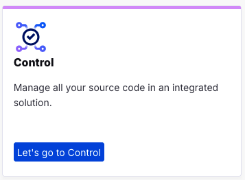

Or you can always switch using the central app switcher on the top left of your screen:

## Managing Repositories and Organizations

The home page for Control is the Repositories and Organizations view. In this view you will get a list of all your repositories and organizations. If you have active repositories also a activity report will be shown. The first time you use Control an empty list is shown:

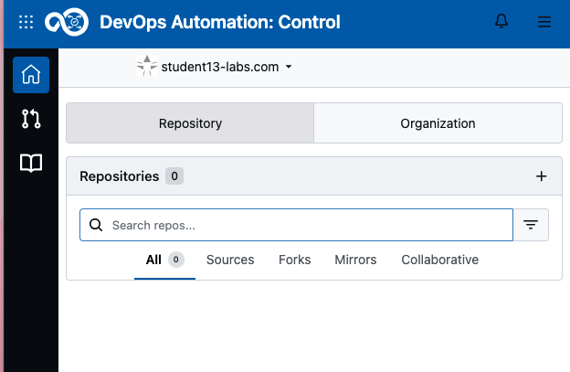

After creation of a repository an activity dashboard will be added to it:

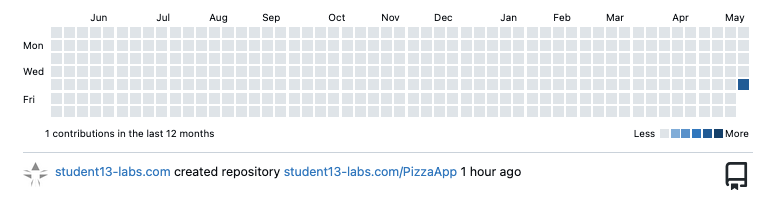

On the left of your screen you can switch to the list of pulls by clicking on the Pull request Icon 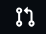 a new view is provided with all your related (assigned to you, created by you, review needed by you or mentioning you) pull requests:

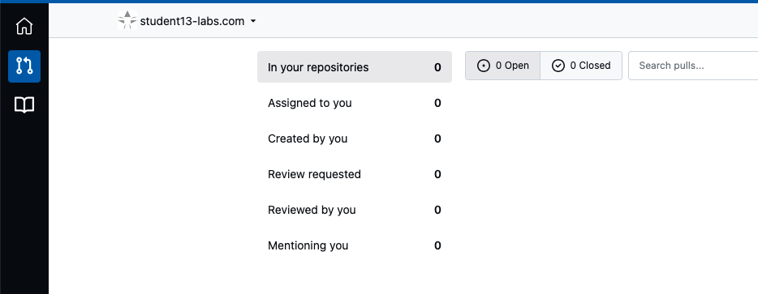

Click on the List all Repositories Icon  to see all Repositories you can get access to:

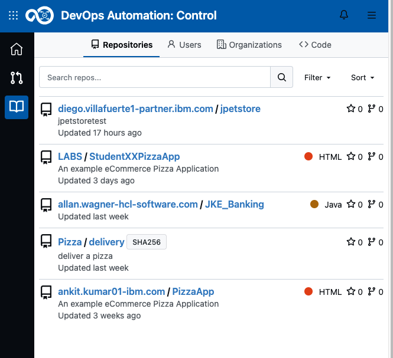

## Create a new Repository

### Fork a repository

In this lab we want to for an existing repository. To achieve this select the PizzaApp repository as shown below:

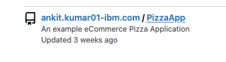

In the repository click the Fork button on the top right left:

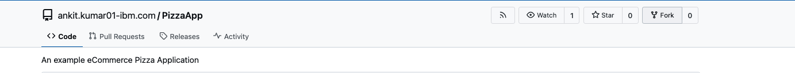

Use the preprovided information and proceed by clicking "Fork ...":

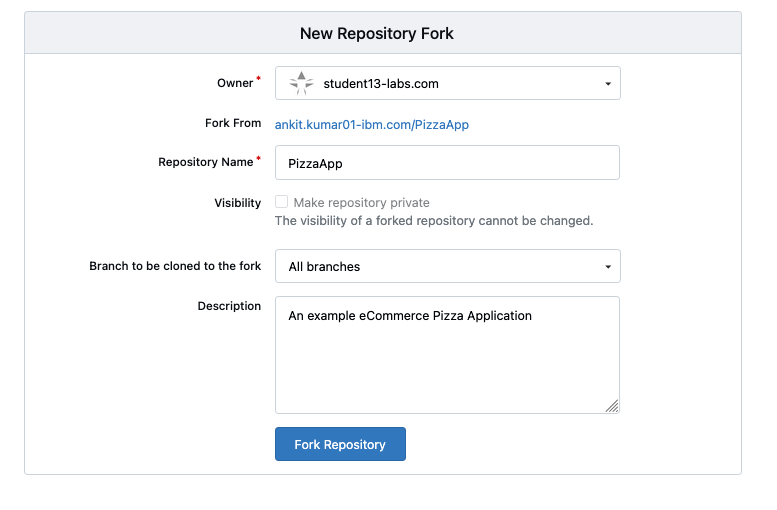

Congratulations! You have now your own repository!

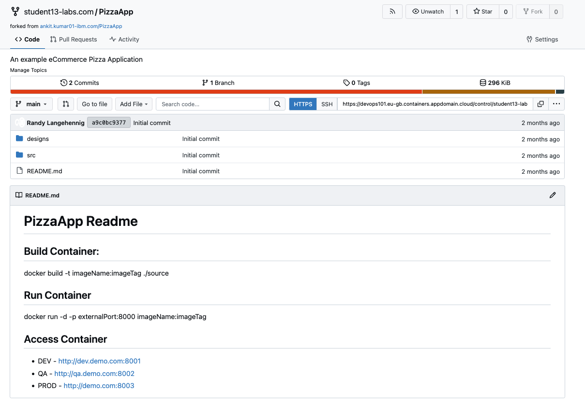

### Create New Repository

If you want to create a fresh new repository or migrate an existing repository to Control, use the NEW button to proceed:

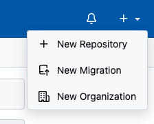

## User provide and Access Token

For external use of the repositories you need to provide an Access Token, for example to be able to clone and push changes to it.

Please clieck on your User Profile and select Settings:

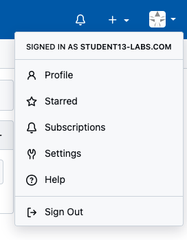

In the Settings view click on Access Tokens then enter a Token name, use your StudentName (eg. Student13) and extend it with "AccessToken" and set the permissions:

- Set Repository to Read and Write
- Set User to Read

These settigs are the minimal needed to provide access to work with your repository through external tools:

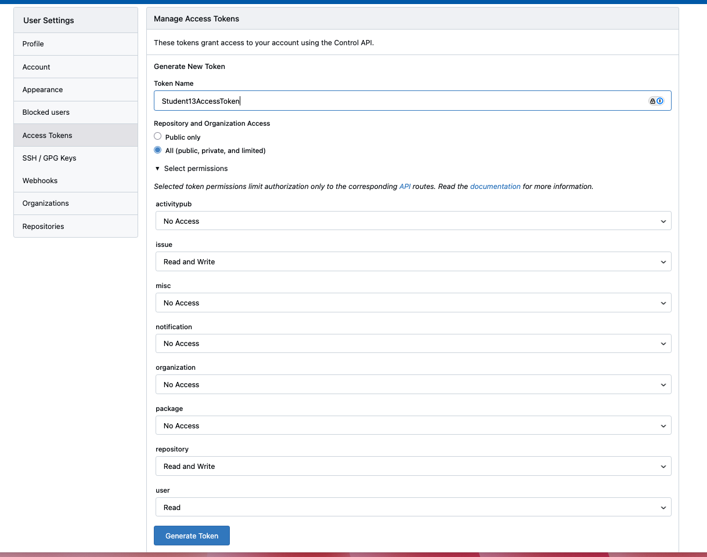

Press Generate Token and **SAVE your newly created Token**:

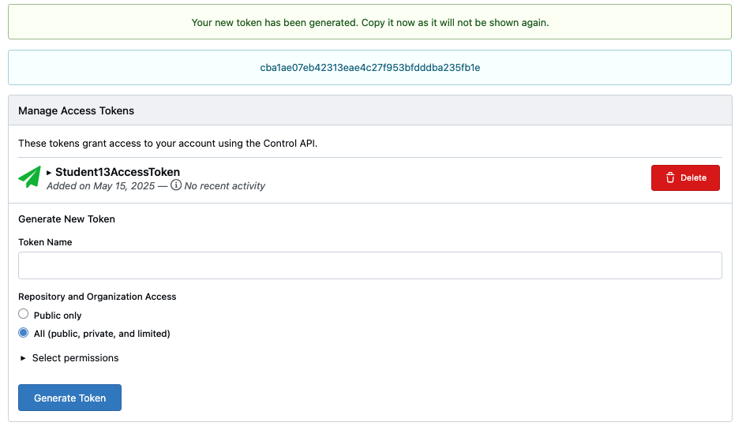

## Conclusio

Congratulations you have finished Control Lab and have created a new repository and an access token.
