# Plan Lab

## Introduction

TODO: add here more about Plan

## How to switch to Plan from Home Page

You can switch to Plan by either pressing "Let's go to Plan" button on its tile:

Or you can always switch using the central app switcher on the top left of your screen:

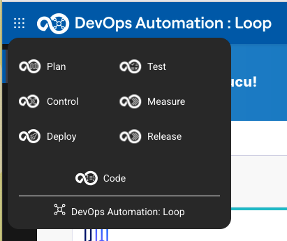

## Let's go with Plan

### Select Plan application to use

If you have not set your default Plan application you will be provided with a screen with all applications you have access to.

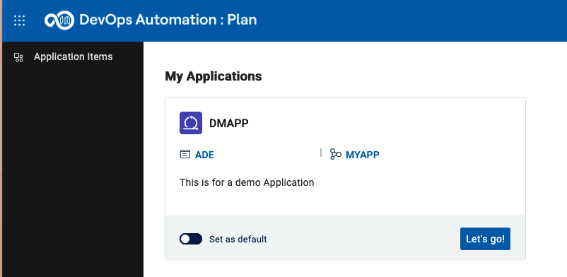

Set the provided app as default and presss "Let's go" to proceed.

### Welcome Page for first time users

If you have logged in the first time into Plan you will get a Welcome Screen:

By pressing the button "Explore" a new page is shown which provides an Introduction to Plan and the used workflow model for the selected application:

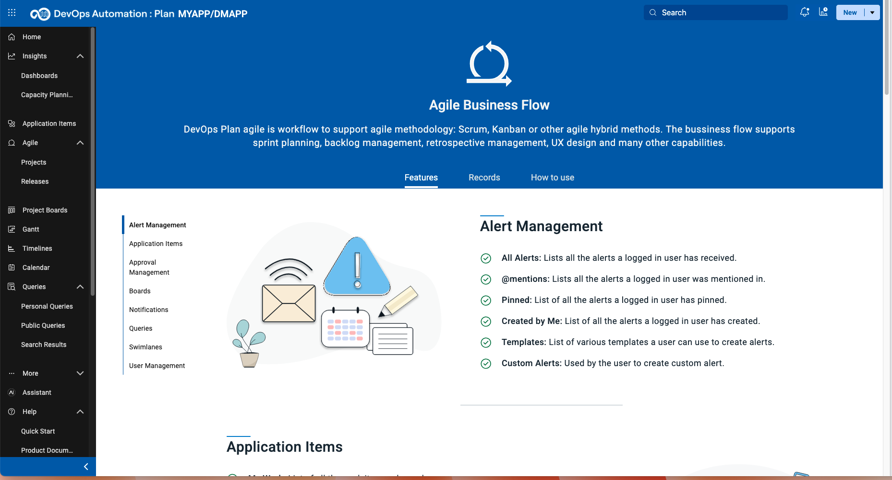

### Use Home Button to switch to Plan Home Page

Please use the "Home" button on the left sidebar to switch to the Home page for Plan.

This Home page will provide you some basic information and also the means to switch between Plan applications (My Applications Button on the right)

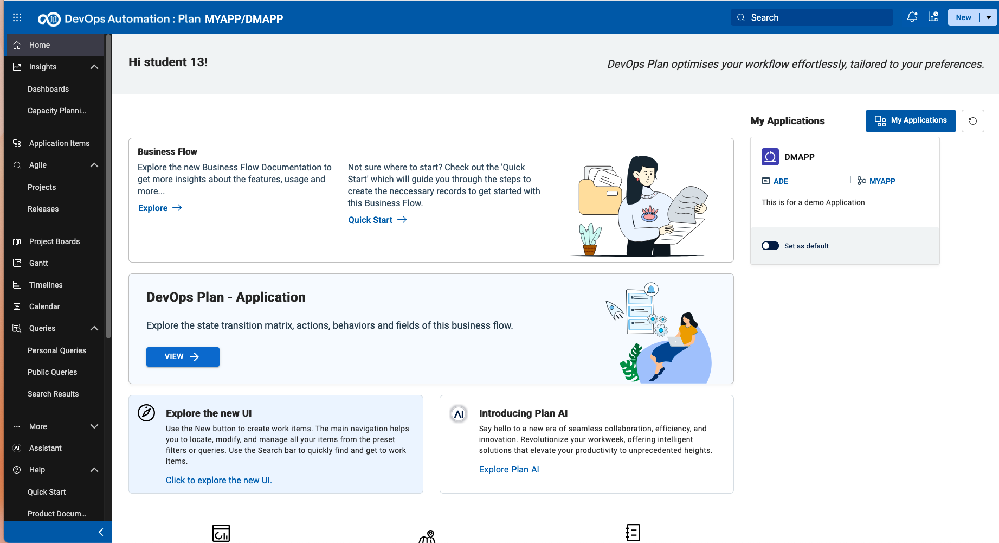

The explore options on this page will forward you to the Exploration page mentioned above.

### Explore the technical worflow

Pressing the button "View":

will open a new view to the technical details of the used workflow for the selected application.

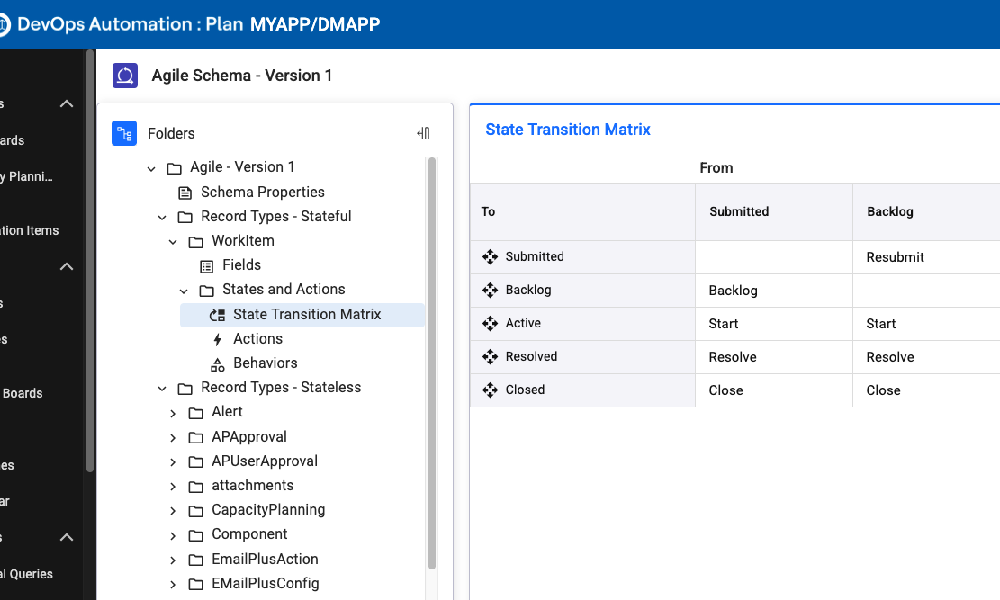

This view provides the used record types, fields, transition matrizes and more.

## Work with Boards

### Project Board

Project Boards provide a graphical Kanban style overview of worktitems.

TODO: add more text here

To open the board use the Project Board icon  on the sidebar.

The initial view is your My Board view which will show worktitems that are assigned to you. As we newly started the board is empty.
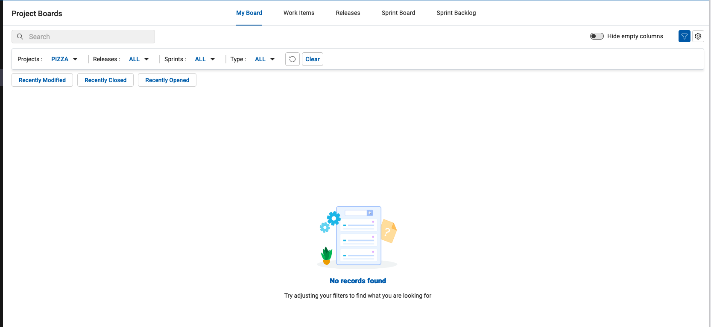

Next to "My Board" is the Tab with all "Work Items" for the active Project. This board will a list of stati (Submitted, Backlog, Active, Resolved and Closed) and the Work Items which are in this state.

To limit the shown Work Items use the Filter bar.

You can switch between Projects using the Projects Switcher

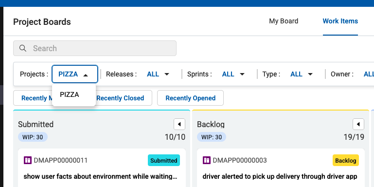

Next Tab is a view on Releases.

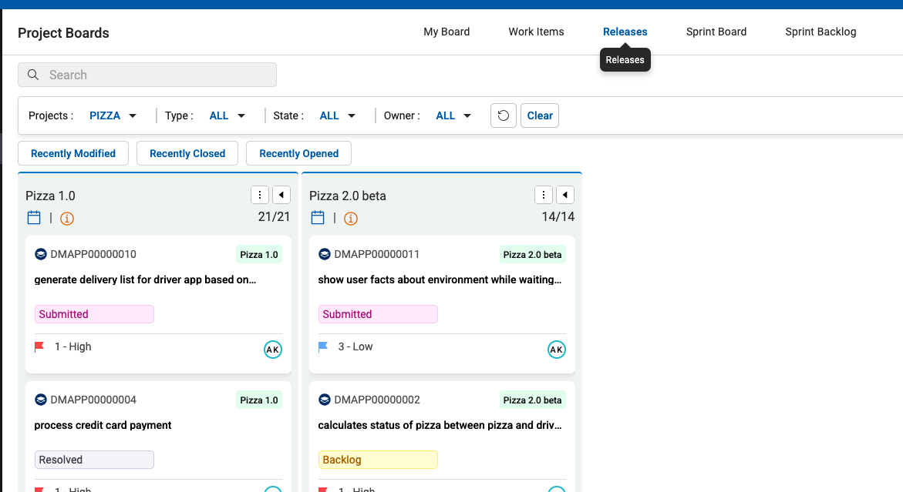

In the Sprint Board View the workitems assigned to the Sprints is shown.

And last but not least is the Sprint Backlog view.

### Project and Releases

In this specific workflow Projects and Releases are used to manage agile software development.

#### Projects

When ths sidebar is minimized you can open the Projects view either by clicking on the Agile button:

 which opens the selction pupup: 

When it is maximized just select directly the Projects entry:

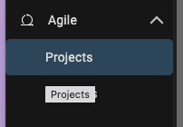

This View will show you a list of available Projects and their Details:

The Details cover Main informations like Name and Description (as shown in the above screenshot), Releases, Sprints and Components which are related to this Project.

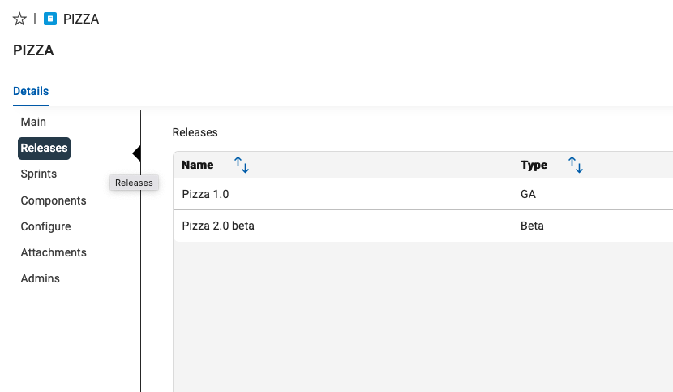

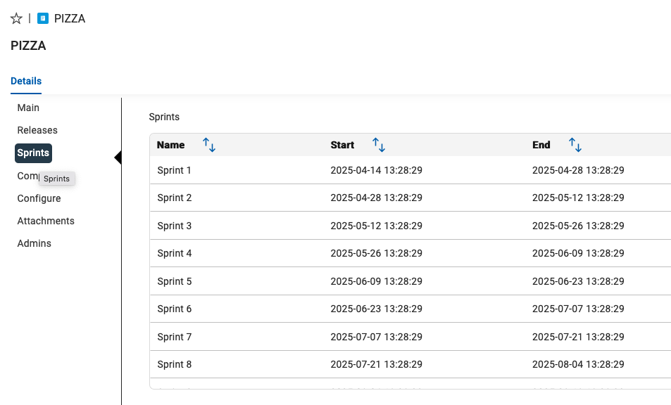

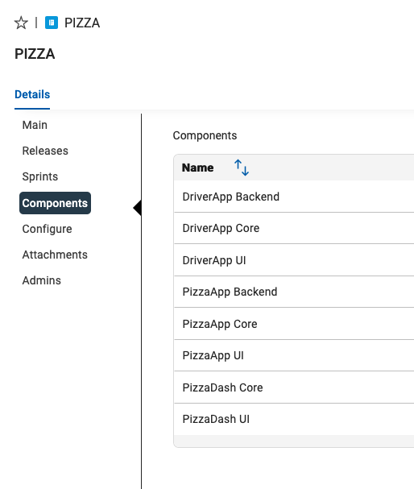

In the Configure section you can configure some of the Selection Fields of a Project. In this Workflow "Work item Types", "Priorities", "Story Points", "Severities", "Resolutions", "Tags" and "Release Types" can be configured:

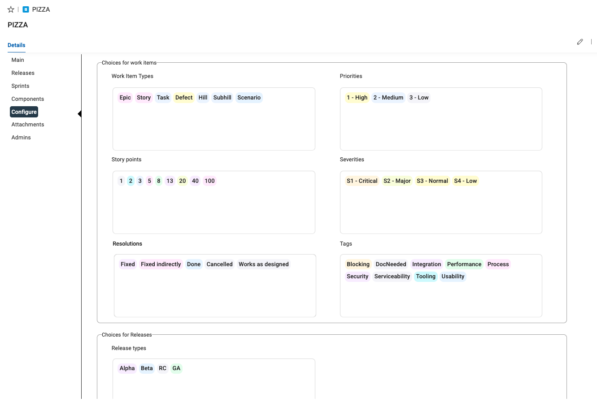

You can edit existing data using the Editor Icons:

The Edit Icon will set the workitem into edit mode and allows changes of the fields:

With the Copy Link icon you can copy the URL of this item:

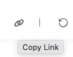

Use the Refresh icon to refresh the view when you think that the values may have been changed by someone else:

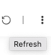

The Three Dots menue provides extra functionality for Printing, Exporting to JSON format, Cloning the workitem or deleting it:

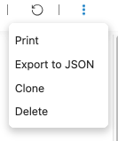

In the Attachments section you can upload files and attach it to this workitem.

The Admin section provides information which user(s) is/are administrators of this item and have the right to change it.

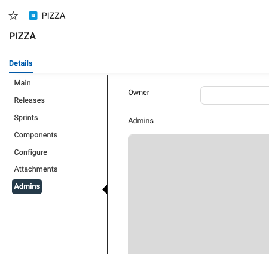

#### Releases

Now let us have a look at Releases. Let's use the Agile icon again but now select Releases:

This View list all the available Releases and their Details:

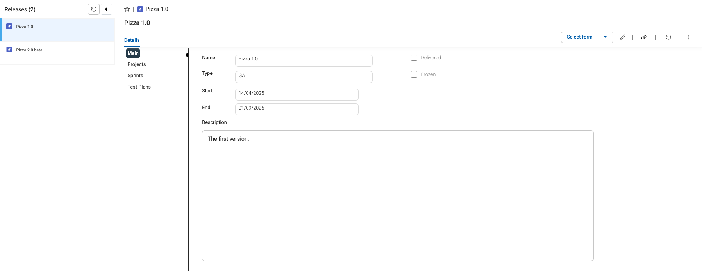

A Release has a Main section providing a Name, Type, Start/End Dates and a Description (see above screenshot).

The Projects Section lists all Projects to which this Release is related:

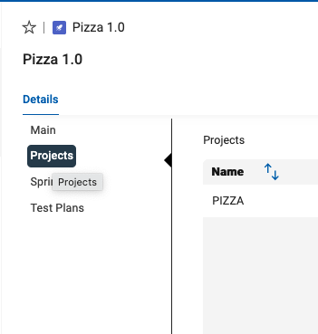

The Sprint Section lists all Sprints to which this Release is related:

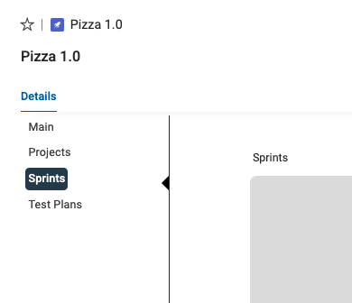

The Test Plans Section lists all Test Plans to which this workitem is related:

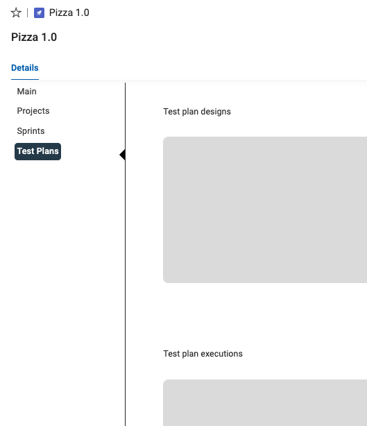

## Create new Workitems

Now it is time to do some work. Let us create a new Project and configure it. Then create new Releases, Sprints and Components and add them to our new Project.

### Create and customize a new Project

To create a new Workitem you have to click on the triangle icon on the NEW button on the top right of your screen:

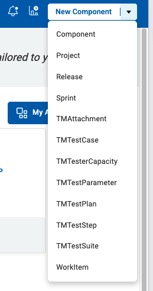

Select Project from the List. This will create a new Record from type "Project" and will show you its Main section first to provide Name and more Details:

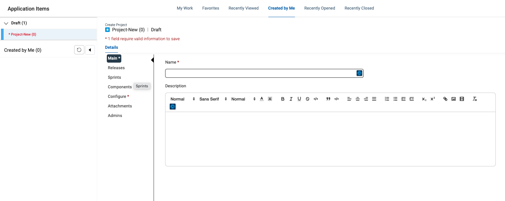

Provide a name such as "Project"+ your **StudentNumber**. Feel free to add a meaningful description too.

Next Mandatory information we have to enter (Sections marked with a red star) is the Configure section. Click on Configure section to open the details.

This screen lets you customize your project with different values for Work Item Types, Priorities, Story Points, Severities, Resolutions, Tags and Release Types. New values can be added by clicking in the white space, typing in a value and clicking the Create link that appears below. Existing values can be removed by clicking the X beside the value

Add a tag named Customer Request and remove the Hill and SubHill work item types.

Click the Save button on the lower right of the screen: 

#### Create Releases, Sprint and Components

Create a new release by click the down arrow next to the New button at the top right of the screen and pick Release:

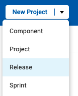

Enter the name of the Release as your **StudentNumber**-12 (example 13-12) with start date of 9/23/24 and end date of 12/20/24.

Click Save and Create Another at the bottom right of the screen: 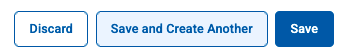

Add two more releases **StudentNumber**-03 12/23/24 - 3/21/25 and **StudentNumber**-06 3/24/25 – 6/20/25

Create a new Sprint by click the down arrow next to the New button at the top right of the screen and pick Sprint.

Using similar steps to Releases create Sprint **StudentNumber**-1 to **StudentNumber**-4 with start and end dates as follows: 9/23/24-10/11/24, 10/14/24-11/08/24, 11/11/24-11/29/42, 12/2/24-12/20/24

Create a new Component by click the down arrow next to the New button at the top right of the screen and pick Component

Using similar steps create these five components and add your **StudentNumber** in Front of the Name: Android App, IOS App, Mid Tier, Database, Mainframe

#### Attach the Releases, Sprints and Components to the Project

Click the Application Items icon on the left side of the screen:

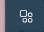

Click the Created By Me link 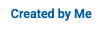 on the top of the screen.

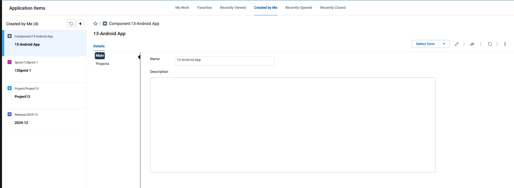

Scroll down the list on the left and click on your Project to select it (example Project13 created by Student13)

Click the Modify/Edit Record Icon towards the top right of the screen 

Click on the Releases tab and then click in the box to show the three releases you created.

Click the checkbox of the three releases to add them to the Project (NOTE: In this example only one Release is visible)

Follow similar steps to add the sprints and components you created. Recently Viewed Items list, type part of the name into the box and it will appear If an item does not show up Recently Viewed Items list, type part of the name into the box and it will appear.

Save the Project.

## Work with Queries

Use Queries to get a list of items you are interested on. Every user can create its own Personal Queries. If you have the role or permission set to be a Public Query Editor then you can publish personal queries as Public Queries.

### Public and Personal Queries

You can switch to the Query Editor by either Clicking on the Queries icon on the left sidebar to open the submenue:

Or when your sidebar is expanded click on Personal to create a new Personal Query:

The Query Editor list all your queries you have access to. You can switch here between Personal and Public queries by clicking on the triangle symbol right beside the Public/Personal Query:

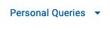

#### create new personal query

Now let us create a simple Query to list all Projects we own. Click on the Add New Query button and select "New Query":

This will open a Popup where you need to provide a name for your query and which record type will be queried:

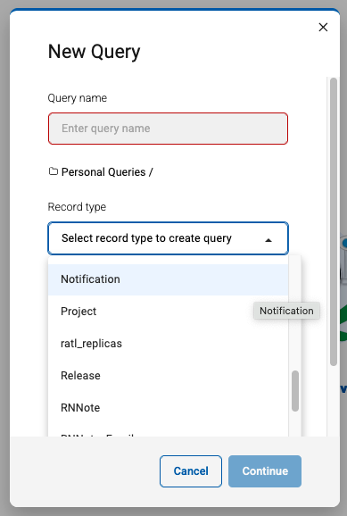

Please provide a meaningful name like "My Project Query" and select the Project record type. Then Press Continue to open the Query Editor:

In this Editor you can configure the fields which will be shown on the result. It is also possible to add fields from related record types like Releases or Sprints. In this example we will keep it Simple and add only the Tagslist to our Result set.

Scroll down on fields list to Tags and press the arrow to add it to your result field view:

In the results field view you can change the ordering of the fields, set the sort order and more. Every field reveals a three dot inline menue for modification of these parameters or if you added it by mistage to remove this field from this list.

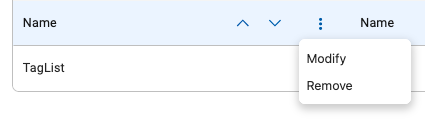

Now let us do a dry run and see the results. Press the Run button on the bottom right of your screen to run and have a look at the result:

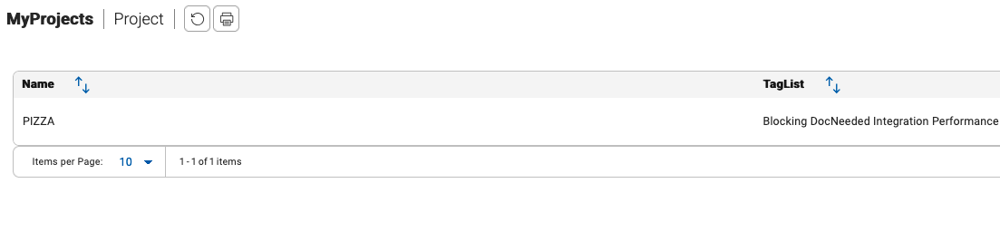

Use the "Back to Edit" link to return to the Query Editor to add aditional fields or change the query:

We need to add a Filter on our Query so that only our own items are selected. This can be done by clicking on the Query Filter link on the top above the field list:

In this view select Owner from the field list and press the arrow button to add it to the Filter Criteria, then you need to change the value to "Current User":

NOTE: you could have selected your own username from the list, but to if you want to publish this query, you can use the generic "Current User" which will automatically use the username of the logged in user.

We are now finished with setting up our query. Press Save and Close on the bottom left:

If you want to save and go on with editing use the Save button. It can be also used for saving your query under a new name too:

#### Public Queries

Have a look at the available Queries in the Public Queries list and try them out.

## Conclusio

Congratulations! You have finished the Plan lab and have got a short overview of its capabilities.
