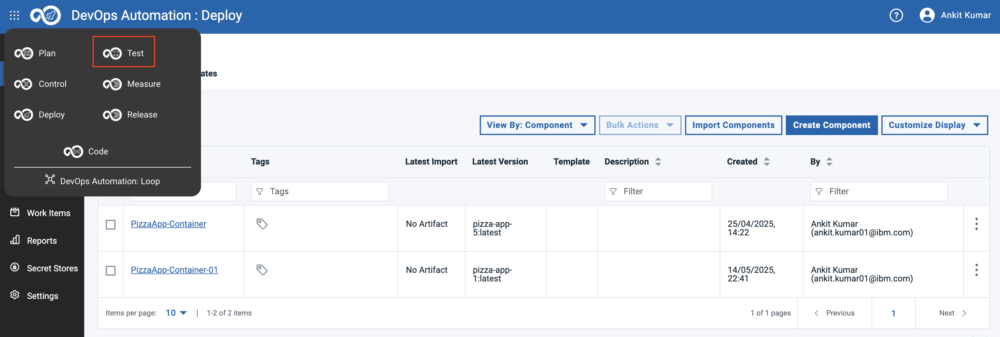
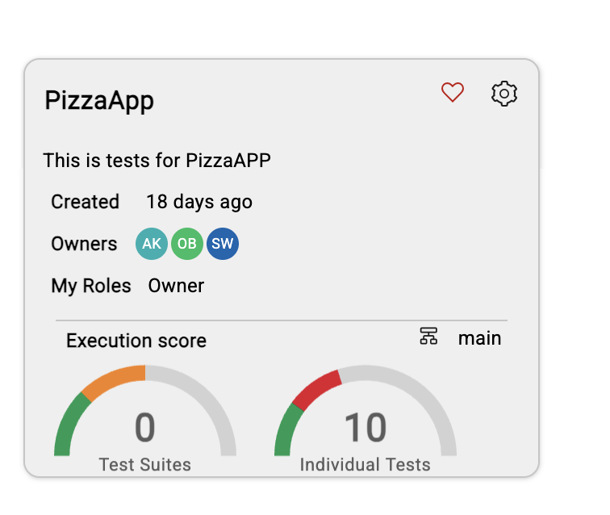
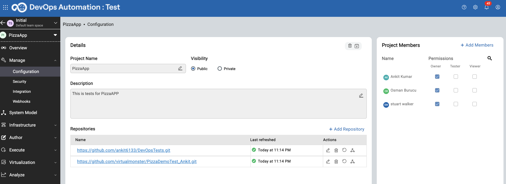
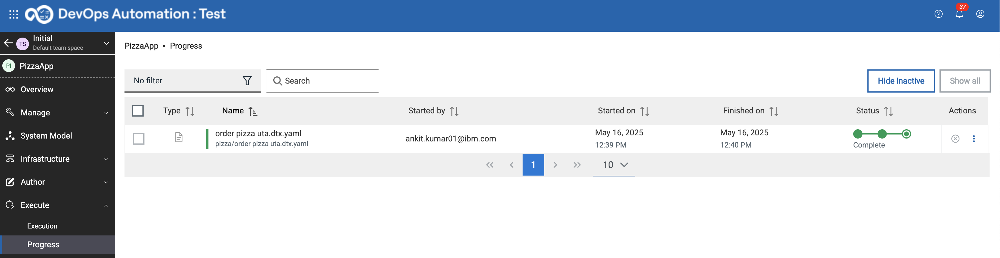
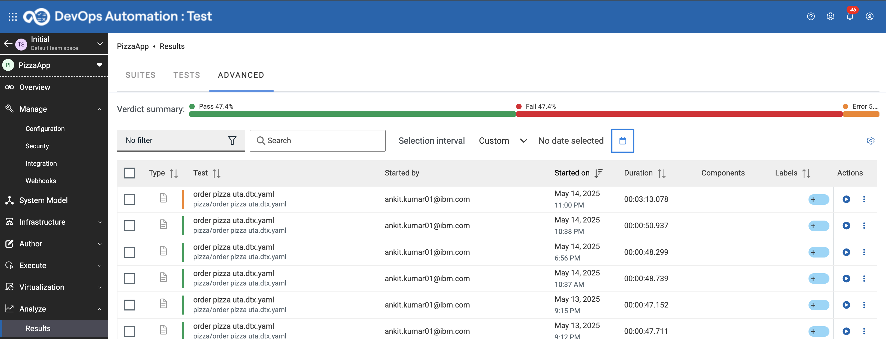
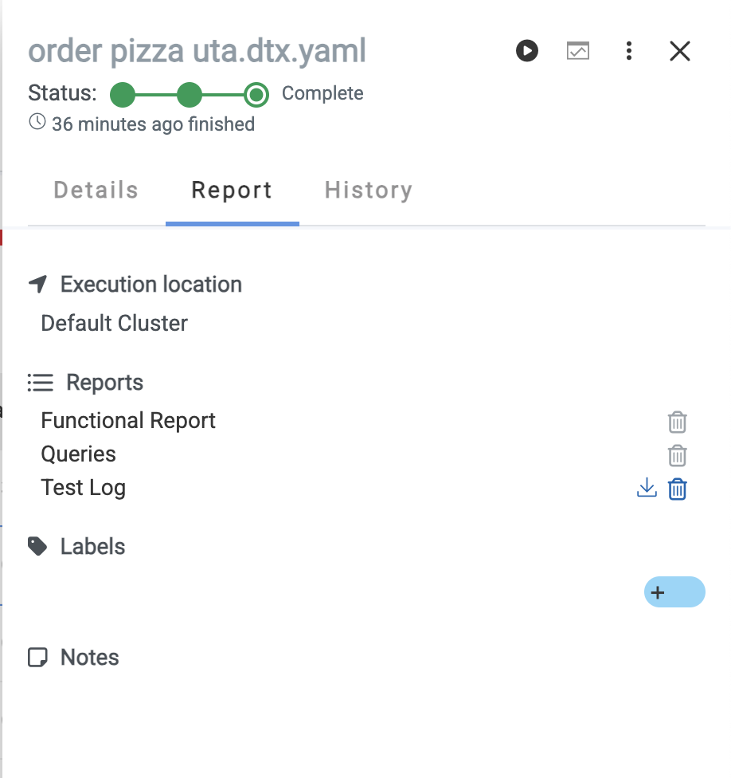
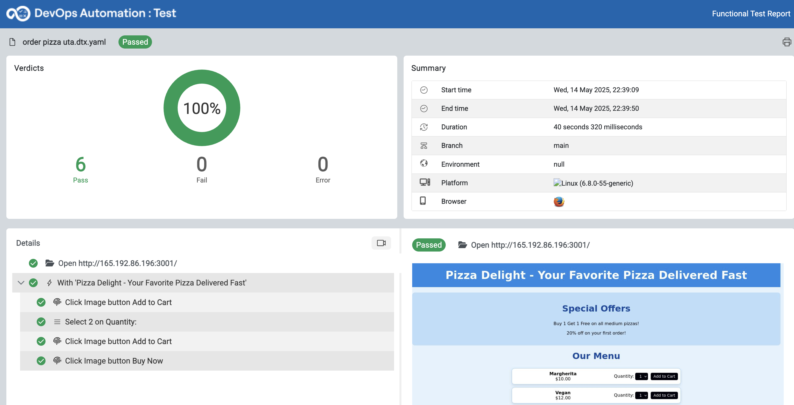

# Test Lab

This lab will provide you with a practical hands-on of our testing capabilities. You can click on the main menu and navigate to the DevOps test.

## Configuration

1. Click on DevOps Test to naviagte to DevOps Test.
    

2. Click on the PizzaApp project, which has tests for our target Application.

   

3. Click on gear icon to look more configuration. It provides the git location where the test scripts are being hosted:

   

4. From left-panal, Navigate to `Execute` > `Progress`  You can click on tests which we are in progress:
    

5. From left-panal, Now check the executed test by navigating to `Analyse` > `Results`

    

6. Clicking on functional report will provide complete insights of the test:

    

7. Explore more results by clicking on available options:

   

## GO TO Measure Section: [Click Here](https://github.com/DevOpsAutomationLabs/End2End/blob/main/docs/Measure/index.md)
