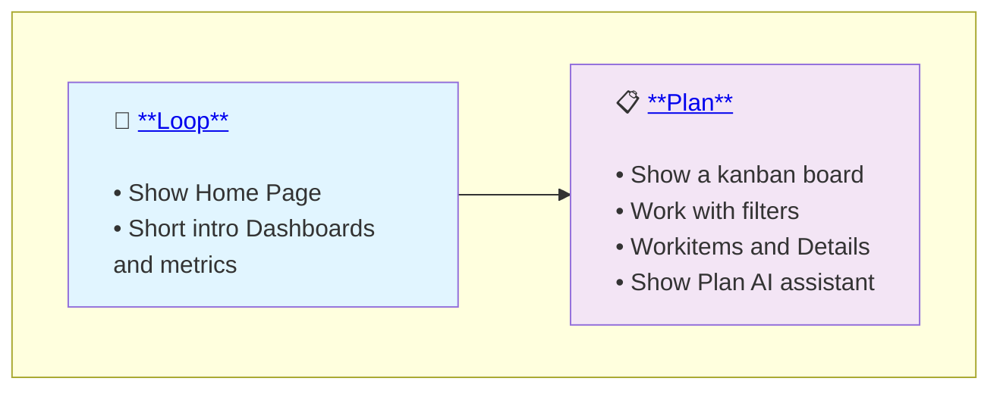
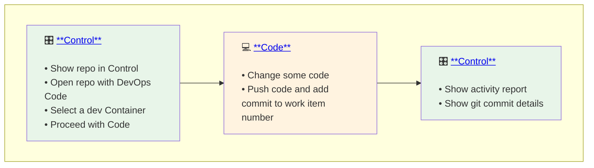
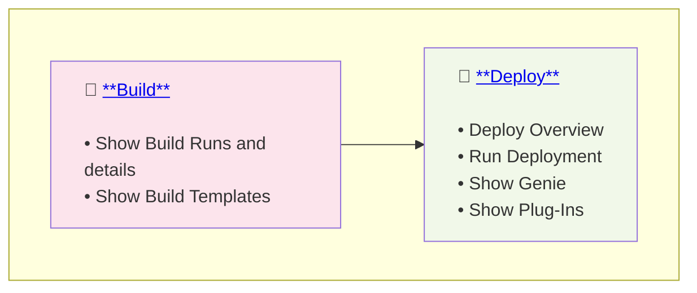
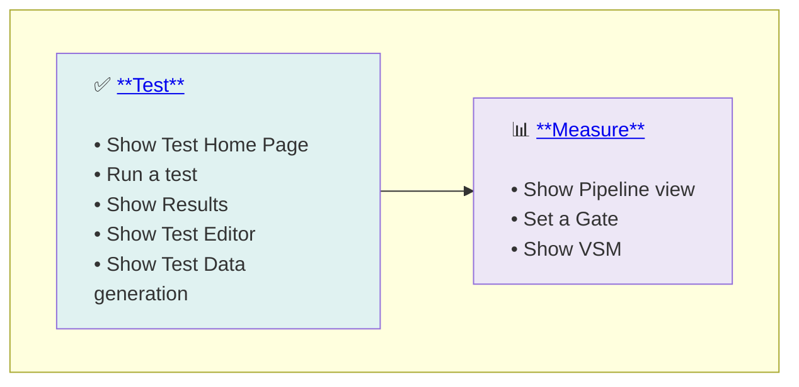
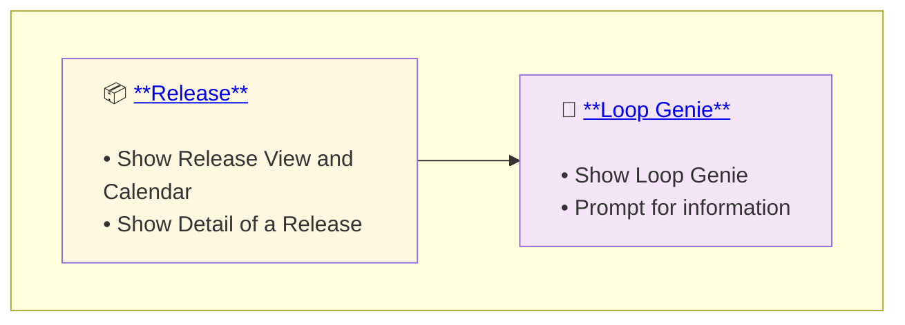
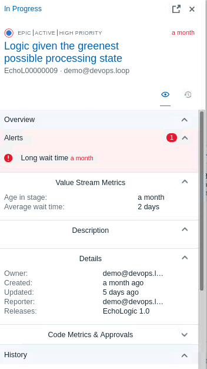
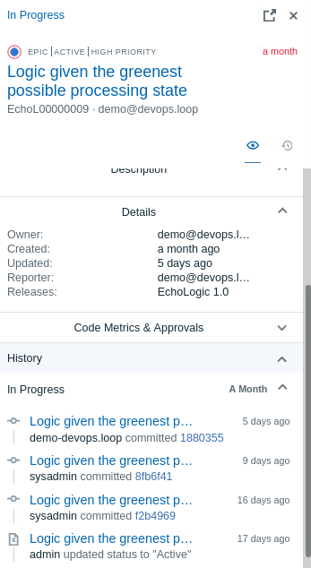

# Classic Demo Flow

<!-- ![Demo Flow][ChartFlowOfDemo] -->

## Overview

This Step by Step Demo Guide will give you compact Instructions how to demo DevOps Loop. For more detailed information about the Capabilities and Steps links to the indepth enablement Guide has been added.

Starting with **Loop and Plan**

Proceeding to **Control and Code**

Now building and deploying with **Build and Deploy**

Run Tests and Show progress with **Test and Measure**

Manage Releases and use AI with **Release and Loop Genie**

## [Loop](../learn/introduction/index.md)

### Login into Loop

--8<--
learn/introduction/index.md:HowtoLogin
--8<--

### The Home Page

--8<--
learn/introduction/index.md:TheHomePage
--8<--

### Dashboards and Metrics

--8<--
learn/introduction/index.md:DashboardMetrics
--8<--

## [Plan](../learn/plan/index.md)

### Plan Overview

#### [Switch to Plan](../learn/plan/index.md#how-to-switch-to-plan-from-home-page)

--8<--
learn/plan/index.md:SWITCH2Plan
--8<--

#### [Show My board][ShowMyBoard]  

--8<--
learn/plan/boards/index.md:ProjectBoard
--8<--

#### [Show how to filter out Epics][HowToFilter]

--8<--
learn/plan/boards/index.md:FilterEpics
--8<--

#### [Show all work items][WorkItems]  

--8<--
learn/plan/boards/index.md:WorkItems
--8<--

### [Use Plan AI Assistant](../learn/plan/ai_assistant/index.md#using-the-plan-ai-assistant)

[For More about AI Assistant follow this link][PlanAI]

#### AI Assistant Chat Dialog

--8<--
learn/plan/ai_assistant/index.md:PlanAIAssistantChat
--8<--

#### AI Assistant Type of Output

--8<--
learn/plan/ai_assistant/index.md:PlanAIAssistantOutputType
--8<--

#### AI Assistant Create Records from Responses

--8<--
learn/plan/ai_assistant/index.md:PlanAIAssistantCreateRecords
--8<--
<!-- [Open a workitem and use AI to create description and exploratory test information](plan/boards/index.md#use-ai-in-workitem) -->

## [Control - Work with Repository](../learn/control/index.md#open-repo-with-code)

--8<--
learn/control/index.md:SWITCH2Control
--8<--
--8<--
learn/control/index.md:ManageRepoOrgs
--8<--
--8<--
learn/control/index.md:OpenRepoWithCode
--8<--

## [Code](../learn/code/index.md)

<!-- --8<--
learn/code/index.md:Switch2Code
--8<-- -->
--8<--
learn/code/index.md:UseCode
--8<--

## [Control](../learn/control/index.md)

--8<--
learn/control/index.md:ShowLastCommits
--8<--
--8<--
learn/control/index.md:ShowGitCommitDetails
--8<--

## [Build](../learn/build/index.md)

--8<--
learn/build/index.md:SWITCH2Build
--8<--

### Show Build Runs and Details

--8<--
learn/build/index.md:ProjectBuildRunResults
--8<--

--8<--
learn/build/index.md:BuildProcDetail
--8<--

### Show Build Templates

--8<--
learn/build/index.md:ProcessTemplates
--8<--

--8<--
learn/build/index.md:ProcessDetailsTemplates
--8<--

--8<--
learn/build/index.md:ProcessDefTemplates
--8<--

## [Deploy](../learn/deploy/index.md)

### [Deploy Overview][REFDeployOverview]

| Step | Details                                                                                 | Additional Information { width="50%" }                                      |
|:----:|:----------------------------------------------------------------------------------------|:----------------------------------------------------------------------------|
|  1   | [Open Deploy][DeployOpen]                                                               |                                                                             |
|  2   | [Show the landing page and explain the metrics][DeployShowLandingPage]                  | ![DeployLandingPage][DeployDashboard]                                       |
|  3   | Show process of [Applications][REFAppProcessView] and [Components][REFCompProcessView]  |                                                                             |
|  4   | Switch to Applications View by clicking on the Sidebar                                  | ![Sidebar Applications][SBApplicationsIcon]                                 |
| 4.1  | View for all Applications is shown                                                      | ![All Applications View][APPSallView]                                       |
| 4.2  | Click on the **EchoLogic** Application to show details                                  | ![Application View with Env][AppViewWEnv]                                   |
| 4.3  | [Switch to Processes View][SwitchToProcessView] by clicking on click on "Processes" Tab | ![App Processes Tab][AppProcessesTab]                                       |
| 4.4  | Available application processes are shown                                               | ![Application Processes][AppProcessesView]                                  |
| 4.5  | Show the **Deploy** Process by clicking on it                                           | ![App Deployment Process][AppViewProcess]                                   |
| 4.6  | [Talk about Application Processes][REFAppProcesses]                                     |                                                                             |
|  5   | [Switch to Components View][REFSwitchToCompView]                                        |                                                                             |
| 5.1  | In the sidebar select the **Components** Icon                                           | ![Sidebar Components Icon][SBCompIcon]                                      |
| 5.2  | All components are shown                                                                | ![Components View][CompView]                                                |
| 5.3  | click on **Echo** component to view details                                             | ![Open Echo Component][CompDetails]                                         |
| 5.4  | click on **Processes** Tab                                                              | ![Switch to Component processes View][CompProcessTab]                       |
| 5.5  | Available Component processes are shown                                                 | ![Component Processes][CompProcesses]                                       |
| 5.6  | show a process which executes a TEST                                                    | and is [setting quality tag on deployed version][DeployShowProcessWithTest] |
| 5.7  | Click on **Deploy with Test Passed**                                                    | ![Final Process with passed Test][DeployComponentProcessPassingTest]        |

### Run a Deplyoment

| Step | Details                                                                                | Additional Information { width="50%" }                                                |
|:----:|:---------------------------------------------------------------------------------------|:--------------------------------------------------------------------------------------|
|  1   | [Run a Process and view results of steps][DeployRunaDeployment]                        |                                                                                       |
|  2   | Open the Applicationslist by clicking on Applications Icon                             | ![Deploy Applications Button on Sidebar][SBApplicationsIcon]                          |
|  3   | Click on **EchoLogic** Name (Link)                                                     | ![Deploy Application][DeployShowApp]                                                  |
|  4   | All Environments of Application will be shown                                          | ![Deploy Application Environment List][DeployAppEnvList]                              |
|  5   | [Run a Deployment][DeployRequestAprocess]                                              |                                                                                       |
| 5.1  | Use the DEV environment                                                                | ![Dev Environment][DeployAppDevEnv]                                                   |
| 5.2  | click on Request Process Button:                                                       | ![Request Button][DeployAppRequestProcessButton]                                      |
| 5.3  | Select **Deploy with Test Passed**                                                     | ![Select Deployment Process][DeployAppProcessRequestSelectProcess]                    |
| 5.4  | Uncheck **Deploy Only Changed** to deploy same versions again                          | ![uncheck Deploy Only Changed][DeployAppProcessRequestOnlyChanged]                    |
| 5.5  | click on **Choose Component Versions** button                                          | ![Choose Versions Button][DeployAppPocessRequestChooseCompVersionButton]              |
| 5.6  | Select the Versions of the Components for deployment                                   |                                                                                       |
| 5.7  | Select Version **1.1** for the **Echo** Component                                      | ![Echo Version][DeployAppPocessRequestSelectCompVersion1]                             |
| 5.8  | Select Version **2.0.1** for the **Logic** Component                                   | ![LogicVersion][DeployAppPocessRequestSelectCompVersion2]                             |
| 5.9  | Press the **Submit** button to start the deployment process                            | ![Submit Button][DeployAppPocessRequestSubmitButton]                                  |
|  6   | Process is started and you can [View the running Process][DeployViewRunningProcess]    | ![Running Process][DeployProcessRunning]                                              |
| 6.1  | In this View the details of the executed steps are shown by clicking on **Expand All** | ![Expand All][DeployProcessRunningExpandAllButton]                                    |
| 6.2  | To view the detailed output of a step click on **3 dots menue** of the step            | ![3 dots menue of step][DeployProcessRunning3DotsofStep]                              |
| 6.3  | View the output of the step                                                            | ![Output of Step][DeployProcessRunningStepOutputDetails]                              |
| 6.4  | When the deplyoment finishes the [Result][DeployResultofRun] will be shown             |                                                                                       |
|  7   | The deployment run successfully                                                        | ![Deployment Success][DeployAppProcessRunSuccess]                                     |
| 7.1  | [Show Environment and its new configuration][DeployResultofRun]                        |                                                                                       |
| 7.2  | Switch to the Environment View of the Application and view the updated configuration   | ![Environment with deployed versions of components][DeployAppEnvwithDeployedVersions] |
| 7.3  | Click on the Component **Echo** to Details                                             | ![Status added to version][DeployComponentFinalProcesWithVersionStatus]               |
| 7.4  | Status in the Versionlist of the component will be shown                               |                                                                                       |

### [Use the Deployment Genie][REFUseGenie]

| Step | Details                                                                                                              | Additional Information { width="50%" }               |
|:----:|:---------------------------------------------------------------------------------------------------------------------|:-----------------------------------------------------|
|  1   | Use Deploy Genie to understand why the deployment failed                                                             |                                                      |
|  2   | To simulate a failed deployment [request a new deployment process][REFRequestAProcess] but now select the following: |                                                      |
|  3   | Deployment Process **Failing Deployment**                                                                            | ![Failing Process][RunSelectFailingDeployment]       |
|  4   | Select following Versions  for **Echo** select **1.0** for **Logic** select **2.0.0**                          | ![Comp Versions][RunFailSelectCompVersions]          |
|  5   | Press the **Submit** button to start the deployment process                                                          | ![Submit Button][DeployAppPocessRequestSubmitButton] |
|  6   | The result will be a **failed** deployment as one step has failed                                                    | ![Failed Result][RunFailed]                          |
|  7   | Click on the **3 dots** ![3 dots menu][DeployPlugin3DotsMenue] to get menu of the failed step                        | ![Step Menu][Step3DotsMenueWithGenie]                |
|  8   | Click on **Deployment Genie** after a few moments the step will be analyzed and the results shown                    | ![AI Analyzed][GenieAnalysis]                        |

### Show the Plug-Ins Page

| Step | Details                                                                        | Additional Information { width="50%" }                 |
|:----:|:-------------------------------------------------------------------------------|:-------------------------------------------------------|
|  1   | [Show the plug-ins page][DeployShowPluginsPage]                                |                                                        |
|      | and explain how easy it is to integrate with 3rd parties out of the box        |                                                        |
|  2   | Switch to Settings by using the Settings Icon                                  | ![Deploy Settings Icon][DeploySettingsIcon]            |
|  3   | In the Settings View in the Section **Automation**                             |                                                        |
|      | [View installed and available Plugins][DeploySettingsAutomationSection]        | ![Automation Plugins][DeploySettingsAutomationPlugins] |
|  4   | By clicking on **Available Plugins** a list of all available Plug-Ins is shown | ![Plugin List][DeploySettingsPluginsList]              |

## [Test](../learn/test/index.md)

| Step  | Details                                                                                                     | Additional Information { width="50%" }           |
|:-----:|:------------------------------------------------------------------------------------------------------------|:-------------------------------------------------|
|   1   | Explain that you are now playing the role of a tester                                                       |                                                  |
|   2   | [Open Test][TestOpen]                                                                                       |                                                  |
|  2.1  | You can switch to Test by either pressing "Let's go to Test" button on its tile                             | ![Test Tile lets go][SwitchToTest]               |
|  2.2  | Or you can always switch using the central app switcher on the right side of your screen                    | ![Central App Switcher][CentralAppSwitcher]      |
|   3   | [Switch Teamspace and select Project if needed][REFSwitchTestTS]                                            |                                                  |
|  3.1  | Should you see a different Teamspace or Project than expected (Demo and EchoLogic), click on Teamspace Icon | ![Teamspace Switcher][SwitchTestTS]              |
|  3.2  | and Select **Demo**. A list of Projects is shown:                                                           | ![Projectlist is shown][TestPrjList]             |
|  3.3  | click on **EchoLogic** Project to open landing page                                                         | ![Open EchoLogic Project][Projecttile]           |
|  3.4  | Show the test landing page and metrics                                                                      | ![Test Landing Page][ProjectHomePage]            |
|   6   | Run a test                                                                                                  |                                                  |
|  6.1  | click on **Execute** Section in the Sidebar                                                                 | ![Test Exec Section][SectionExecute]             |
|  6.2  | List of Scripts is shown                                                                                    | ![List of executable Scripts][ExecuteScriptList] |
|  6.3  | click on **Run Button** on the right of Script **DemoTest**                                                 | ![Run Button][ButtonRun]                         |
|  6.4  | Dialog is opened to select a Browser, use the default settings                                              | ![Select Browser][RunDialog]                     |
|  6.5  | Click on **Execute** Button to start Test Execution                                                         | ![Execute Button][ButtonExecute]                 |
|  6.6  | Run will take a few moments                                                                                 | ![Running Script][RunningScript]                 |
|   7   | Show the analysis of the test results                                                                       |                                                  |
|  7.1  | click on **Analyze** section in Sidebar to get list of Menu                                                 | ![Analyze Section][SectionAnalyze]               |
|  7.2  | click on **Results** to get Results View                                                                    | ![Results Overview][ResultsOverview]             |
|   8   | Show how we can create or edit a test                                                                       |                                                  |
|  8.1  | click on **Author** section on **Test Editor** menu entry                                                   | ![Test Author Section][SectionAuthor]            |
|  8.2  | Test Editor View opens and select the **DemoTestFail** script                                               | ![Test Editor View][TestEditorView]              |
|  8.3  | Test Script will be shown                                                                                   | ![Test Script][TestScriptEditor]                 |
|  8.4  | click on the **verification** step to view step details                                                     | ![Step Details][TestScriptStepDetails]           |
|   9   | Run a new test that will fail                                                                               |                                                  |
|  9.1  | click on **Execute** Section in the Sidebar                                                                 | ![Test Exec Section][SectionExecute]             |
|  9.2  | List of Scripts is shown                                                                                    | ![List of executable Scripts][ExecuteScriptList] |
|  9.3  | click on **Run Button** on the right of Script **DemoTestFail**                                             | ![Run Button][ButtonRun]                         |
|  9.4  | Testexecution will take a few moments.                                                                      |                                                  |
|  10   | Create a defect in Plan and show that is has all the data automatically                                     |                                                  |
| 10.1  | Switch to Results View using the **Analyze** Section menu                                                   | ![Analyze Section menu][MenueAnalyze]            |
| 10.2  | In the **Results** View select the **DemoTestFail** run                                                     | ![Results Overview][ResultsOverview]             |
| 10.3  | Click on **DevOps Plan** ![Create ticket icon][CreateTicketIcon] Icon on the right side of the row          | ![Failed Test][ResultsFailedTest]                |
| 10.4  | A WorkItem creation Dialog opens, select **Workitem** in the Type field                                     | ![CreateWI][WICreatedialog]                      |
| 10.5  | Select Project "EchoLogic",  Workitem Type "Defect" and enter a Title                                       | ![CreateWI Enter Title][WICreateDetails]         |
| 10.6  | In the **Results** View click on the **DemoTestFail** name to get a Detailed View                           | ![Result Details with Plan Link][ResultLinked]   |
| 10.7  | Explain that everything is traceable                                                                        |                                                  |
|  11   | Generate test data                                                                                          |                                                  |
| 11.1  | Open **Author** section on **Test Editor** menue entry and click on **Data**                                | ![Test Author Section][SectionAuthor]            |
| 11.2  | Data Definitions and Schemas are shown                                                                      | ![Data Definitions Schemas][DataDefView]         |
| 11.3  | click on **CRM-System** in the Schema folder                                                                | ![Schemas][DataSchemas]                          |
| 11.4  | the **CRM-System** Data Schema is shown                                                                     | ![Schema View][DataSchemaView]                   |
| 11.5  | Click on the **Preview Icon** ![Preview Icon][DataPreviewIcon]                                              | ![Data Preview][DataPreview]                     |
| 11.6  | Click on the **Generate Icon** ![Generate Icon][GenerateIcon]                                               | ![Generate Dialog][GenerateDialog]               |
| 11.7  | Download the generated Data by clicking on **Downlad** Button                                               | ![Download button][ButtonDownload]               |
| 11.8  | Unzip and open the create folder                                                                            | ![Downloaded Unzipped][TestDataFolder]           |
| 11.9  | Two files are created **Customers** and **Orders**                                                          | ![Gnereated Files][TestDataFiles]                |
| 11.10 | Open one **Orders.csv** to view gnerated Data                                                               | ![Generated Data][TestDataGenerated]             |

## [Measure](../learn/measure/index.md)

| Step | Details                                                                                                                  | Additional Information { width="50%" }                                        |
|:----:|:-------------------------------------------------------------------------------------------------------------------------|:------------------------------------------------------------------------------|
|  1   | [Open Measure][MeasureOpen]                                                                                              |                                                                               |
|      | Explain that we have built, deployed and tested so now we need to coordinate [releases](#release)                        |                                                                               |
|  2   | Show and talk about pipeline(s) with environments and Gates                                                              |                                                                               |
| 2.1  | click on ![Pipeline Tab][TabPipeline] in the Tabbar to view [Pipelines][REFMeasurePipelines]                             | ![Measure VSM Tabs][MeasureTabs]                                              |
| 2.2  | Delivery Pipelines linked to this VSM are shown                                                                          | ![Pipeline view][PipelineView]                                                |
| 2.3  | Create simple new [Gate][REFMeasureGates]                                                                                |                                                                               |
| 2.4  | click on the **3 Dots** ![3 Dots][3Dots] of the QA environment to view its menue                                         | ![3 dots][MeasureEnv3DotsMenue]                                               |
| 2.5  | click on **Add Gate** to create an approver gate                                                                         | ![Gate Dialog 1][MeasureGateDialog1]                                          |
|      |                                                                                                                          | ![Gate Dialog 2][MeasureGateDialog2]                                          |
|  3   | Explain that we have been shoeing individual roles but we can look across roles and track the value of our delivery work |                                                                               |
| 3.1  | Open the [VSM][REFMeasureVSM] for the project by clicking on **Value Stream** in the Tabmenue                            | ![Measure VSM Tabs][MeasureTabs]                                              |
| 3.2  | The ValueStream of EchoLogic Project is shown                                                                            | ![EchoLogic VSM][VSMEchoLogic]                                                |
| 3.3  | click on a dot to get more information                                                                                   | ![View Dot][VSMSelectDot]                                                     |
| 3.4  | This view will give you a complate Audit information of this item                                                        |  |
|      |                                                                                                                          |  |
|  4   | click on **Swimlane** ![Swimmlane][TabSwimlane] in tabbar                                                                | ![Measure VSM Tabs][MeasureTabs]                                              |
| 4.1  | The Swimlane view opens and gives more information about the distribution of items                                       | ![Swimlane View][SwimlaneView]                                                |

## [Release](../learn/release/index.md)

| Step | Details                                                                                                                                    | Additional Information { width="50%" }        |
|:----:|:-------------------------------------------------------------------------------------------------------------------------------------------|:----------------------------------------------|
|  1   | [Open Release][ReleaseOpen]                                                                                                                |                                               |
|      | You can switch to Release by either pressing "Let's go to Release" button on its tile                                                      | ![Release Tile lets go][ReleaseTile]          |
|      | Or you can always switch using the central app switcher on the right side of your screen:                                                  | ![Central App Switcher][CentralAppSwitcher]   |
|  2   | The Releases View and a Calender is shown                                                                                                  | ![Releases View][ReleaseViewasList]           |
| 2.1  | Switch to Tiles view by clicking on ![Release tiles icon][ReleaseSwitchToTiles]                                                            | ![Releases as Tiles view][ReleaseViewasTiles] |
|      | So how do we ensure everyone understands the state of our project.  Well we can generate a release readiness report. – Generate the report |                                               |

## [Loop Genie](../learn/introduction/genie/index.md)

Explain that we have covered a lot of roles and used a mixture of AI and automation but we can bring it all together with what we call our Loop Genie

| Step | Details                                                                    | Additional Information { width="50%" }                 |
|:----:|:---------------------------------------------------------------------------|:-------------------------------------------------------|
|      | [Open Home Page][HomePage]                                                 |                                                        |
|      | Open Loop Genie by clicking on its Icon on the right side of the Dashboard | ![Loop Genie Icon on Home Page][LoopHomeLoopGenieIcon] |
|      | Loop Genie Dialog opens                                                    | ![Loop Genie Dialog][LoopGenieDialog]                  |
|      | Ask xyz question.                                                          |                                                        |
|      |                                                                            |                                                        |
|      |                                                                            |                                                        |
|      |                                                                            |                                                        |
|      |                                                                            |                                                        |
|      |                                                                            |                                                        |

Explain that we are back to the start and that this has been a quick end to end demo

---

[GoBackToDemoOverview]: ../index.md
[ChartFlowOfDemo]: media/demo-demoflow.png

<!-- INTRODUCTION -->

[CentralAppSwitcher]: ../learn/introduction/media/intro-loop-central-app-control.png
[IntroductionAboutBoxSidebarPlugins]: ../learn/introduction/about/index.md
[SwitchToHome]: ../learn/introduction/media/intro-loop-sidebar-switch-team-space.png
[LoopHomePage]: ../learn/introduction/index.md#the-home-page
[HomePage]: ../learn/introduction/media/intro-loop-home-page.png
[HomePageSideBar]: ../learn/introduction/media/intro-loop-home-page-side-bar.png

[URLDoraMetrics]: https://www.ibm.com/docs/en/devops-velocity/5.1.0?topic=metrics-dora
[3Dots]: ../media/common-3-dots.png

[ReleaseTile]: ../learn/introduction/media/intro-loop-switch-to-release.png
[SwitchToTest]: ../learn/introduction/media/intro-loop-switch-to-test.png
[NoTeamSpaceAvailable]: ../learn/introduction/media/intro-1-no-teamspace.png
[CreateTSandLoop]: ../learn/introduction/index.md#setup-a-teamspace-and-loop
[SwitchTeamSpaces]: ../learn/introduction/index.md#switch-between-teamspaces-and-back-to-home
[LoopHomePageView]: ../learn/introduction/media/intro-loop-home-page.png
[MetricPlan]: ../learn/introduction/media/intro-loop-home-plan-metrics.png
[MetricBuild]: ../learn/introduction/media/intro-loop-home-build-metrics.png
[MetricDeploy]: ../learn/introduction/media/intro-loop-home-deploy-metrics.png
[MetricControl]: ../learn/introduction/media/intro-loop-home-control-metrics.png
[KPIDoraLeadTime]: ../learn/introduction/media/intro-loop-home-lead-time.png
[KPIDoraCycleTime]: ../learn/introduction/media/intro-loop-home-cycle-time.png
[LoginDialog]: ../learn/introduction/media/intro-loop-login-page.png
[SignInButton]: ../learn/introduction/media/intro-loop-sign-in-button.png
[URLDevOpsLoop]: https://devops.automation.techzone.ibm.com/automation
[WhatWouldYouLikeToDoToday]: ../learn/introduction/media/intro-loop-whatwouldyouliketodotoday.png
[LoopHomeLoopGenieIcon]: ../learn/introduction/genie/media/intro-genie-loop-genie-button.png
[LoopGenieDialog]: ../learn/introduction/genie/media/intro-genie-loop-genie-dialog.png
[PlanMetric]: ../learn/introduction/media/intro-loop-home-plan-metrics.png
[BuildMetric]: ../learn/introduction/media/intro-loop-home-build-metrics.png
[DeployMetric]: ../learn/introduction/media/intro-loop-home-deploy-metrics.png
[ControlMetric]: ../learn/introduction/media/intro-loop-home-control-metrics.png
[LeadTime]: ../learn/introduction/media/intro-loop-home-lead-time.png
[CycleTime]: ../learn/introduction/media/intro-loop-home-cycle-time.png
[PlanTile]: ../learn/introduction/media/intro-loop-switch-to-plan.png

<!-- PLAN -->
[PLANopen]: ../learn/plan/index.md#how-to-switch-to-plan-from-home-page
[ShowMyBoard]: ../learn/plan/boards/index.md#project-board
[MyWorkBoard]: ../learn/plan/boards/media/plan-boards-plan-project-board-my-board.png
[ProjectBoardsIcon]: ../learn/plan/boards/media/plan-boards-plan-project-board-icon.png
[SideBarBoardIcon]: ../learn/plan/boards/media/plan-boards-plan-project-board-icon.png
[SideBar]: ../learn/plan/media/plan-plan-sidebar-project-boards.png
[BoardMyBoardwithoneentry]: ../learn/plan/boards/media/plan-boards-plan-project-board-my-board.png
[HowToFilter]: ../learn/plan/boards/index.md#filter-epics
[FilterBar]: ../learn/plan/boards/media/plan-boards-plan-project-board-filterbar.png
[ButtonClearFilter]: ../learn/plan/boards/media/plan-boards-plan-project-board-clear-filter-button.png
[FilterUncheckEpic]: ../learn/plan/boards/media/plan-boards-plan-project-board-filterbar-uncheck-epic.png
[BoardFiltered]: ../learn/plan/boards/media/plan-boards-plan-project-board-work-items-filtered.png
[WorkItems]: ../learn/plan/boards/index.md#work-items
[ProjectBoardWorkItems]: ../learn/plan/boards/media/plan-boards-plan-project-board-work-items.png
[SelectWorkItem]: ../learn/plan/boards/index.md#workitem
[BoardSelectWorkItem]: ../learn/plan/boards/media/plan-boards-boards-select-wi.png
[BoardShowWorkItemDetail]: ../learn/plan/workitems/media/plan-workitems-board-show-wi-detail.png
[ShowCommit]: ../learn/plan/workitems/index.md#show-commit
[REFWIuseAI]: ../learn/plan/workitems/index.md#use-ai-in-workitem
[PlanShowCommit]: ../learn/plan/media/plan-show-git-commit.png
[PlanShowSCMEntryDetails]: ../learn/plan/media/plan-plan-show-scm-entry-details.png

<!-- PLAN AI -->
[PlanAI]: ../learn/plan/index.md#ai-assistant
[PlanAIIcon]: ../learn/plan/ai_assistant/media/plan-ai-assistant-icon.png
[PlanSidebar]: ../learn/plan/media/plan-sidebar.png
[AcceptTerms]: ../learn/plan/ai_assistant/media/plan-ai-accept-terms.png
[AIAssistantDialog]: ../learn/plan/ai_assistant/media/plan-ai-dialog-01.png
[AIEnterPrompt]: ../learn/plan/ai_assistant/media/plan-ai-enter-prompt.png
[AINextButton]: ../learn/plan/ai_assistant/media/plan-ai-next-button.png
[AIGenerateActionItems]: ../learn/plan/ai_assistant/media/plan-ai-generate-action-items.png
[AIApplyingPromptsType]: ../learn/plan/ai_assistant/media/plan-ai-user-input-type.png
[AIResponses]: ../learn/plan/ai_assistant/media/plan-ai-to-create-items.png
[AISelectButtonBreakDownintoTitles]: ../learn/plan/ai_assistant/media/plan-ai-select-button-list.png
[AIResponsesWithCheckboxes]: ../learn/plan/ai_assistant/media/plan-ai-select-items.png
[AISelectedResponses]: ../learn/plan/ai_assistant/media/plan-ai-select-items-02.png
[AISelectRecordTypeButton]: ../learn/plan/ai_assistant/media/plan-ai-select-record-type.png
[AISelectWorkitemRecordtype]: ../learn/plan/ai_assistant/media/plan-ai-recordtype-workitem.png
[AIRecordCreationDialogEmpty]: ../learn/plan/ai_assistant/media/plan-ai-recordtype-dialog-01.png
[AIRecordCreationDialogFilled]: ../learn/plan/ai_assistant/media/plan-ai-recordtype-dialog-02.png
[AICreateRecordsButton]: ../learn/plan/ai_assistant/media/plan-ai-create-records-button.png
[AINewlyCreatedRecords]: ../learn/plan/ai_assistant/media/plan-ai-records-created.png
[AIDoneButton]: ../learn/plan/ai_assistant/media/plan-ai-done.png
[AIChatDialog]: ../learn/plan/ai_assistant/index.md#ai-assistant-chat-dialog
[AIPagewithPrompttypes]: ../learn/plan/ai_assistant/index.md#ai-assistant-type-of-output
[PlanAICreateRecords]: ../learn/plan/ai_assistant/index.md#ai-assistant-create-records-from-responses

<!-- CODE -->
[CODEopen]: ../learn/code/index.md#how-to-switch-to-code-from-home-page
[WCAxExplain1]: ../learn/code/media/code-wc-ax-explain-01.png
[WCAExplain2]: ../learn/code/media/code-wc-ax-explain-02.png
[CommitWithWI]: ../learn/code/media/code-commit-with-wi.png
[CODEWcaX]: ../learn/code/index.md#watsonx-code-assistant
[CODEcommitWI]: ../learn/code/index.md#commit-code-with-wi
[CodeWithWIcommit]: ../learn/code/media/code-commit-with-wi.png
[CommitAndPush]: ../learn/code/media/code-code-commit-and-push.png
[GitStagingQuestion]: ../learn/code/media/code-code-git-stage-question.png
[GitFetchQuestion]: ../learn/code/media/code-code-git-fetch-question.png
[CodeGitCloneSuccess]: ../learn/code/media/code-code-git-clone-success.png
[CodeDevContainerView]: ../learn/code/media/code-code-dev-container-two-tabs.png
[NoRunningDevContainer]: ../learn/code/media/code-code-no-running-dev-containers.png
[ListOfRunningDevContainer]: ../learn/code/media/code-code-running-dev-containers.png
[LetsGoButton]: ../learn/code/media/code-code-dev-container-lets-go.png
[TerminateButton]: ../learn/code/media/code-code-dev-container-terminate.png
[ListOfAvailableDevContainer]: ../learn/code/media/code-code-dev-container-overview-page.png
[SettingUpEnv]: ../learn/code/media/code-code-setting-up-environment.png
[WCAxNoRepo]: ../learn/code/media/code-code-watson-x-dev-container-no-rep.png

<!-- CONTROL -->
[ControlOPEN]: ../learn/control/index.md#how-to-switch-to-control-from-home-page
[ControlShowUpdate]: ../learn/control/index.md#show-activity-report
[ControlShowLastCommit]: ../learn/control/media/control-show-last-commit.png
[ControlListOrgsRepos]: ../learn/control/media/control-control-list-repo-and-org.png
[ControlHomePage]: ../learn/control/media/control-home-page-of-demo-echo-logic.png
[ControlListPullRequests]: ../learn/control/media/control-control-list-pulls.png
[ControlAllRepoIcon]: ../learn/control/media/control-control-sidebar-repos.png
[ControlExploreOtherOrgRepo]: ../learn/control/media/control-control-list-explore-repo-orgs-etc.png
[ControlLearningRepo]: ../learn/control/media/control-control-learning-data-repo.png
[ControlShowCommit]: ../learn/control/media/control-show-git-commit.png
[REFControlOpenWithCode]: ../learn/control/index.md#open-repo-with-code
[ButtonCode]: ../learn/control/media/control-control-code-button.png
[ButtonCodeExpanded]: ../learn/control/media/control-control-code-button-expanded.png
[OpenWithCode]: ../learn/control/media/control-control-open-with-dev-ops-code.png
[SelectFromListDC1]: ../learn/control/media/control-control-dev-container-select-from-list.png
[SelectFromListDC2]: ../learn/control/media/control-control-dev-container-select-from-list-02.png
[CloneButton]: ../learn/control/media/control-control-code-clone-button.png
[ControlHomeButton]: ../learn/control/media/control-control-sidebar-home.png
[ControlListPullrequestsIcon]: ../learn/control/media/control-control-sidebar-pull.png

<!-- BUILD -->
[BuildProcessDetail]: ../learn/build/media/build-process-runs-details.png
[BuildProcessTemplates]: ../learn/build/media/build-template-process.png
[BuildShowBuildProcess]: ../learn/build/index.md#build-process-detail
[BuildOpen]: ../learn/build/index.md#how-to-switch-to-build-from-home-page
[BuildOverviewRunsResults]: ../learn/build/index.md#build-project-runs
[BuildProjectRunsResults]: ../learn/build/media/build-process-runs-results.png
[BuildProcessTemplatesDetail]: ../learn/build/media/build-templates-process-detail.png
[BuildProcessTemplatesDefinition]: ../learn/build/media/build-templates-process-def.png
[BuildShowTemplates]: ../learn/build/index.md#templates
[BuildShowTemplateDetail]: ../learn/build/index.md#process-template-detail
[BuildShowTemplateDefinition]: ../learn/build/media/build-templates-process-def.png
[BuildMetrics]: ../learn/build/media/build-build-metrics.png
[Build3Buttons]: ../learn/build/media/build-build-3-buttons.png
[BuildProcDetails]: ../learn/build/media/build-build-process-link-in-projects-view.png
[BuildRecentRunsMetricsFilter]: ../learn/build/media/build-build-process-runs-details-metrics-and-filter.png
[BuildTimePeriodFilter]: ../learn/build/media/build-build-metrics-time-periodfilter.png

<!-- DEPLOY -->
[DeployOpen]: ../learn/deploy/index.md#how-to-switch-to-deploy-from-home-page
[REFDeployOverview]: ../learn/deploy/index.md#overview
[DeployShowLandingPage]: ../learn/deploy/index.md#deploy-landing-page
[DeployDashboard]: ../learn/deploy/media/deploy-dashboard.png
[DeployShowProcessWithTest]: ../learn/deploy/processes/index.md#adding-version-statuses
[DeployComponentProcessPassingTest]: ../learn/deploy/processes/media/deploy-proc-component-process-final-with-passing-test.png
[DeployComponentFinalProcesWithVersionStatus]: ../learn/deploy/processes/media/deploy-proc-component-version-list-with-status.png
[DeployShowApp]: ../learn/deploy/applications/media/deploy-app-deploy-applications-view.png
[DeployAppEnvList]: ../learn/deploy/media/deploy-application-environmentlist.png
[DeployAppRequestProcessButton]: ../learn/deploy/media/deploy-application-request-process.png
[DeployAppProcessRequestSelectProcess]: ../learn/deploy/media/deploy-application-runappprocessdialog-1-select-deployment-process.png
[DeployAppProcessRequestOnlyChanged]: ../learn/deploy/media/deploy-application-runappprocessdialog-3-only-changed.png
[DeployAppPocessRequestChooseCompVersionButton]: ../learn/deploy/media/deploy-application-runappprocessdialog-4-choose-comp-version-button.png
[DeployAppPocessRequestSelectCompVersion1]: ../learn/deploy/media/deploy-application-runappprocessdialog-5-select-comp-version.png
[DeployAppPocessRequestSelectCompVersion2]: ../learn/deploy/media/deploy-application-runappprocessdialog-6-select-comp-version.png
[DeployAppPocessRequestSubmitButton]: ../learn/deploy/media/deploy-application-runappprocessdialog-7-submit.png
[DeployRunaDeployment]: ../learn/deploy/index.md#run-a-deployment
[DeployRequestAprocess]: ../learn/deploy/index.md#request-a-process
[DeployAppDevEnv]: ../learn/deploy/media/deploy-app-env-dev.png
[DeployProcessRunning]: ../learn/deploy/media/deploy-running-process-01.png
[DeployProcessRunningExpandAllButton]: ../learn/deploy/media/deploy-running-process-2-expand-all.png
[DeployProcessRunning3DotsofStep]: ../learn/deploy/media/deploy-running-process-3-stepdetails.png
[DeployProcessRunningStepOutputDetails]: ../learn/deploy/media/deploy-running-process-4-step-details.png
[DeployViewRunningProcess]: ../learn/deploy/index.md#view-of-running-process
[DeployAppProcessRunSuccess]: ../learn/deploy/media/deploy-app-process-finished-success.png
[DeployAppEnvwithDeployedVersions]: ../learn/deploy/media/deploy-application-environment-result-versions.png
[DeployResultofRun]: ../learn/deploy/index.md#result-of-run
[DeployShowPluginsPage]: ../learn/deploy/index.md#settings
[DeploySettingsIcon]: ../learn/deploy/media/deploy-settings-icon.png
[DeploySettingsAutomationPlugins]: ../learn/deploy/settings/media/deploy-settings-settings-automation-section.png
[DeploySettingsPluginsList]: ../learn/deploy/settings/media/deploy-settings-plugins-list.png
[DeploySettingsAutomationSection]: ../learn/deploy/settings/index.md#plugins
[DeployPlugin3DotsMenue]: ../learn/deploy/media/deploy-plugin-list-3-dots-menue.png
[SBApplicationsIcon]: ../learn/deploy/media/deploy-deploy-sidebar-app-icon.png
[APPSallView]: ../learn/deploy/applications/media/deploy-app-deploy-applications-view.png
[AppViewWEnv]: ../learn/deploy/applications/media/deploy-app-deploy-application-view-with-env.png
[SwitchToProcessView]: ../learn/deploy/applications/index.md#show-processes
[AppProcessesTab]: ../learn/deploy/applications/media/deploy-app-deploy-application-processes-tab.png
[AppProcessesView]: ../learn/deploy/applications/media/deploy-app-deploy-app-processes-view.png
[AppViewProcess]: ../learn/deploy/applications/media/deploy-app-deploy-app-deployment-process.png
[REFSwitchToCompView]: ../learn/deploy/components/index.md#switch-to-components-view
[SBCompIcon]: ../learn/deploy/media/deploy-deploy-sidebar-components-icon.png
[CompView]: ../learn/deploy/media/deploy-components-list.png
[CompDetails]: ../learn/deploy/components/media/deploy-comp-component-imported.png
[CompProcessTab]: ../learn/deploy/components/media/deploy-comp-component-tabbar-processes.png
[CompProcesses]: ../learn/deploy/components/media/deploy-comp-component-processlist-withentries.png
[REFUseGenie]: ../learn/deploy/index.md#use-the-deployment-genie
[RunSelectFailingDeployment]: ../learn/deploy/media/deploy-deploy-run-proc-failing-deploy.png
[REFRequestAProcess]: ../learn/deploy/index.md#request-a-process
[RunFailSelectCompVersions]: ../learn/deploy/media/deploy-deploy-app-run-selected-comp-versions.png
[RunFailed]: ../learn/deploy/media/deploy-deploy-app-run-result-failed.png
[GenieAnalysis]: ../learn/deploy/media/deploy-deploy-app-process-ai-analysis.png
[Step3DotsMenueWithGenie]: ../learn/deploy/media/deploy-deploy-app-run-result-failed-step-3-dots.png
[REFAppProcessView]: ../learn/deploy/processes/index.md#view-application-processes
[REFCompProcessView]: ../learn/deploy/processes/index.md#view-component-processes
[REFAppProcesses]: ../learn/deploy/processes/index.md#application-processes

<!-- TEST -->
[TestOpen]: ../learn/test/index.md#how-to-switch-to-test-from-home-page
[SectionExecute]: ../learn/test/media/test-test-sidebar-execute-section.png
[ExecuteScriptList]: ../learn/test/media/test-test-execute-script-list.png
[ButtonRun]: ../learn/test/media/test-test-run-button.png
[CreateTicketIcon]: ../learn/test/media/test-test-result-view-failed-test-create-ticket.png
[Projecttile]: ../learn/test/media/test-test-project-tile.png
[ProjectHomePage]: ../learn/test/media/test-test-project-homepage.png
[RunDialog]: ../learn/test/media/test-test-run-dialog.png
[ButtonExecute]: ../learn/test/media/test-test-execute-button.png
[RunningScript]: ../learn/test/media/test-test-execute-script-list-running-script.png
[SectionAnalyze]: ../learn/test/media/test-test-sidebar-analyze-section.png
[ResultsOverview]: ../learn/test/media/test-test-analyze-result-overview.png
[SectionAuthor]: ../learn/test/media/test-test-sidebar-author-section.png
[TestEditorView]: ../learn/test/media/test-test-test-editor-view.png
[TestScriptEditor]: ../learn/test/media/test-test-test-editor-script-opened.png
[TestScriptStepDetails]: ../learn/test/media/test-test-test-editor-step-details.png
[MenueAnalyze]: ../learn/test/media/test-test-sidebar-analyze-menue.png
[ResultsFailedTest]: ../learn/test/media/test-test-result-view-failed-test.png
[WICreatedialog]: ../learn/test/media/test-test-plan-wi-dialog-01.png
[WICreateDetails]: ../learn/test/media/test-test-plan-wi-dialog-02.png
[ResultLinked]: ../learn/test/media/test-test-result-details-with-plan-link.png
[REFSwitchTestTS]: ../learn/test/index.md#switch-teamspace-and-project-if-needed
[TestPrjList]: ../learn/test/media/test-test-show-project-list.png
[SwitchTestTS]: ../learn/test/media/test-test-switch-ts.png
[DataDefView]: ../learn/test/media/test-test-author-data-def-view.png
[DataSchemas]: ../learn/test/media/test-test-author-schemas.png
[DataSchemaView]: ../learn/test/media/test-test-author-schema-view.png
[DataPreviewIcon]: ../learn/test/media/test-test-data-preview-icon.png
[DataPreview]: ../learn/test/media/test-test-data-preview.png
[GenerateIcon]: ../learn/test/media/test-test-data-generate-icon.png
[GenerateDialog]: ../learn/test/media/test-test-data-generate-dialog.png
[ButtonDownload]: ../media/common-button-download.png
[TestDataFolder]: ../learn/test/media/test-test-data-downloaded-unzipped.png
[TestDataFiles]: ../learn/test/media/test-test-data-downloaded-files.png
[TestDataGenerated]: ../learn/test/media/test-test-data-generated-data.png

<!-- MEASURE -->
[MeasureOpen]: ../learn/measure/index.md#how-to-switch-to-measure-from-home-page
[MeasureEnv3DotsMenue]: ../learn/measure/media/measure-measure-pipeline-env-3-dotsmenue.png
[MeasureGateDialog1]: ../learn/measure/media/measure-measure-pipeline-env-create-gatedialog-01.png
[MeasureGateDialog2]: ../learn/measure/media/measure-measure-pipeline-env-create-gatedialog-02.png
[MeasureTabs]: ../learn/measure/media/measure-tabs.png
[REFMeasurePipelines]: ../learn/measure/index.md#pipeline
[REFMeasureGates]: ../learn/measure/index.md#quality-gates
[REFMeasureVSM]: ../learn/measure/index.md#have-a-look-at-the-value-stream
[VSMEchoLogic]: ../learn/measure/media/measure-measure-vsm-echo-logic.png
[VSMSelectDot]: ../learn/measure/media/measure-view-dot.png
[TabSwimlane]: ../learn/measure/media/measure-measure-swimlane-tab.png
[SwimlaneView]: ../learn/measure/media/measure-measure-swimlane-view.png
[TabPipeline]: ../learn/measure/media/measure-measure-pipeline-tab.png
[PipelineView]: ../learn/measure/media/measure-measure-pipeline-view.png

<!-- RELEASE -->
[ReleaseOpen]: ../learn/release/index.md#how-to-switch-to-release-from-home-page
[ReleaseViewasList]: ../learn/release/media/release-release-view-as-list.png
[ReleaseSwitchToTiles]: ../learn/release/media/release-release-switch-to-tiles-view.png
[ReleaseViewasTiles]: ../learn/release/media/release-release-view-as-tiles.png
<!-- [OpenWithVSCode]: ../learn/control/media/control-control-open-with-vs-code.png
[AllowToOpenVSCode]: ../learn/control/media/control-control-allow-open-vs-code.png
[SelectTargetFolderforCloning]: ../learn/code/media/code-code-vs-code-clone-targetfolder.png
[CodeEnterUserID]: ../learn/code/media/code-code-vs-code-enter-git-user.png
[CodeEnterPAT]: ../learn/code/media/code-code-vs-code-enter-pat.png
[REFPATSection]: ../learn/control/index.md#access-token
 -->
