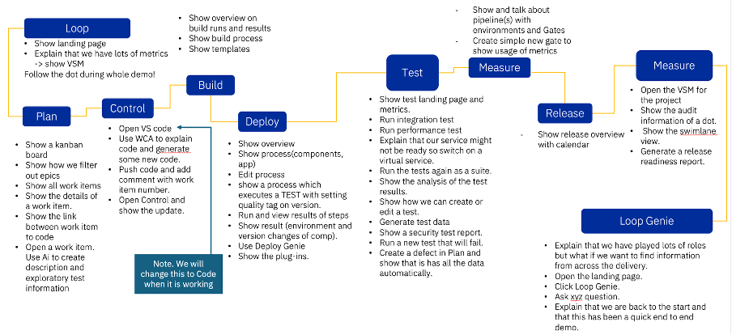

# Demo Flow

## [Loop](introduction/index.md)

| Step | Details                                                                                                       | Additional Information                |
|:----:|:--------------------------------------------------------------------------------------------------------------|:--------------------------------------|
|  1   | After loging in you will be on the [Home Page][LoopHomePage] of Loop                                          | ![Home Page][HomePage]                |
|  2   | If you are not on the Home Page page, click on Home button in the side bar to switch to the Home Page         | ![Home Page Sidebar][HomePageSideBar] |
|  3   | The Home Page provides metrics and dashboards over all of my accessible Loops                                 |                                       |
|  4   | Showing data from Plan - Ratio of Issues created versus closed                                                | ![Plan Metric][PlanMetric]            |
|  5   | Number of Build Jobs failed and successeful finished                                                          | ![Build Metric][BuildMetric]          |
|  6   | Count of Deployments and how many of them were successfull or failed                                          | ![Deploy Metric][DeployMetric]        |
|  7   | Top contributors in Control                                                                                   | ![Control Metric][ControlMetric]      |
|  8   | Two DORA (DevOps Research and Assessment) metrics for                                                         |                                       |
|      | Lead Time: In general, lead-time reflects the time from the start of a project until its final disposition    | ![Lead Time][LeadTime]                |
|      | Cycle Time: In general, cycle-time reflects the time project elements take to resolve or complete             | ![Cycle Time][CycleTime]              |
|      | Find out more about [DORA Metrics here](https://www.ibm.com/docs/en/devops-velocity/5.1.0?topic=metrics-dora) |                                       |

## [Plan](plan/index.md)

### Plan Overview

| Step | Details                                                                                                 | Additional Information                                  |
|:----:|:--------------------------------------------------------------------------------------------------------|:--------------------------------------------------------|
|  1   | [Open Plan][PLANopen]                                                                                   |                                                         |
|      | You can switch to Plan by either pressing "Let's go to Plan" button on its tile                         | ![Plan Tile lets go][PlanTile]                          |
|      | Or you can always switch using the central app switcher on the top left of your screen                  | ![Central App Switcher][AppSwitcher]                    |
|  2   | [Show My board][ShowMyBoard]                                                                            |                                                         |
|      | To open the board use the Project Board icon ![Board Icon in sidebar][ProjectBoardsIcon] on the sidebar | ![sidebar][SidebarBoardIcon]                            |
|      | The initial view is your My Board view which will show worktitems that are assigned to you              | ![myWork Board][MyWorkBoard]                            |
|  3   | [Show how to filter out Epics][HowToFilter]                                                             | ![Board filter][FilterBar]                              |
|  4   | [Show all work items][WorkItems]                                                                        | ![Board workitems][ProjectBoardWorkItems]               |
|  5   | [Select and Show the details of a work item][SelectWorkItem]                                            | ![Select WorkItem from Board][BoardSelectWorkItem]      |
|      |                                                                                                         | ![Show Workitem Details][BoardShowWorkItemDetail]       |
|  6   | [Show the link between work item to code and explain how easy it is to have traceability][ShowCommit]   |                                                         |
|      |                                                                                                         | ![PLAN - Show Control/Git Commit Link][PlanShowCommit]  |
|      |                                                                                                         | ![CONTROL - Show Git Commit Details][ControlShowCommit] |

### Use Plan AI Assistant

| Step | Details                                                                                    | Additional Information                                     |
|:----:|:-------------------------------------------------------------------------------------------|:-----------------------------------------------------------|
|  1   | [Use the AI Assistant][PlanAI]                                                             |                                                            |
|  2   | Select the AI Assistant Icon ![AI Assistant Icon][PlanAIIcon] from the Sidebar             | ![Sidebar][PlanSidebar]                                    |
|  3   | Accept the Terms of Service                                                                | ![Accept Terms][AcceptTerms]                               |
|  4   | [The AI Assistant Chat Dialog opens][AIChatDialog]                                         | ![AI Assistant Dialog][AIAssistantDialog]                  |
|  5   | Enter Now a prompt, you can use the example prompts or use the following one:              | ![Enter Prompt][AIEnterPrompt]                             |
|      | Provide the necessary steps to implement a Keycloak solution in our enterprise application |                                                            |
|  6   | Click on the **Next** Button to proceed                                                    | ![Next Button][AINextButton]                               |
|  7   | [The Applying Prompts page is shown with several types][AIPagewithPrompttypes]             | ![Applying Prompts][AIApplyingPromptsType]                 |
|  8   | Select **Generate Action Items** (click into the circle with the check mark)               | ![Generate Action Items][AIGenerateActionItems]            |
|  9   | This will generate a set of responses                                                      | ![AI Responses][AIResponses]                               |
|  10  | Click the **Select** Button and select **Break Down into Titles**                          | ![Select Button][AISelectButtonBreakDownintoTitles]        |
|  11  | This will convert the list of responses to a list with checkboxes                          | ![AI Responses with Checkboxes][AIResponsesWithCheckboxes] |
|  12  | Select a few you like from the list                                                        | ![AI Responses selected][AISelectedResponses]              |
|  14  | [Create Records from Responses][PlanAICreateRecords]                                       |                                                            |
|  15  | Click the **Select Record Type** Button                                                    | ![Select Record Type][AISelectRecordTypeButton]            |
|  16  | to select **Workitem** from the list                                                       | ![Select Workitem][AISelectWorkitemRecordtype]             |
|  17  | In the next Dialog  select the right **Project** and **Workitem Type**                     | ![Record Creation Dialog1][AIRecordCreationDialogEmpty]    |
|  18  | for example **Project**: Echologic and **Type**: Epic                                      | ![Record Creation Dialog2][AIRecordCreationDialogFilled]   |
|  19  | Press the **Create Records** Button to get the **Epics** created.                          | ![Create Records Button][AICreateRecordsButton]            |
|  20  | A few seconds later all newly created records are now created                              | ![Newly created Records][AINewlyCreatedRecords]            |
|  21  | Press **Done**  to finish using the AI Assistant                                           | ![Done Button][AIDoneButton]                               |

<!-- [Open a workitem and use AI to create description and exploratory test information](plan/boards/index.md#use-ai-in-workitem) -->

## [Code](code/index.md)

| Step | Details                                                                     | Additional Information                             |
|:----:|:----------------------------------------------------------------------------|:---------------------------------------------------|
|  1   | Explain that we showed the link between a work item and the code in control |                                                    |
|  2   | [Now open CODE][CODEopen]                                                   | ( use VScode for now, Switch to DevOps Code later) |
|  3   | [Use WCA to explain code and generate some new code][CODEWcaX]              | ![Explain code part 1][WcaXexplain1]               |
|      |                                                                             | ![Explain code part 2][WcaXexplain2]               |
|  4   | [Push code and add comment with work item number][CODEcommitWI]             | ![Commit Code with WI][CodeWithWIcommit]           |
|  5   | [Open Control and show the update](#control)                                |                                                    |

## [Control](control/index.md)

| Step | Details                                                                       | Additional Information                                  |
|:----:|:------------------------------------------------------------------------------|:--------------------------------------------------------|
|  1   | [Open Control][ControlOPEN]                                                   |                                                         |
|  2   | [Show the Update][ControlShowUpdate] in the activity report of the repository | ![Show Last Commit][ControlShowLastCommit]              |
|  3   | Git Commit Details                                                            | ![CONTROL - Show Git Commit Details][ControlShowCommit] |

## [Build](build/index.md)

| Step | Details                                                             | Additional Information                                             |
|:----:|:--------------------------------------------------------------------|:-------------------------------------------------------------------|
|      | [Open Build][BuildOpen]                                             |                                                                    |
|      | [Show overview on build runs and results][BuildOverviewRunsResults] | ![Project Build Runs and Results][BuildProjectRunsResults]         |
|      | [Show build process][BuildShowBuildProcess]                         | ![Build Process Detail][BuildProcessDetail]                        |
|      | [Show Templates][BuildShowTemplates]                                | ![Templates - Process][BuildProcessTemplates]                      |
|      | [Show Build Template Detail][BuildShowTemplateDetail]               | ![Templates - Process Details][BuildProcessTemplatesDetail]        |
|      | [Show Build Template Definition][BuildShowTemplateDefinition]       | ![Templates - Process Definition][BuildProcessTemplatesDefinition] |
|      |                                                                     |                                                                    |

## [Deploy](deploy/index.md)

### Deploy Overview

| Step | Details                                                                                                    | Additional Information                                                                   |
|:----:|:-----------------------------------------------------------------------------------------------------------|:-----------------------------------------------------------------------------------------|
|  1   | [Open Deploy][DeployOpen] by [Using the ‘What would you like to do today’ and select Deploy][DeployWWYLTT] | ![What would you like to do today?][WhatWouldYouLikeToDoToday]                           |
|  2   | [Show the landing page and explain the metrics][DeployShowLandingPage]                                     | [DeployLandingPage][DeployDashboard]                                                     |
|  3   | [Show process (components, app)][DeployShowProcesses]                                                      |                                                                                          |
|  4   | Component Process                                                                                          | ![component processes][DeployComponentWithProcesses]                                     |
|  5   | You can either create a [new process][DeployShowProcessDesigner] by pressing Create Process Button         | ![Create new Process Button][DeployComponentCreateNewProcessButton]                      |
|  6   | - It will show you the process designer for a new process                                                  | ![Process Designer][DeployProcessDesigner]                                               |
|  7   | Or click on existing Process to view and edit the given Process                                            | ![select one of the processes][DeployComponentProcessesList]                             |
|  8   | - [show a process which executes a TEST with setting quality tag on version][DeployShowProcessWithTest]    |                                                                                          |
|  9   | -- Deploy with Test Passed                                                                                 | ![Process Designer - Final Process with passed Test][DeployComponentProcessPassingTest]  |
|  10  | -- Deploy with Test Failed                                                                                 | ![Process Designer - Final Process with failing Test][DeployComponentProcessFailingTest] |

### Run a Deplyoment

| Step | Details                                                                                                             | Additional Information                                                                        |
|:----:|:--------------------------------------------------------------------------------------------------------------------|:----------------------------------------------------------------------------------------------|
|  1   | [Run a Process and view results of steps][DeployRunaDeployment]                                                     |                                                                                               |
|  2   | Open the Applicationslist by clicking on Applications Icon                                                          | ![Deploy Applications Button on Sidebar][DeploySidebarAppIcon]                                |
|  3   | Select your Application by clicking on the link in the Applications List                                            | ![Deploy Application][DeployShowApp]                                                          |
|  4   | All Environments of Application will be shown                                                                       | ![Deploy Application Environment List][DeployAppEnvList]                                      |
|  5   | [Run a Deployment in an Environment][DeployRequestAprocess]                                                         |                                                                                               |
|  6   | On the DEV environment click on Request Process Button: ![Request Button][DeployAppRequestProcessButton]            | ![Dev Environment][DeployAppDevEnv]                                                           |
|  7   | Select **Deploy with Test Passed**                                                                                  | ![Run Process Dialog - Select Deployment Process][DeployAppProcessRequestSelectProcess]       |
|  8   | Uncheck **Deploy Only Changed** to deploy same versions again                                                       | ![Run Process Dialog - uncheck Deploy Only Changed][DeployAppProcessRequestOnlyChanged]       |
|  9   | click on **Choose Component Versions** button                                                                       | ![Run Process Dialog - Choose Versions Button][DeployAppPocessRequestChooseCompVersionButton] |
|  10  | Select the Versions of the Components for deployment                                                                |                                                                                               |
|  11  |                                                                                                                     | ![Run Process Dialog - Select Component Version 1][DeployAppPocessRequestSelectCompVersion1]  |
|  12  |                                                                                                                     | ![Run Process Dialog - Select Component Version 2][DeployAppPocessRequestSelectCompVersion2]  |
|  13  | Press the Submit button to start the deployment process                                                             | ![Submit Button][DeployAppPocessRequestSubmitButton]                                          |
|  14  | The Deployment Process is started and you can [View the running Process][DeployViewRunningProcess]                  | ![Running Process][DeployProcessRunning]                                                      |
|  15  | In this View the details of the executed steps are shown by clicking on **Expand All**                              | ![Expand All][DeployProcessRunningExpandAllButton]                                            |
|  16  | To view the detailed output of a step click on **3 dots menue** of the step                                         | ![3 dots menue of step][DeployProcessRunning3DotsofStep]                                      |
|  17  | View the output of the step                                                                                         | ![Output of Step][DeployProcessRunningStepOutputDetails]                                      |
|  18  | When the deplyoment finishes the [Result][DeployResultofRun] will be shown                                          |                                                                                               |
|  19  | The deployment run successfully                                                                                     | ![Deployment Success][DeployAppProcessRunSuccess]                                             |
|  20  | [Show Environment and its new configuration][DeployResultofRun]                                                     |                                                                                               |
|  21  | Switch to the Environment View of the Application and view the updated configuration                                | ![Environment with deployed versions of components][DeployAppEnvwithDeployedVersions]         |
|  22  | By clicking on the Component **Echo** in this view the set Status in the Versionlist of the component will be shown | ![Status added to version][DeployComponentFinalProcesWithVersionStatus]                       |

### Use the Deployment Genie

| Step | Details                                                  | Additional Information                                               |
|:----:|:---------------------------------------------------------|:---------------------------------------------------------------------|
|      | Use Deploy Genie to understand why the deployment failed | TODO: update as soon as connected to openai to showcase Deploy Genie |
|      |                                                          |                                                                      |
|      |                                                          |                                                                      |
|      |                                                          |                                                                      |

### Show the Plug-Ins Page

| Step | Details                                                                                                                                     | Additional Information                                               |
|:----:|:--------------------------------------------------------------------------------------------------------------------------------------------|:---------------------------------------------------------------------|
|  1   | [Show the plug-ins page and explain how easy it is to integrate with 3rd parties out of the box][DeployShowPluginsPage]                     |                                                                      |
|  2   | Switch to Settings by using the Settings Icon                                                                                               | ![Deploy Settings Icon][DeploySettingsIcon]                          |
|  3   | In the Settings View there is a [Section Automation to View installed and available Plugins][DeploySettingsAutomationSection]               | ![Automation Plugins][DeploySettingsAutomationPlugins]               |
|  4   | By clicking on **Available Plugins** a list of all available Plug-Ins is shown                                                              | ![Plugin List][DeploySettingsPluginsList]                            |
|  5   | [Install a new Plugin][DeployShowHowToInstallPlugin] by clicking on the **3 Dots Menue** [3 dots menue][DeployPlugin3DotsMenue] of a Plugin | ![Install plugin][DeployInstallPlugin]                               |
|  6   | An Installation Confirmation Dialog will pop up, click here on **Confirm** to proceed                                                       | ![Plugin Installation Confirmation][DeployInstallPluginConfirmation] |
|  7   | Installation is Successfull Notification                                                                                                    | ![Plugin Installation Successfull][DeployPluginInstallSuccess]       |

## [Test](test/index.md)

| Step | Details                                                                 | Additional Information |
|:----:|:------------------------------------------------------------------------|:-----------------------|
|  1   | [Open Test][TestOpen]                                                   |                        |
|      | Explain that you are now playing the role of a tester                   |                        |
|      | Show the test landing page and metrics                                  |                        |
|      | Run a test                                                              |                        |
|      | Show the analysis of the test results                                   |                        |
|      | Show how we can create or edit a test                                   |                        |
|      | Generate test data                                                      |                        |
|      | Run a new test that will fail                                           |                        |
|      | Create a defect in Plan and show that is has all the data automatically |                        |
|      | Explain that everything is traceabl                                     |                        |

## [Measure](measure/index.md)

| Step | Details                                                                                                                  | Additional Information |
|:----:|:-------------------------------------------------------------------------------------------------------------------------|:-----------------------|
|  1   | [Open Measure][MeasureOpen]                                                                                              |                        |
|      | Explain that we have built, deployed and tested so now we need to coordinate releases                                    |                        |
|      | Show and talk about pipeline(s) with environments and Gates                                                              |                        |
|      | Create simple new gate to show usage of metrics                                                                          |                        |
|      | Explain that we have been shoeing individual roles but we can look across roles and track the value of our delivery work |                        |
|      | Open the VSM for the project                                                                                             |                        |
|      | Show the audit information of a dot                                                                                      |                        |
|      | Show the swimlane view.                                                                                                  |                        |

## [Release](release/index.md)

| Step | Details                                                                                                                                    | Additional Information                      |
|:----:|:-------------------------------------------------------------------------------------------------------------------------------------------|:--------------------------------------------|
|  1   | [Open Release][ReleaseOpen]                                                                                                                |                                             |
|      | You can switch to Release by either pressing "Let's go to Release" button on its tile                                                      | ![Release Tile lets go][ReleaseTile]        |
|      | Or you can always switch using the central app switcher on the top left of your screen:                                                    | ![Central App Switcher][CentralAppSwitcher] |
|      | Show release overview with calendar                                                                                                        |                                             |
|      | So how do we ensure everyone understands the state of our project.  Well we can generate a release readiness report. – Generate the report |                                             |

## Genie

Explain that we have covered a lot of roles and used a mixture of AI and automation but we can bring it all together with what we call our Loop Genie

| Step | Details                                                                    | Additional Information                                 |
|:----:|:---------------------------------------------------------------------------|:-------------------------------------------------------|
|      | [How to use Loop Genie](introduction/index.md#how-to-use-loop-genie)       |                                                        |
|      | [Open Home Page][HomePage]                                                 |                                                        |
|      | Open Loop Genie by clicking on its Icon on the right side of the Dashboard | ![Loop Genie Icon on Home Page][LoopHomeLoopGenieIcon] |
|      | Loop Genie Dialog opens                                                    | ![Loop Genie Dialog][LoopGenieDialog]                  |
|      | Ask xyz question.                                                          |                                                        |
|      |                                                                            |                                                        |
|      |                                                                            |                                                        |
|      |                                                                            |                                                        |
|      |                                                                            |                                                        |
|      |                                                                            |                                                        |

Explain that we are back to the start and that this has been a quick end to end demo

## Conclusio

If you want to talk more about Loop please have a look at the [About Box, Sidebar and Plug-Ins](intro/index.md) introduction.

Go back to [Lab and Demo Overview][GoBackToDemoOverview]

---

[LoopHomeLoopGenieIcon]: introduction/intro/media/LOOP_HomePage_LoopGenieButton.png
[LoopGenieDialog]: introduction/intro/media/LOOP_HomePage_LoopGenieDialog.png
[GoBackToDemoOverview]: index.md#introduction

[HomePage]: introduction/media/Loop_Home_Page.png
[HomePageSideBar]: introduction/media/Loop_Home_Page_SideBar.png
[PlanMetric]: introduction/media/LoopHome_Plan_metrics.png
[BuildMetric]: introduction/media/LoopHome_Build_Metrics.png
[DeployMetric]: introduction/media/LoopHome_Deploy_Metrics.png
[ControlMetric]: introduction/media/LoopHome_Control_metrics.png
[LeadTime]: introduction/media/LoopHome_LeadTime.png
[CycleTime]: introduction/media/LoopHome_CycleTime.png
[PLANopen]: plan/index.md#how-to-switch-to-plan-from-home-page
[PlanTile]: introduction/media/Loop_switch_to_Plan.png
[AppSwitcher]: introduction/media/Loop_central_app_control.png
[ShowMyBoard]: plan/boards/index.md#project-board
[MyWorkBoard]: plan/boards/media/Plan_ProjectBoard_myBoard.png
[ProjectBoardsIcon]: plan/boards/media/Plan_ProjectBoard_Icon.png
[SidebarBoardIcon]: plan/media/Plan_Sidebar_ProjectBoards.png
[HowToFilter]: plan/boards/index.md#filter-epics
[FilterBar]: plan/boards/media/Plan_ProjectBoard_Filterbar.png
[WorkItems]: plan/boards/index.md#work-items
[ProjectBoardWorkItems]: plan/boards/media/Plan_ProjectBoard_WorkItems.png
[SelectWorkItem]: plan/boards/index.md#select-workitem
[BoardSelectWorkItem]: plan/boards/media/PLAN_Boards_SelectWI.png
[BoardShowWorkItemDetail]: plan/boards/media/PLAN_Board_ShowWI_Detail.png
[ShowCommit]: plan/boards/index.md#show-commit
[PlanShowCommit]: plan/media/PLAN_Show_GitCommit.png
[ControlShowCommit]: control/media/CONTROL_ShowGitCommit.png
[PlanAI]: plan/index.md#ai-assistant
[PlanAIIcon]: plan/media/PLAN_AI_assistant_Icon.png
[PlanSidebar]: plan/media/PLAN_Sidebar.png
[AcceptTerms]: plan/media/PLAN_AI_accept_Terms.png
[AIAssistantDialog]: plan/media/PLAN_AI_Dialog1.png
[AIEnterPrompt]: plan/media/PLAN_AI_enter_prompt.png
[AINextButton]: plan/media/PLAN_AI_NextButton.png
[AIGenerateActionItems]: plan/media/PLAN_AI_Generate_Action_Items.png
[AIApplyingPromptsType]: plan/media/PLAN_AI_UserInputType.png
[AIResponses]: plan/media/PLAN_AI_to_create_Items.png
[AISelectButtonBreakDownintoTitles]: plan/media/PLAN_AI_SelectButton_List.png
[AIResponsesWithCheckboxes]: plan/media/PLAN_AI_select_items.png
[AISelectedResponses]: plan/media/PLAN_AI_select_items2.png
[AISelectRecordTypeButton]: plan/media/PLAN_AI_select_record_type.png
[AISelectWorkitemRecordtype]: plan/media/PLAN_AI_recordtype_workitem.png
[AIRecordCreationDialogEmpty]: plan/media/PLAN_AI_recordtype_Dialog1.png
[AIRecordCreationDialogFilled]: plan/media/PLAN_AI_recordtype_Dialog2.png
[AICreateRecordsButton]: plan/media/PLAN_AI_create_records_button.png
[AINewlyCreatedRecords]: plan/media/PLAN_AI_records_created.png
[AIDoneButton]: plan/media/PLAN_AI_done.png
[AIChatDialog]: plan/index.md#ai-assistant-chat-dialog
[AIPagewithPrompttypes]: plan/index.md#ai-assistant-type-of-output
[PlanAICreateRecords]: plan/index.md#ai-assistant-create-records-from-responses
[CODEopen]: code/index.md#how-to-switch-to-code-from-home-page
[CODEWcaX]: code/index.md#watsonx-code-assistant
[WcaXexplain1]: code/media/CODE_WCAx_Explain1.png
[WcaXexplain2]: code/media/CODE_WCAx_Explain2.png
[CODEcommitWI]: code/index.md#commit-code-with-wi
[CodeWithWIcommit]: code/media/CODE_CommitWithWI.png
[ControlOPEN]: control/index.md#how-to-switch-to-control-from-home-page
[ControlShowUpdate]: control/index.md#show-activity-report
[ControlShowLastCommit]: control/media/CONTROL_ShowLastCommit.png
[BuildProcessDetail]: build/media/BUILD_Process_Runs_Details.png
[BuildProcessTemplates]: build/media/BUILD_Template_Process.png
[BuildShowBuildProcess]: build/index.md#build-process-detail
[BuildOpen]: build/index.md#how-to-switch-to-build-from-home-page
[BuildOverviewRunsResults]: build/index.md#build-project-runs
[BuildProjectRunsResults]: build/media/BUILD_Process_Runs_results.png
[BuildProcessTemplatesDetail]: build/media/BUILD_Templates_Process_Detail.png
[BuildProcessTemplatesDefinition]: build/media/BUILD_Templates_Process_Def.png
[BuildShowTemplates]: build/index.md#templates
[BuildShowTemplateDetail]: build/index.md#process-template-detail
[BuildShowTemplateDefinition]: build/index.md#media/BUILD_Templates_Process_Def.png

[DeployOpen]: deploy/index.md#how-to-switch-to-deploy-from-home-page
[DeployWWYLTT]: deploy/index.md#what-would-you-like-to-do-today
[WhatWouldYouLikeToDoToday]: introduction/media/Loop_whatwouldyouliketodotoday.png
[DeployShowLandingPage]: deploy/index.md#deploy-landing-page
[DeployDashboard]: deploy/media/dashboard.png
[DeployShowProcesses]: deploy/index.md#processes
[DeployComponentWithProcesses]: deploy/media/DEPLOY_Component_Processlist_withentries.png
[DeployShowProcessDesigner]: deploy/index.md#process-designer
[DeployProcessDesigner]: deploy/media/DEPLOY_Component_ProcessEditor.png
[DeployShowProcessWithTest]: deploy/index.md#adding-version-statuses
[DeployComponentProcessPassingTest]: deploy/media/DEPLOY_ComponentProcessFinalWithPassingTest.png
[DeployComponentProcessFailingTest]: deploy/media/DEPLOY_ComponentProcessFinalWithFailingTest.png
[DeployComponentFinalProcesWithVersionStatus]: deploy/media/DEPLOY_Component_VersionList_withStatus.png
[DeployComponentProcessesList]: deploy/media/DEPLOY_Component_WithProcesslist.png
[DeployComponentCreateNewProcessButton]: deploy/media/DEPLOY_Component_CreateProcessButton.png
[DeployShowApp]: deploy/media/DEPLOY_ApplicationList_ShowEcologic.png
[DeploySidebarAppIcon]: deploy/media/DEPLOY_ApplicationsButton.png
[DeployAppEnvList]: deploy/media/DEPLOY_Application_Environmentlist.png
[DeployAppRequestProcessButton]: deploy/media/DEPLOY_Application_RequestProcess.png
[DeployAppProcessRequestSelectProcess]: deploy/media/DEPLOY_Application_Runappprocessdialog1_SelectDeploymentProcess.png
[DeployAppProcessRequestOnlyChanged]: deploy/media/DEPLOY_Application_Runappprocessdialog3_OnlyChanged.png
[DeployAppPocessRequestChooseCompVersionButton]: deploy/media/DEPLOY_Application_Runappprocessdialog4_ChooseCompVersionButton.png
[DeployAppPocessRequestSelectCompVersion1]: deploy/media/DEPLOY_Application_Runappprocessdialog5_SelectCompVersion.png
[DeployAppPocessRequestSelectCompVersion2]: deploy/media/DEPLOY_Application_Runappprocessdialog6_SelectCompVersion.png
[DeployAppPocessRequestSubmitButton]: deploy/media/DEPLOY_Application_Runappprocessdialog7_Submit.png
[DeployRunaDeployment]: deploy/index.md#run-a-deployment
[DeployRequestAprocess]: deploy/index.md#request-a-process
[DeployAppDevEnv]: deploy/media/DEPLOY_AppEnv_DEV.png
[DeployProcessRunning]: deploy/media/DEPLOY_RunningProcess1.png
[DeployProcessRunningExpandAllButton]: deploy/media/DEPLOY_RunningProcess2_ExpandAll.png
[DeployProcessRunning3DotsofStep]: deploy/media/DEPLOY_RunningProcess3_Stepdetails.png
[DeployProcessRunningStepOutputDetails]: deploy/media/DEPLOY_RunningProcess4_StepDetails.png
[DeployViewRunningProcess]: deploy/index.md#view-of-running-process
[DeployAppProcessRunSuccess]: deploy/media/DEPLOY_AppProcessFinishedSuccess.png
[DeployAppEnvwithDeployedVersions]: deploy/media/DEPLOY_Application_EnvironmentResultVersions.png
[DeployResultofRun]: deploy/index.md#result-of-run
[DeployShowPluginsPage]: deploy/index.md#settings
[DeploySettingsIcon]: deploy/media/DEPLOY_SettingsIcon.png
[DeploySettingsAutomationPlugins]: deploy/media/DEPLOY_Settings_AutomationSection.png
[DeploySettingsPluginsList]: deploy/media/DEPLOY_PluginsList.png
[DeploySettingsAutomationSection]: deploy/index.md#plugins
[DeployInstallPlugin]: media/DEPLOY_Plugins_Install.png
[DeployPlugin3DotsMenue]: media/DEPLOY_PluginList_3DotsMenue.png
[DeployShowHowToInstallPlugin]: deploy/index.md#how-to-install-a-plugin
[DeployInstallPluginConfirmation]: deploy/media/DEPLOY_PluginInstallConfirmation.png
[DeployPluginInstallSuccess]: deploy/media/DEPLOY_PluginInstallSuccess.png
[TestOpen]: test/index.md#how-to-switch-to-test-from-home-page
[MeasureOpen]: measure/index.md#how-to-switch-to-measure-from-home-page
[ReleaseOpen]: measure/index.md#how-to-switch-to-measure-from-home-page
[ReleaseTile]: ../introduction/media/Loop_switch_to_Release.png
[CentralAppSwitcher]: ../introduction/media/Loop_central_app_control.png
[LoopHomePage]: introduction/index.md#the-home-page
