# Deploy Lab

TODO: Flow needs complete rewrite and new screenshots
_**TODO: update flow, app references from PIZZA to EchoLogic and screenshots**_

## Overview

This lab provides a practical, hands-on experience in deploying an application to a target server.

Explore the comprehensive dashboard provided by DevOps Deploy, which displays key information about deployment successes and failures

### How to switch to Deploy from Home Page

#### Lets go

You can switch to Deploy by either pressing "Let's go to Deploy" button on its tile:

![Deploy Tile lets go][DeployTile]

#### What would you like to do today?

You can switch directly to Deploy by using the button/link from What would you like to do today section:

![What would you like to do today?][WhatWouldYouLikeToDoToday]

#### Central App Switcher

Or you can always switch using the central app switcher on the top left of your screen:

![Central App Switcher][CentralAppSwitcher]

### Deploy Landing Page

   ![Deploy Dashboard Page][DeployDashboard]
<!-- 
### Note

1. Agent-Based Installation Support: DevOps Deploy works on agent-based deployments, allowing you to deploy applications across various environments—including On-Premises, IBM Cloud, Microsoft Azure, AWS, Google Cloud Platform (GCP), Mainframes, and more.
2. Demo Environment: In this demonstration, the deployment agent is running on IBM Cloud. Therefore, the application will be deployed to an IBM Cloud environment.

## Configuration

DevOps Deploy is a rich tool and provides excellent mechanisms to control the deployment of application. A simple architecture is
Application > Environment(DEV, QA, PROD, etc.) > Components

  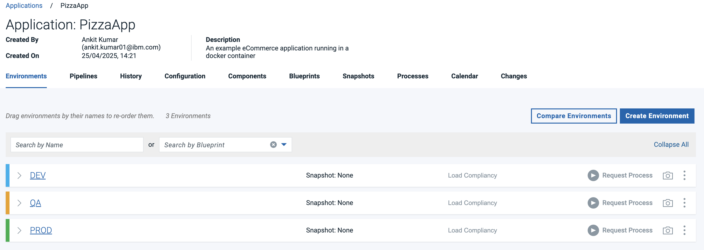

 **_Important Note: This is a shared lab environment. To ensure a smooth experience for everyone, please only modify the applications, components, or processes that you create during your lab session. Kindly avoid making changes to any existing applications or configurations visible in DevOps Deploy, as they may be in use by others_**

In order to deploy application, please download the [Application file](../../files/PizzaApp.json) directly (if you are using the repo localy) or from [GitHub Link](https://github.com/DevOpsAutomationLabs/End2End/blob/main/files/PizzaApp.json) (if you are using the web) open it on your preferred editor, and update the following in the file.

1. Search for `"name": "PizzaApp-01"` and replace it with your student code (xx appended to your email id. eg., `"name": "PizzaApp-02"`)
2. Search all the occurances for `PizzaApp-Container-01` and replace it with your student code (xx appended to your email id. eg., `PizzaApp-Container-02`)
3. Search for `"commandOptions": "-d -p 3001:8000"` and replace the `3002` with your student code (30xx appended with to email id. eg., `"commandOptions": "-d -p 3002:8000"`) . Troubleshooting: If you see any issue, try to update the port like 3016,3017, etc...
4. Save the file.

## Upload this to DevOps Deploy

Go to DevOps Deploy > Applications > Import Application > (Scroll down) Choose File > Select your updated file > Submit

  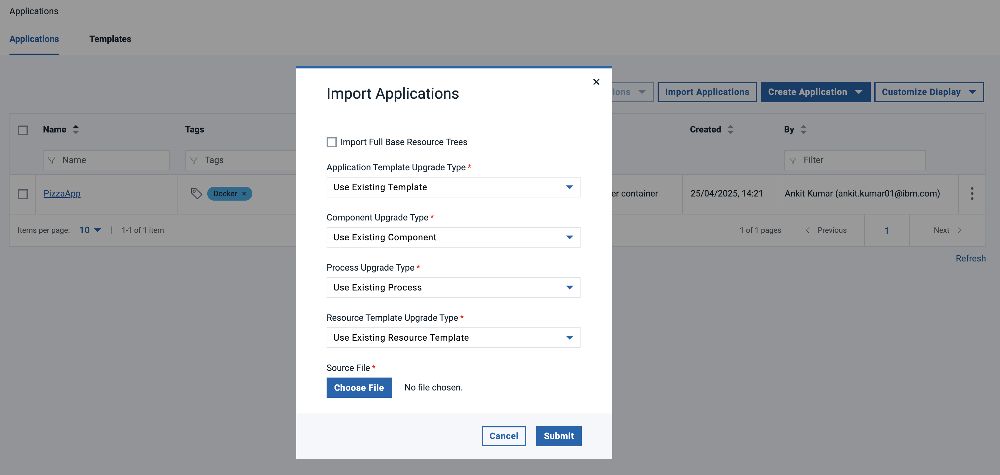

Once you import the application, you would be able to see additional application listes like:

  

Now, Click on your application(PizzaApp-XX) > Switch Tab to Components > Click on PizzaApp-Container-XX > Switch tab to Process > Click on "Deploy PizzaApp"
 -->

## Components

TODO: talk about components

![List of components][DeployComponentList]

### Create New Component

- Press Create new Component Button: ![Component - Create new][DeployComponentCreateNew]
- ![Component - Create Dialog 1][DeployComponentCreateNewDialog1]
- ![Component - Create Dialog 2][DeployComponentCreateNewDialog2]
- ![Component - Create Dialog 3][DeployComponentCreateNewDialog3]
- ![Component - Create Dialog 4][DeployComponentCreateNewDialog4]
- Component successful created, first view is the Versions view
- ![Component - Newly Created Comp first view versions ][DeployComponentNewVersionView]
- have a look at the Components configuration, you can change it here if needed
- ![Component - Newly Created Comp configuraiton view][DeployComponentNewConfigurationView]
- have a look at the processes of the component
- ![Component - Newly Created Comp Processes view][DeployComponentNewProcessesView]

## Processes

TODO: talk about processes

### Types of Processes

#### Generic Processes

TODO: talk about generic processes and for what they are good for

#### Application Processes

TODO: talk about app processes and what is the diff to other

#### Component Processes

TODO: talk about component processes and what is it good fore

A freshly created component does not have any processes:

![component processes][DeployComponentProcessesListEmpty]

Every Component needs at least one (1) process. To create one press the Create Process Button ![Create new Process Button][DeployComponentCreateNewProcessButton]

![Component Process - Dialog][DeployComponentCreateProcessDialog]

TODO: talk about process details

### Process Designer

It will show you the process designer for a new process:

![Process Designer][DeployProcessDesigner]

#### Process Designer Sidebar

TODO: talk about sidebar

![Process Designer Sidebar][DeployComponentProcessDesignerSidebar]

Drag Drop a step onto the canvas.

![Dragged a Step onto the canvas][DeployProcessDesignerAddStepp]

Configure the step:

![Step properties 1][DeployProcessDesignerStepProperties1]
![Step properties 2][DeployProcessDesignerStepProperties2]

In this example the shell step requires to have some script/commands added into the shell script field:

![Shell Script1][DeployProcessDesignerStepShellScript1]
![Shell Script2][DeployProcessDesignerStepShellScript2]

#### Final Process Diagram

![Deploy Process Diagram Application Page][DeployComponentFinalProcess]

#### Adding Version Statuses

![Process Designer - sidebar add version status][DeployProcesDesignerSidebarAddVersionStatus]
![process designer - step added add version status][DeployProcessDesignerAddedVersionStatus]
![process designer - add version status properites][DeployProcessDesignerAddedVersionStatusProperties]

##### Final Process Diagrams (Passing and Failing tests)

![Process Designer - Final Process with passed Test][DeployComponentProcessPassingTest]
![Process Designer - Final Process with failing Test][DeployComponentProcessFailingTest]

Now we have additional deployment processes. One for passing a test and one for failing a test. Both processes will set the appropiate version tag about status of test.

![Component with Deployment Process passing and failing][DeployComponentProcessesList]

Result in the Versionlist of the component:
![Status added to version][DeployComponentFinalProcesWithVersionStatus]

## Applications

TODO: talk about applications

Open the Applicationslist by clicking on Applications Icon: ![Deploy Applications Button on Sidebar][DeploySidebarAppIcon]

## Environments

TODO: talk about environments

## Run a deployment

Select your Application by clicking on the link: ![Deploy Application][DeployShowApp]

All Environments of Application will be shown:
![Deploy Application Environment List][DeployAppEnvList]

### Request a Process

click on Request Process Button: ![Request Button][DeployAppRequestProcessButton] on the DEV Environment ![Dev Environment][DeployAppDevEnv]

Go through dialog:

- ![Run Process Dialog - Select Deployment Process][DeployAppProcessRequestSelectProcess]
- ![Run Process Dialog - Select Select Version Or Snapshot][DeployAppProcessRequestSelectSnapsotOrVersions]
- ![Run Process Dialog - uncheck Deploy Only Changed][DeployAppProcessRequestOnlyChanged]
- ![Run Process Dialog - Choose Versions Button][DeployAppPocessRequestChooseCompVersionButton]
- ![Run Process Dialog - Select Component Version 1][DeployAppPocessRequestSelectCompVersion1]
- ![Run Process Dialog - Select Component Version 2][DeployAppPocessRequestSelectCompVersion2]

Press the Submit button: ![Submit Button][DeployAppPocessRequestSubmitButton] to start the deployment process.

### View of Running Process

The details of the running process are shown:
![Running Process][DeployProcessRunning]

Click on Expand All ![Expand All][DeployProcessRunningExpandAllButton] so see step details

Click on 3 dots menue of a step ![3 dots menue of step][DeployProcessRunning3DotsofStep]
View the output of the step ![Output of Step][DeployProcessRunningStepOutputDetails]

### Result of Run

The deployment run successfully ![Deployment Success][DeployAppProcessRunSuccess]
and updated the configuration of the environment with the deployed component versions:
![Environment with deployed versions of components][DeployAppEnvwithDeployedVersions]

### Create a Snapshot

TODO: talk about snapshots and what they are good for

Select the Create Snapshot Icon: 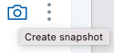

- 
- 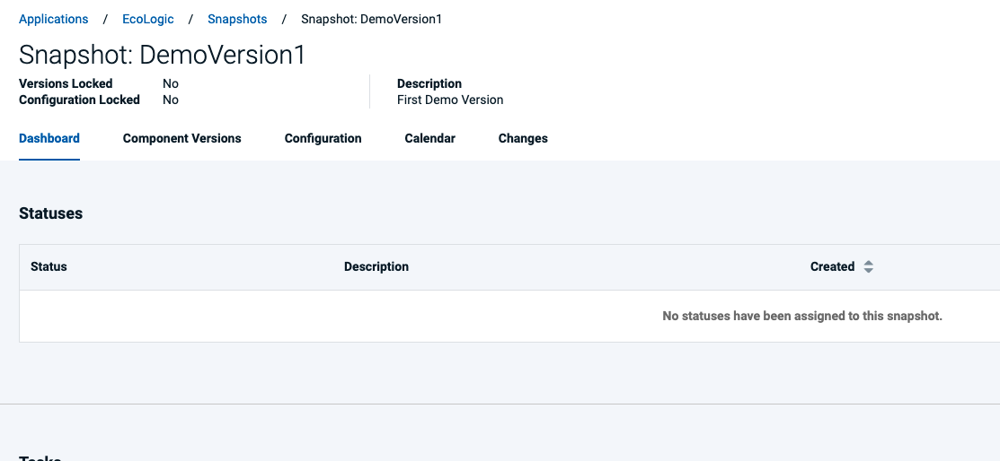
- 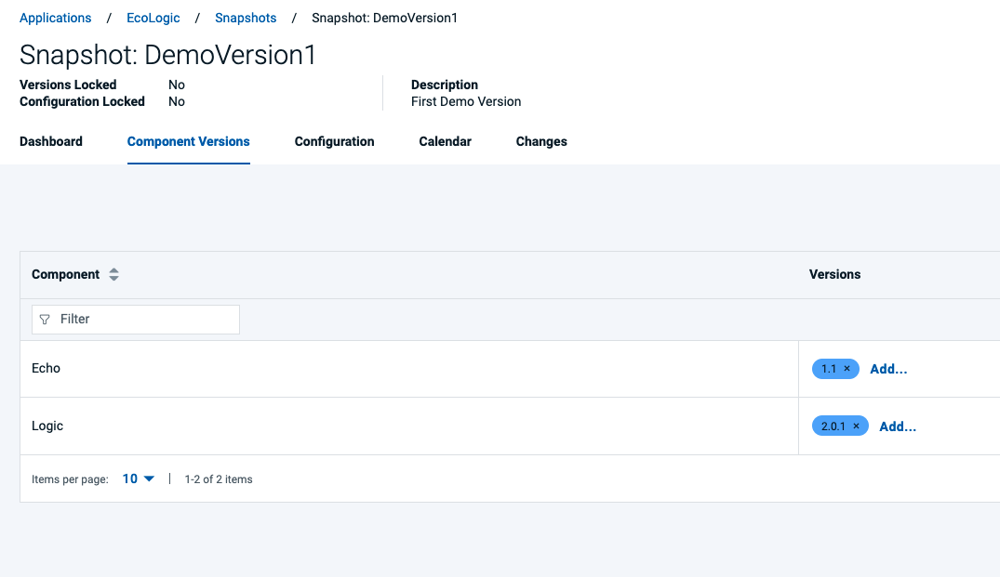

Now the Environment configuration has been updated to indicate that a Snapshot is applied:
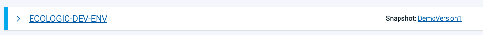

## Settings

Switch to Settings by using the Settings Icon: ![Deploy Settings Icon][DeploySettingsIcon]

### Plugins

Plugins are listed in the Automation Section of the Settings pages.

- ![Automation Plugins][DeploySettingsAutomationPlugins]
- ![Plugin List][DeploySettingsPluginsList]

#### How to install a plugin

click on the [3 dots menue][DeployPlugin3DotsMenue] of the plugin you want to install and select install: ![Install plugin][DeployInstallPlugin]
An Installation Confirmation Dialog will pop up, click here on **Confirm** to proceed ![Plugin Installation Confirmation][DeployInstallPluginConfirmation]
Installation is Successfull Notification ![Plugin Installation Successfull][DeployPluginInstallSuccess]

### How to upgrade a plugin

Same procedure as installing a Plugin. Click on the 3 Dots menue and select **Upgrade**

<!-- 
Now click on edit button available on the individual process:

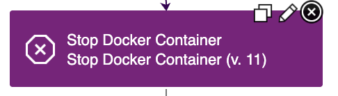

Now click edit on `Stop Docker Container` and change the Docker Container edit field from `pizzaapp` to : pizzaapp-01 (note: 01 should be replaced with you student id) and save it.

Now Edit `Remove Docker Container`: pizzaapp-01 (note: 01 should be replaced with you student id) and save it.

Now edit `Run Pizza App Container` :

 1. Update container name to `pizzaapp-01` (note: 01 should be replaced with you student id) and save it.
  

Now Click on save button on the screen.

## Build image and publish to Deploy

1. Open http://165.192.86.196:8080/
2. Click on New Item and fill `Enter an item name` with : App-01 (01 should be replaced with your student ID as mentioned in your email)
3. Choose `pipeline`, press Ok
4. Copy the content available on: https://github.com/DevOpsAutomationLabs/End2End/blob/main/files/Jenkins
5. Paste it to any editor and update the text as below:
     1. Search for `COMPONENT = "PizzaApp-Container-XX"` and Update XX with your student id. Eg. `COMPONENT = "PizzaApp-Container-02"`
     2. Search for all the occurances of `XX` and replace it with your student id. Eg. `02`
     3. Search for `<YOUR DEVOPS CONTROL EMAIL>"` and replace it with your email id shown in DevOps Control. Eg. `student02-labs.com`
        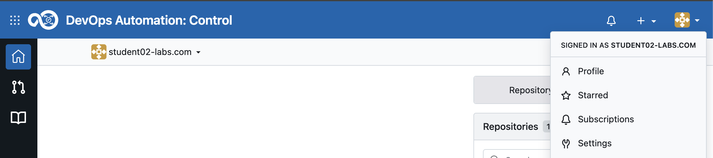

6. Now, switch back to Jenkins, and scroll down and find the pipeline script textbox.
7. Copy the upadted content and Paste the copied text in `pipeline script`
8. Click Save
9. Jenkins Credential Setup (Optional): This has been already configured. So skip it. If you face issue while running jenkins build, then follow the below steps} Go to Jenkins Dashboard → Manage Jenkins → Credentials.
    Choose the right scope (e.g., "Global").
    Click Add Credentials.
    Use these settings:
      * Kind: Username with password
      * Username: your Devops Control email id (Eg. student01-ibm.com)
      * Password: the GitHub token (paste it here) (Note: You can get this by opening `DevOps Control` > Click on `Profile` > `Settings` > On left  panel select `Access token` > Give token name : “labs” > Select all permissions (Read and Write) > `Generate Token` > Copy and paste in the password field in jenkins credentials)
      * ID: github-token-creds-xx (Note: xx is your student id ans should match with pipeline script)

10. Click `Build Now` on Jenkins and wait until the image link is pushed to DevOps Deploy
11. `Troubleshooting`: If your jenkins build fails, check if your control has the repository cloned or not. It is important to clone before you start build.

  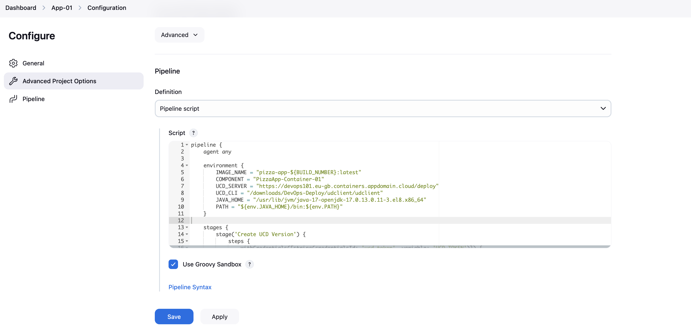

## Update the resource Tree

Do not forget to do this important step once you can successfully run the Jenkins command:

1. Navigate to DevOps Deploy > Find Resources on the left Pane and click on that > `Resource Tree` > Click on `Main` > locate row showing `online` > Click on 3 dots > `Add Component` (your component name. Eg. `PizzaApp-Container-02`)
2. Back to Deploy Dashboard.

  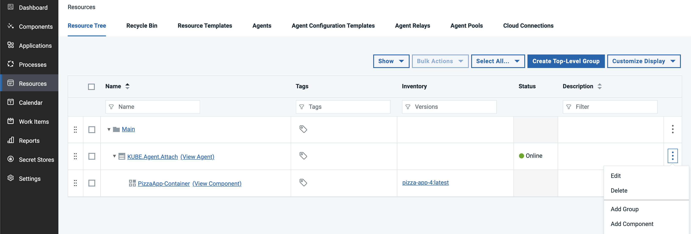

## Final steps for Deployment

1. Click on Application on the left panel
2. Click on your application. Eg. `PizzApp-02`
3. Switch Tab to Processes > Click on `Deploy App`
4. Click on Edit symbol on `install Component Install: "PizzaApp-Container-01"`
5. Under Component section, click the dopdown and Select your component. Eg. `PizzaApp-Container-02`
6. Click Ok and then Click Save.
7. Click on Application on the left panel again.
8. Click on your application. Eg. `PizzApp-02`
9. Locate DEV  > Request Process > Click `"Request Process"`
10. Click `"Choose Component Version"`
   
11. A right panel will open, click on `Add` , the drop-down`"By Version Lookup"` Select the first available
12. Click on Submit
13. Expand the process and check the deployment process. Note: You might see failure in `Stop Docker Container` and `Remove Docker Container` those are fine as you are running this process for the first time and you don't have after we have the running container.
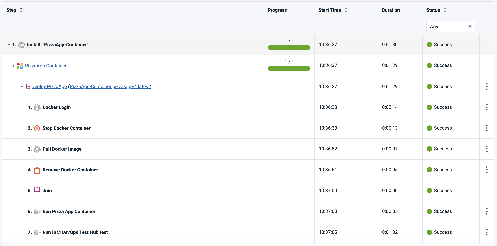
14. Check your running application at: http://165.192.86.196:30XX (Note: XX should be relaced with your student id)
 -->

[DeployTile]: ../introduction/media/Loop_switch_to_Deploy.png
[WhatWouldYouLikeToDoToday]: ../introduction/media/Loop_whatwouldyouliketodotoday.png
[CentralAppSwitcher]: ../introduction/media/Loop_central_app_control.png
[DeployDashboard]: media/dashboard.png
[DeployComponentList]: media/DEPLOY_Components_List.png
[DeployComponentCreateNew]: media/DEPLOY_Components_CreateComponentButton.png
[DeployComponentCreateNewDialog1]: media/DEPLOY_Components_CreateDialog1.png
[DeployComponentCreateNewDialog2]: media/DEPLOY_Components_CreateDialog2.png
[DeployComponentCreateNewDialog3]: media/DEPLOY_Components_CreateDialog3.png
[DeployComponentCreateNewDialog4]: media/DEPLOY_Components_CreateDialog4.png
[DeployComponentNewVersionView]: media/DEPLOY_Components_NewCreatedComponentVersion.png
[DeployComponentNewConfigurationView]: media/DEPLOY_Components_NewCreatedComponentConfig.png
[DeployComponentNewProcessesView]: media/DEPLOY_Components_NewCreatedComponentProcesses.png
[DeployProcessDesigner]: media/DEPLOY_Component_ProcessEditor.png
[DeployComponentProcessDesignerSidebar]: media/DEPLOY_Component_ProcessEditor_Sidebar.png
[DeployProcessDesignerAddStepp]: media/DEPLOY_Component_Process_AddStep.png
[DeployProcessDesignerStepProperties1]: media/DEPLOY_Component_Process_Step_Properties1.png
[DeployProcessDesignerStepProperties2]: media/DEPLOY_Component_Process_Step_Properties2.png
[DeployComponentProcessesListEmpty]: media/DEPLOY_Component_Processlist.png
[DeployComponentProcessesList]: media/DEPLOY_Component_WithProcesslist.png
[DeployComponentCreateNewProcessButton]: media/DEPLOY_Component_CreateProcessButton.png
[DeployComponentCreateProcessDialog]: media/DEPLOY_Component_CreateProcessDialog.png
[DeployProcessDesignerStepShellScript1]: media/DEPLOY_Component_Process_Step_ShellScript1.png
[DeployProcessDesignerStepShellScript2]: media/DEPLOY_Component_Process_Step_ShellScript2.png
[DeployComponentFinalProcess]: media/DEPLOY_Component_Process_Final.png
[DeployProcesDesignerSidebarAddVersionStatus]: media/DEPLOY_Component_ProcessEditor_SidebarAddStatus.png
[DeployProcessDesignerAddedVersionStatus]: media/DEPLOY_Component_ProcessEditor_StepAdded_AddStatus.png
[DeployProcessDesignerAddedVersionStatusProperties]: media/DEPLOY_Component_Process_Step_AddStatusProperties.png
[DeployComponentFinalProcesWithVersionStatus]: media/DEPLOY_Component_VersionList_withStatus.png
[DeploySidebarAppIcon]: media/DEPLOY_ApplicationsButton.png
[DeployShowApp]: media/DEPLOY_ApplicationList_ShowEcologic.png
[DeployAppEnvList]: media/DEPLOY_Application_Environmentlist.png
[DeployAppRequestProcessButton]: media/DEPLOY_Application_RequestProcess.png
[DeployAppProcessRequestSelectProcess]: media/DEPLOY_Application_Runappprocessdialog1_SelectDeploymentProcess.png
[DeployAppProcessRequestSelectSnapsotOrVersions]: media/DEPLOY_Application_Runappprocessdialog2_SelectCompVersionOrSnapshot.png
[DeployAppProcessRequestOnlyChanged]: media/DEPLOY_Application_Runappprocessdialog3_OnlyChanged.png
[DeployAppPocessRequestChooseCompVersionButton]: media/DEPLOY_Application_Runappprocessdialog4_ChooseCompVersionButton.png
[DeployAppPocessRequestSelectCompVersion1]: media/DEPLOY_Application_Runappprocessdialog5_SelectCompVersion.png
[DeployAppPocessRequestSelectCompVersion2]: media/DEPLOY_Application_Runappprocessdialog6_SelectCompVersion.png
[DeployAppPocessRequestSubmitButton]: media/DEPLOY_Application_Runappprocessdialog7_Submit.png
[DeployComponentProcessPassingTest]: media/DEPLOY_ComponentProcessFinalWithPassingTest.png
[DeployComponentProcessFailingTest]: media/DEPLOY_ComponentProcessFinalWithFailingTest.png
[DeployAppDevEnv]: media/DEPLOY_AppEnv_DEV.png
[DeployProcessRunning]: media/DEPLOY_RunningProcess1.png
[DeployProcessRunningExpandAllButton]: media/DEPLOY_RunningProcess2_ExpandAll.png
[DeployProcessRunning3DotsofStep]: media/DEPLOY_RunningProcess3_Stepdetails.png
[DeployProcessRunningStepOutputDetails]: media/DEPLOY_RunningProcess4_StepDetails.png
[DeployAppProcessRunSuccess]: media/DEPLOY_AppProcessFinishedSuccess.png
[DeployAppEnvwithDeployedVersions]: media/DEPLOY_Application_EnvironmentResultVersions.png
[DeploySettingsIcon]: media/DEPLOY_SettingsIcon.png
[DeploySettingsAutomationPlugins]: media/DEPLOY_Settings_AutomationSection.png
[DeploySettingsPluginsList]: media/DEPLOY_PluginsList.png
[DeployInstallPlugin]: media/DEPLOY_Plugins_Install.png
[DeployPlugin3DotsMenue]: media/DEPLOY_PluginList_3DotsMenue.png
[DeployInstallPluginConfirmation]: media/DEPLOY_PluginInstallConfirmation.png
[DeployPluginInstallSuccess]: media/DEPLOY_PluginInstallSuccess.png
