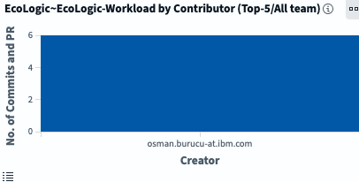
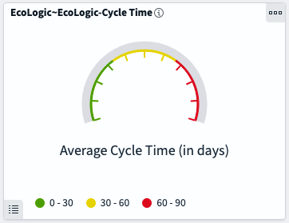

# Introduction

TODO: update flow, app references and screenshots.
_**TODO: update flow, app references to EchoLogic and screenshots**_

## Start Here

To use the platform you have to be onboarded onto it. This is normaly done by your administrators. For this lab we have provided you with pre created accounts.

### How to log in

Please navigate to the given URL and enter your provided credentials in the Login Screen:

and press the Sign In Button.

### The Home Page

After you have been logged in you will be directed to your homepage and it will provide you an overview about metrics from your Loops:

![Home Page][LoopHomePageView]

#### Dashboard and Metrics

#### What would you like to do today?

You can switch directly to the capability/solution by using the button/link

#### Central Solution/App Switcher

or by using the central app switcher on the top left:

## Creation of a Teamspace and Loops

In the case of an empty environment you need to create a new Teamspace and at least one Loop.

### Create a TeamSpace

Please follow the [Instructions for creating Teamspace(s)][InstructionsCreateTeamSpace]

When the creation of a TeamSpace is finished you will be forwarded to your empty loops home page for your new TeamSpace.

![Empty Loops Homepage][LoopHomePageCreateNewLoop]

### Create a Loop

You need to create at least one Loop in your TeamSpace, please follow the [Instructions for creation of a new Loop][InstructionsCreateLoop]

## How to use Loop Genie

![Loop Genie Icon on Home Page][LoopHomeLoopGenieIcon]
![Loop Genie Dialog][LoopGenieDialog]

## Conclusio

If you want to talk more about Loop please have a look at the [About Box, Sidebar and Plug-Ins](intro/index.md) introduction.

Go back to [Lab and Demo Overview][GoBackToDemoOverview]

---

[LoopHomePageView]: media/Loop_Home_Page.png
[LoopHomePageCreateNewLoop]: loops/media/Loop_Teamspace_07_CreateNewLoop_Home.png
[InstructionsCreateTeamSpace]: teamspace/index.md
[InstructionsCreateLoop]: loops/index.md
[GoBackToDemoOverview]: ../index.md#introduction
[LoopHomeLoopGenieIcon]: media/../intro/media/LOOP_HomePage_LoopGenieButton.png
[LoopGenieDialog]: intro/media/LOOP_HomePage_LoopGenieDialog.png
