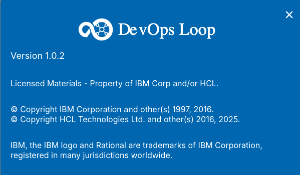
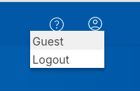
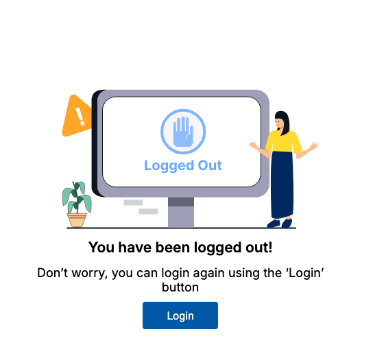
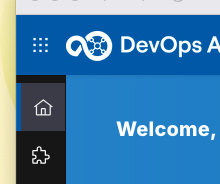
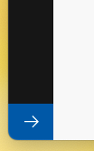
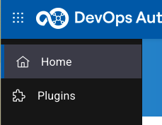
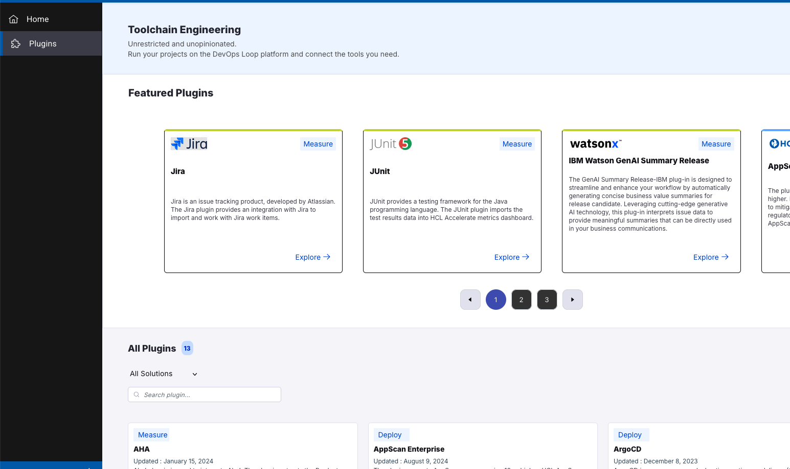

# About Box, Sidebar and Plug-Ins

## About Box and Logging out

On the above right side of your page you have the buttons for viewing the About box:

By pressing the About button the Information about the platform version and copyright will be presented. Please close by clicking on the "x" symbol on popup.

You can always log out of the platform by pressing the user symbol:

After a secure log out you will be presented with a new page which provides a login again:

## Sidebar

On the left side of the page you will have the side bar which will provide context related menu:

You can expand the side bar with the expand button on the bottom left side of the page:

Which will provide the sidebar items with text details:

## Plug-Ins

On the sidebar a view of slected plug-ins is available. By pressing on the Plug-Ins symbol the Featured Plugins page will be presented:

<!--  -->
