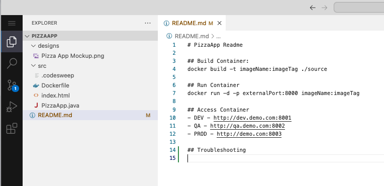

# Code Lab

TODO: update flow, app references and screenshots

## Introduction

TODO: add here more about Code

## How to work with Code

### Switch to Code

--8<-- [start:Switch2Code]

| Step | Details                                                                                          | Additional Information { width="50%" }                      |
|:----:|:-------------------------------------------------------------------------------------------------|:------------------------------------------------------------|
|  1   | You can always switch using the central app switcher on the top left of your screen              | ![Central App Switcher][AppSwitcher]                        |
|  2   | Overview Page of Code is shown with two tabs.                                                    | ![Two sub tabs][CodeDevContainerView]                       |
|  3   | One for Running Dev Containers                                                                   |                                                             |
| 3.1  | Which may be empty when no Dev Container has been started                                        | ![No running Dev Container][NoRunningDevContainer]          |
| 3.2  | Or all running Dev Containers with detailed Information is shown                                 | ![List of running Dev Container][ListOfRunningDevContainer] |
| 3.3  | Open the running container by clicking on **Let's Go** Button                                    | ![Lets go with this container][LetsGoButton]                |
| 3.4  | If no more needed press **Terminate** button to shutdown and remove it                           | ![Terminate this container][TerminateButton]                |
|  4   | And another for all available types of Dev Container                                             | ![Available Dev Container][ListOfAvailableDevContainer]     |
| 4.1  | By clicking on **Let's Go** Button a Dev Container (for example WatsonX) it will be instantiated | ![Lets go with this container][LetsGoButton]                |
| 4.2  | and a message will be shown in a new window                                                      | ![Setting up a dev container environment][SettingUpEnv]     |
| 4.3  | **it takes a few seconds till your environment is setup and running, please be patient**         |                                                             |
| 4.4  | Code is shown (example: WatsonX)                                                                 | ![Code is shown for WatsonX][WCAxNoRepo]                    |

--8<-- [end:Switch2Code]

### How to use Code

If Code has not been opened yet [Open the repository with Code from Control Repo view][REFControlOpenWithCode]

--8<-- [start:UseCode]

| Step | Details                                                                       | Additional Information { width="50%" }          |
|:----:|:------------------------------------------------------------------------------|:------------------------------------------------|
|  1   | Talk about Code                                                               |                                                 |
|  2   | change some code and save the changes to be able to commit to Control         |                                                 |
| 2.1  | TODO: add steps with screenshots here!                                        |                                                 |
|  3   | Or **optionaly** Use WCA to explain code and generate some new code           | ![Explain code part 1][WCAxExplain1]            |
| 3.1  | here an example                                                               | ![Explain code part 2][WCAExplain2]             |
|  4   | Add comment with work item number                                             | ![Commit Code with WI][CommitWithWI]            |
|  5   | Click on **Commit&Push** by opening the **Commit Button**                     | ![Commit and push][CommitAndPush]               |
| 5.1  | a message might appear about **staging** changes, press the **Always** button | ![asking about git staging][GitStagingQuestion] |
| 5.2  | a message might appear about **fetching** changes from git, press **Fetch**   | ![periodially use Git Fetch][GitFetchQuestion]  |

--8<-- [end:UseCode]

## Close and terminate Environment

Your development environment runs in it's own pod and uses resources. When you are finished with your work it is recommended to terminate the Environment.

NOTE: your session will not be terminated when you switch between capabilities or just close your browser!

Use the Logout icon  to get a popup which asks what to do with your running development environment:

Click on "Yes, terminate it" to shutdown the pod, which will delete all unsaved or pushed changes! Or you can decide to keep it alive with "No, let it run" if you want to continue working later.

<!-- 

### Edit a file and commit the changes

Open the README.md file and add some text. In this example added "Troubleshooting" at the end of the file then saved changes"

Now click on the Source Control icon  which shows the changed files and provide a good commit message and press commit:

Click on the triangle on the Commit Button to open the menue:

Click on Commit and Push. A new popup will appear and ask how to stage the changes. Press on Always to proceed:

Congratulations you have commited your first change into your repository. In the Graph view you will see your commit message:

Switch Back to Control and verify that in the activity view you have your commit visible:

 -->

---

[AppSwitcher]: ../introduction/media/Loop_central_app_control.png
[WCAxExplain1]: media/CODE_WCAx_Explain1.png
[WCAExplain2]: media/CODE_WCAx_Explain2.png
[CommitWithWI]: media/CODE_CommitWithWI.png
[REFControlOpenWithCode]: ../control/index.md#open-repo-with-code
<!-- [CODEcommitWI]: index.md#commit-code-with-wi -->

[CodeDevContainerView]: media/Code_Dev_Container_two_tabs.png
[NoRunningDevContainer]: media/Code_No_running_dev_containers.png
[ListOfRunningDevContainer]: media/Code_Running_Dev_Containers.png
[LetsGoButton]: media/Code_Dev_Container_LetsGo.png
[TerminateButton]: media/Code_Dev_Container_Terminate.png
[ListOfAvailableDevContainer]: media/Code_Dev_Container_Overview_Page.png
[SettingUpEnv]: media/Code_Setting_Up_Environment.png
[WCAxNoRepo]: media/Code_WatsonX_Dev_Container_no_Rep.png
[CommitAndPush]: media/Code_Commit_and_Push.png
[GitStagingQuestion]: media/Code_Git_Stage_Question.png
[GitFetchQuestion]: media/Code_Git_Fetch_Question.png
