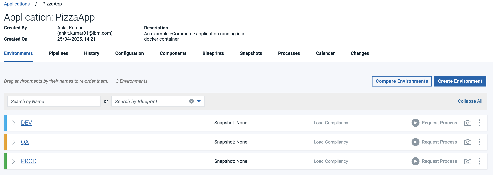
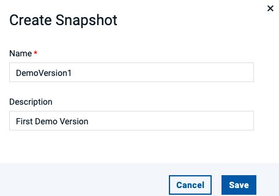
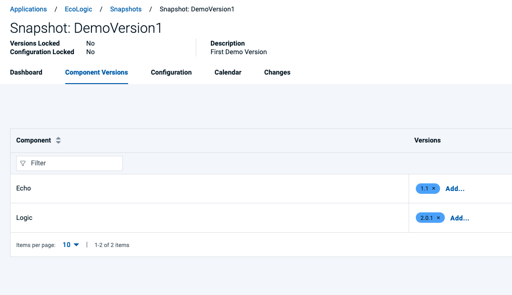
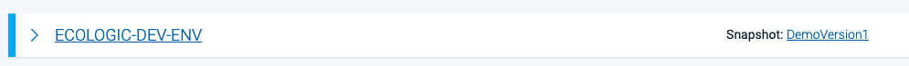

# Deploy Lab

TODO: Flow needs complete rewrite and new screenshots
_**TODO: update flow, app references from PIZZA to EchoLogic and screenshots**_

## Overview

This lab provides a practical, hands-on experience in deploying an application to a target server.

Explore the comprehensive dashboard provided by DevOps Deploy, which displays key information about deployment successes and failures

### How to switch to Deploy from Home Page

#### Lets go

You can switch to Deploy by either pressing "Let's go to Deploy" button on its tile:

![Deploy Tile lets go][DeployTile]

#### What would you like to do today?

You can switch directly to Deploy by using the button/link from What would you like to do today section:

![What would you like to do today?][WhatWouldYouLikeToDoToday]

#### Central App Switcher

Or you can always switch using the central app switcher on the top left of your screen:

![Central App Switcher][CentralAppSwitcher]

### Deploy Landing Page

   ![Deploy Dashboard Page][DeployDashboard]

**This Dashboard provides an overall view on:**

- Deployment statuses (Number of executions, Number of successfull ones and Number of failed ones)
- How many applications and components are managed by this instance
- Utilization and Health status of deployment agents (which are doing the actual deployment work)
- And a timeline of deployment activities and their results

<!-- 
### Note

1. Agent-Based Installation Support: DevOps Deploy works on agent-based deployments, allowing you to deploy applications across various environments—including On-Premises, IBM Cloud, Microsoft Azure, AWS, Google Cloud Platform (GCP), Mainframes, and more.
2. Demo Environment: In this demonstration, the deployment agent is running on IBM Cloud. Therefore, the application will be deployed to an IBM Cloud environment.

## Configuration

DevOps Deploy is a rich tool and provides excellent mechanisms to control the deployment of application. A simple architecture is
Application > Environment(DEV, QA, PROD, etc.) > Components

  

 **_Important Note: This is a shared lab environment. To ensure a smooth experience for everyone, please only modify the applications, components, or processes that you create during your lab session. Kindly avoid making changes to any existing applications or configurations visible in DevOps Deploy, as they may be in use by others_**

In order to deploy application, please download the [Application file](../../files/PizzaApp.json) directly (if you are using the repo localy) or from [GitHub Link](https://github.com/DevOpsAutomationLabs/End2End/blob/main/files/PizzaApp.json) (if you are using the web) open it on your preferred editor, and update the following in the file.

1. Search for `"name": "PizzaApp-01"` and replace it with your student code (xx appended to your email id. eg., `"name": "PizzaApp-02"`)
2. Search all the occurances for `PizzaApp-Container-01` and replace it with your student code (xx appended to your email id. eg., `PizzaApp-Container-02`)
3. Search for `"commandOptions": "-d -p 3001:8000"` and replace the `3002` with your student code (30xx appended with to email id. eg., `"commandOptions": "-d -p 3002:8000"`) . Troubleshooting: If you see any issue, try to update the port like 3016,3017, etc...
4. Save the file.

## Upload this to DevOps Deploy

Go to DevOps Deploy > Applications > Import Application > (Scroll down) Choose File > Select your updated file > Submit

  

Once you import the application, you would be able to see additional application listes like:

  

Now, Click on your application(PizzaApp-XX) > Switch Tab to Components > Click on PizzaApp-Container-XX > Switch tab to Process > Click on "Deploy PizzaApp"
 -->

## [Applications](applications/index.md)

TODO: talk about applications

### Switch to Applications View

| Step | Details                                                | Additional Information                                |
|:----:|:-------------------------------------------------------|:------------------------------------------------------|
|  1   | Switch to Applications View by clicking on the Sidebar |                                                       |
|      |                                                        | ![Sidebar Applications][SBApplicationsIcon]           |
|      |                                                        | ![Sidebar Applications with Text][SBApplicationsText] |
|      | View for all Applications                              | ![All Applications View][APPSallView]                 |
|      |                                                        |                                                       |

### Create New Application

## [Components](components/index.md)

TODO: talk about components

![List of components][DeployComponentList]

### Create New Component

- Press Create new Component Button: ![Component - Create new][DeployComponentCreateNew]
  - ![Component - Create Dialog 1][DeployComponentCreateNewDialog1]
  - ![Component - Create Dialog 2][DeployComponentCreateNewDialog2]
  - ![Component - Create Dialog 3][DeployComponentCreateNewDialog3]
  - ![Component - Create Dialog 4][DeployComponentCreateNewDialog4]
- Component successful created, first view is the Versions view
  - ![Component - Newly Created Comp first view versions ][DeployComponentNewVersionView]
- have a look at the Components configuration, you can change it here if needed
  - ![Component - Newly Created Comp configuraiton view][DeployComponentNewConfigurationView]
- have a look at the processes of the component, which are empty too
  - ![Component - Newly Created Comp Processes view][DeployComponentNewProcessesView]
  - We will add processes later in this lab

## Processes

TODO: talk about processes

### Types of Processes

#### Generic Processes

TODO: talk about generic processes and for what they are good for

#### Application Processes

[Detailed Documentation on Application Processes][DOCAppProccesses]

Application processes, like component processes, are created with the process editor. You use application processes to deploy or to roll back components, define the orchestration of the deployment of components. Means if there are dependencies between components deploy them sequentially, if no dependency exists do it in parallel.

##### View Application Processes

| Step | Details                                         | Additional Information { width="50%" }   |
|:----:|:------------------------------------------------|:-----------------------------------------|
|      | [Switch to Applications View][APPSallView]      |                                          |
|      | [Open EchoLogic App][AppViewWithEnv]            |                                          |
|      | [Switch to Processes View][SwitchToProcessView] |                                          |
|      | Available application processes are shown       | ![Application Processes][AppProcessList] |
|      |                                                 |                                          |

#### Component Processes

TODO: talk about component processes and what is it good for

##### View Component Processes

[Switch to Components View][REFSwitchToCompView]

[View Component Processes][REFCompProcessesView]

A freshly created component does not have any processes:

![component processes][DeployComponentProcessesListEmpty]

Every Component needs at least one (1) process. To create one press the Create Process Button ![Create new Process Button][DeployComponentCreateNewProcessButton]

![Component Process - Dialog][DeployComponentCreateProcessDialog]

TODO: talk about process details

### Process Designer

It will show you the process designer for a new process:

![Process Designer][DeployProcessDesigner]

#### Process Designer Sidebar

TODO: talk about sidebar

![Process Designer Sidebar][DeployComponentProcessDesignerSidebar]

Drag Drop a step onto the canvas.

![Dragged a Step onto the canvas][DeployProcessDesignerAddStepp]

Configure the step:

![Step properties 1][DeployProcessDesignerStepProperties1]
![Step properties 2][DeployProcessDesignerStepProperties2]

In this example the shell step requires to have some script/commands added into the shell script field:

![Shell Script1][DeployProcessDesignerStepShellScript1]
![Shell Script2][DeployProcessDesignerStepShellScript2]

#### Final Process Diagram

![Deploy Process Diagram Application Page][DeployComponentFinalProcess]

#### Adding Version Statuses

![Process Designer - sidebar add version status][DeployProcesDesignerSidebarAddVersionStatus]
![process designer - step added add version status][DeployProcessDesignerAddedVersionStatus]
![process designer - add version status properites][DeployProcessDesignerAddedVersionStatusProperties]

##### Final Process Diagrams (Passing and Failing tests)

![Process Designer - Final Process with passed Test][DeployComponentProcessPassingTest]
![Process Designer - Final Process with failing Test][DeployComponentProcessFailingTest]

Now we have additional deployment processes. One for passing a test and one for failing a test. Both processes will set the appropiate version tag about status of test.

![Component with Deployment Process passing and failing][DeployComponentProcessesList]

Result in the Versionlist of the component:
![Status added to version][DeployComponentFinalProcesWithVersionStatus]

## Environments

TODO: talk about environments

## Run a deployment

| Step | Details                                                       | Additional Information { width="50%" }                   |
|:----:|:--------------------------------------------------------------|:---------------------------------------------------------|
|  1   | [Switch to Applications view][REFSwitchToAppView]             |                                                          |
|  2   | Select **EchoLogic** Application by clicking on the name/link | ![Deploy Application][DeployShowApp]                     |
|  4   | All Environments of Application will be shown                 | ![Deploy Application Environment List][DeployAppEnvList] |

### Request a Process

click on Request Process Button: ![Request Button][DeployAppRequestProcessButton] on the DEV Environment ![Dev Environment][DeployAppDevEnv]

Go through dialog:

- ![Run Process Dialog - Select Deployment Process][DeployAppProcessRequestSelectProcess]
- ![Run Process Dialog - Select Select Version Or Snapshot][DeployAppProcessRequestSelectSnapsotOrVersions]
- ![Run Process Dialog - uncheck Deploy Only Changed][DeployAppProcessRequestOnlyChanged]
- ![Run Process Dialog - Choose Versions Button][DeployAppPocessRequestChooseCompVersionButton]
- ![Run Process Dialog - Select Component Version 1][DeployAppPocessRequestSelectCompVersion1]
- ![Run Process Dialog - Select Component Version 2][DeployAppPocessRequestSelectCompVersion2]

Press the Submit button: ![Submit Button][DeployAppPocessRequestSubmitButton] to start the deployment process.

### View of Running Process

The details of the running process are shown:
![Running Process][DeployProcessRunning]

Click on Expand All ![Expand All][DeployProcessRunningExpandAllButton] so see step details

Click on 3 dots menue of a step ![3 dots menue of step][DeployProcessRunning3DotsofStep]
View the output of the step ![Output of Step][DeployProcessRunningStepOutputDetails]

### Result of Run

The deployment run successfully ![Deployment Success][DeployAppProcessRunSuccess]

and updated the configuration of the environment with the deployed component versions:

![Environment with deployed versions of components][DeployAppEnvwithDeployedVersions]

### Create a Snapshot

TODO: talk about snapshots and what they are good for

Select the Create Snapshot Icon: 

- 
- 
- 

Now the Environment configuration has been updated to indicate that a Snapshot is applied:

## Settings

Switch to Settings by using the Settings Icon: ![Deploy Settings Icon][DeploySettingsIcon]

### Plugins

Plugins are listed in the Automation Section of the Settings pages.

- ![Automation Plugins][DeploySettingsAutomationPlugins]
- ![Plugin List][DeploySettingsPluginsList]

#### How to install a plugin

click on the [3 dots menue][DeployPlugin3DotsMenue] of the plugin you want to install and select install: ![Install plugin][DeployInstallPlugin]
An Installation Confirmation Dialog will pop up, click here on **Confirm** to proceed ![Plugin Installation Confirmation][DeployInstallPluginConfirmation]
Installation is Successfull Notification ![Plugin Installation Successfull][DeployPluginInstallSuccess]

### How to upgrade a plugin

Same procedure as installing a Plugin. Click on the 3 Dots menue and select **Upgrade**

## Conclusio

Go back to [Introduction][GoBackToParentIndex], [Lab and Demo Overview][GoBackToDemoOverview] or proceed with [Next Lab][NextLab]

---

[GoBackToDemoOverview]: ../index.md
[GoBackToParentIndex]: ../index.md#deploy
[NextLab]: ../index.md#test

[DeployTile]: ../introduction/media/Loop_switch_to_Deploy.png
[WhatWouldYouLikeToDoToday]: ../introduction/media/Loop_whatwouldyouliketodotoday.png
[CentralAppSwitcher]: ../introduction/media/Loop_central_app_control.png
[DeployDashboard]: media/dashboard.png
[DeployComponentList]: media/DEPLOY_Components_List.png
[DeployComponentCreateNew]: media/DEPLOY_Components_CreateComponentButton.png
[DeployComponentCreateNewDialog1]: media/DEPLOY_Components_CreateDialog1.png
[DeployComponentCreateNewDialog2]: media/DEPLOY_Components_CreateDialog2.png
[DeployComponentCreateNewDialog3]: media/DEPLOY_Components_CreateDialog3.png
[DeployComponentCreateNewDialog4]: media/DEPLOY_Components_CreateDialog4.png
[DeployComponentNewVersionView]: components/media/Component_Versions_View_empty.png
[DeployComponentNewConfigurationView]: components/media/Component_Config.png
[DeployComponentNewProcessesView]: components/media/Component_Tabbar_Processes.png
[DeployProcessDesigner]: media/DEPLOY_Component_ProcessEditor.png
[DeployComponentProcessDesignerSidebar]: media/DEPLOY_Component_ProcessEditor_Sidebar.png
[DeployProcessDesignerAddStepp]: media/DEPLOY_Component_Process_AddStep.png
[DeployProcessDesignerStepProperties1]: media/DEPLOY_Component_Process_Step_Properties1.png
[DeployProcessDesignerStepProperties2]: media/DEPLOY_Component_Process_Step_Properties2.png
[DeployComponentProcessesListEmpty]: media/DEPLOY_Component_ProcessList.png
[DeployComponentProcessesList]: media/DEPLOY_Component_WithProcessList.png
[DeployComponentCreateNewProcessButton]: media/DEPLOY_Component_CreateProcessButton.png
[DeployComponentCreateProcessDialog]: media/DEPLOY_Component_CreateProcessDialog.png
[DeployProcessDesignerStepShellScript1]: media/DEPLOY_Component_Process_Step_ShellScript1.png
[DeployProcessDesignerStepShellScript2]: media/DEPLOY_Component_Process_Step_ShellScript2.png
[DeployComponentFinalProcess]: media/DEPLOY_Component_Process_Final.png
[DeployProcesDesignerSidebarAddVersionStatus]: media/DEPLOY_Component_ProcessEditor_SidebarAddStatus.png
[DeployProcessDesignerAddedVersionStatus]: media/DEPLOY_Component_ProcessEditor_StepAdded_AddStatus.png
[DeployProcessDesignerAddedVersionStatusProperties]: media/DEPLOY_Component_Process_Step_AddStatusProperties.png
[DeployComponentFinalProcesWithVersionStatus]: media/DEPLOY_Component_VersionList_withStatus.png
[DeployShowApp]: applications/media/Deploy_Applications_View.png
[DeployAppEnvList]: media/DEPLOY_Application_Environmentlist.png
[DeployAppRequestProcessButton]: media/DEPLOY_Application_RequestProcess.png
[DeployAppProcessRequestSelectProcess]: media/DEPLOY_Application_Runappprocessdialog1_SelectDeploymentProcess.png
[DeployAppProcessRequestSelectSnapsotOrVersions]: media/DEPLOY_Application_Runappprocessdialog2_SelectCompVersionOrSnapshot.png
[DeployAppProcessRequestOnlyChanged]: media/DEPLOY_Application_Runappprocessdialog3_OnlyChanged.png
[DeployAppPocessRequestChooseCompVersionButton]: media/DEPLOY_Application_Runappprocessdialog4_ChooseCompVersionButton.png
[DeployAppPocessRequestSelectCompVersion1]: media/DEPLOY_Application_Runappprocessdialog5_SelectCompVersion.png
[DeployAppPocessRequestSelectCompVersion2]: media/DEPLOY_Application_Runappprocessdialog6_SelectCompVersion.png
[DeployAppPocessRequestSubmitButton]: media/DEPLOY_Application_Runappprocessdialog7_Submit.png
[DeployComponentProcessPassingTest]: media/DEPLOY_ComponentProcessFinalWithPassingTest.png
[DeployComponentProcessFailingTest]: media/DEPLOY_ComponentProcessFinalWithFailingTest.png
[DeployAppDevEnv]: media/DEPLOY_AppEnv_DEV.png
[DeployProcessRunning]: media/DEPLOY_RunningProcess1.png
[DeployProcessRunningExpandAllButton]: media/DEPLOY_RunningProcess2_ExpandAll.png
[DeployProcessRunning3DotsofStep]: media/DEPLOY_RunningProcess3_Stepdetails.png
[DeployProcessRunningStepOutputDetails]: media/DEPLOY_RunningProcess4_StepDetails.png
[DeployAppProcessRunSuccess]: media/DEPLOY_AppProcessFinishedSuccess.png
[DeployAppEnvwithDeployedVersions]: media/DEPLOY_Application_EnvironmentResultVersions.png
[DeploySettingsIcon]: media/DEPLOY_SettingsIcon.png
[DeploySettingsAutomationPlugins]: media/DEPLOY_Settings_AutomationSection.png
[DeploySettingsPluginsList]: media/DEPLOY_PluginsList.png
[DeployInstallPlugin]: media/DEPLOY_Plugins_Install.png
[DeployPlugin3DotsMenue]: media/DEPLOY_PluginList_3DotsMenue.png
[DeployInstallPluginConfirmation]: media/DEPLOY_PluginInstallConfirmation.png
[DeployPluginInstallSuccess]: media/DEPLOY_PluginInstallSuccess.png
[APPSallView]: applications/index.md#switch-to-applications-view
[AppViewWithEnv]: applications/index.md#view-application
[SwitchToProcessView]: applications/index.md#show-processes
[AppProcessList]: applications/media/Deploy_AppProcess_ListFinal.png
[REFSwitchToCompView]: components/index.md#switch-to-components-view
[REFCompProcessesView]: components/index.md#view-component-processes
[DOCAppProccesses]: https://www.ibm.com/docs/en/devops-deploy/8.1.2?topic=processes-application
[SBApplicationsIcon]: media/Deploy_Sidebar_AppIcon.jpg
[SBApplicationsText]: media/Deploy_Sidebar_AppIconWithText.png
[REFSwitchToAppView]: #switch-to-applications-view
