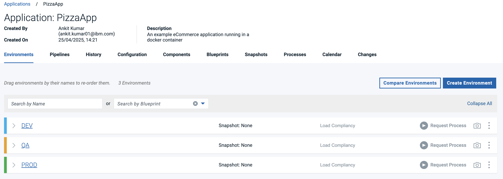
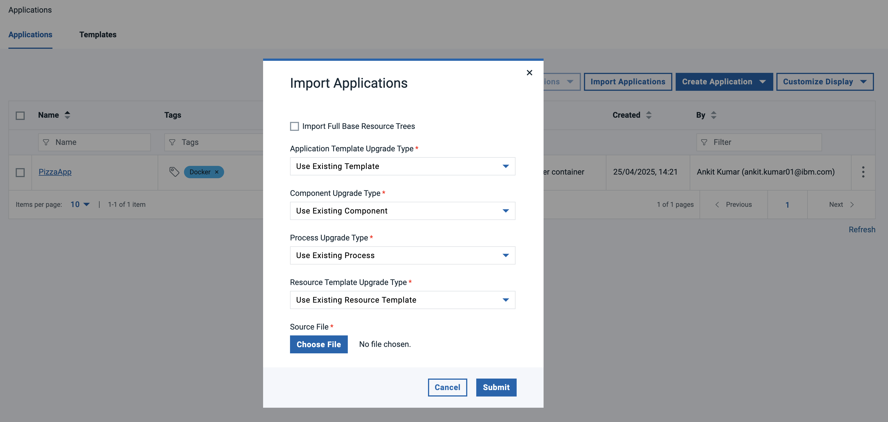

# Deploy Lab

!!! warning "Work in Progress"
    This section is being updated. Content and screenshots will be added in the next revision.

## Introduction

--8<-- [start:Intro]

Use DevOps Deploy (Deploy) to standardize and simplify the process of deploying software components to each environment in your development cycle.

Deploy helps you meet the challenge of deploying software throughout your enterprise by providing tools that improve both deployment speed and reliability. The release automation tools in Deploy provide complete visibility into n-tiered deployments. Use the tools to model processes that orchestrate complex deployments across every environment and approval gate.

By using plug-ins in Deploy, you integrate the server with your existing middleware and organize code from your existing code repositories into components. You design processes to deploy your code by using steps that run each required task. Then, you organize your components into applications and create environments for each stage of your release process. Finally, you create an application process to set the deployment order of your components and deploy your application to an environment.

You can model the topology of your environment, specify which virtual images contain Deploy components, and provision both the environment and components to your cloud in a single action.

To learn more about DevOps Deploy please have a look at the [documentation][DeployDocumentation].

--8<-- [end:Intro]

## Overview

--8<-- [start:Overview]

This lab provides a practical, hands-on experience in deploying an application to a target server.

Explore the comprehensive dashboard provided by DevOps Deploy, which displays key information about deployment successes and failures

--8<-- [end:Overview]

### How to switch to Deploy from Home Page

--8<-- [start:SWITCH2Deploy]

| Step | Details                                                                                                  | Additional Information                                         |
|:----:|:---------------------------------------------------------------------------------------------------------|:---------------------------------------------------------------|
|      | **Central App Switcher**                                                                                 |                                                                |
|      | Or you can always switch using the central app switcher on the top left of your screen:                  | ![Central App Switcher][CentralAppSwitcher]                    |
|      | **What would you like to do today**                                                                      |                                                                |
|      | You can switch directly to Deploy by using the button/link from What would you like to do today section: | ![What would you like to do today?][WhatWouldYouLikeToDoToday] |

--8<-- [end:SWITCH2Deploy]

### Deploy Landing Page

--8<-- [start:DeployLandingPage]

   ![Deploy Dashboard Page][DeployDashboard]

**This Dashboard provides an overall view on:**

- Deployment statuses (Number of executions, Number of successfull ones and Number of failed ones)
- How many applications and components are managed by this instance
- Utilization and Health status of deployment agents (which are doing the actual deployment work)
- And a timeline of deployment activities and their results

--8<-- [end:DeployLandingPage]

<!--
### Note

1. Agent-Based Installation Support: DevOps Deploy works on agent-based deployments, allowing you to deploy applications across various environments—including On-Premises, IBM Cloud, Microsoft Azure, AWS, Google Cloud Platform (GCP), Mainframes, and more.
2. Demo Environment: In this demonstration, the deployment agent is running on IBM Cloud. Therefore, the application will be deployed to an IBM Cloud environment.

## Configuration

DevOps Deploy is a rich tool and provides excellent mechanisms to control the deployment of application. A simple architecture is
Application > Environment(DEV, QA, PROD, etc.) > Components

  

 **_Important Note: This is a shared lab environment. To ensure a smooth experience for everyone, please only modify the applications, components, or processes that you create during your lab session. Kindly avoid making changes to any existing applications or configurations visible in DevOps Deploy, as they may be in use by others_**

In order to deploy application, please download the [Application file](../../files/PizzaApp.json) directly (if you are using the repo localy) or from [GitHub Link](https://github.com/DevOpsAutomationLabs/End2End/blob/main/files/PizzaApp.json) (if you are using the web) open it on your preferred editor, and update the following in the file.

1. Search for `"name": "PizzaApp-01"` and replace it with your student code (xx appended to your email id. eg., `"name": "PizzaApp-02"`)
2. Search all the occurances for `PizzaApp-Container-01` and replace it with your student code (xx appended to your email id. eg., `PizzaApp-Container-02`)
3. Search for `"commandOptions": "-d -p 3001:8000"` and replace the `3002` with your student code (30xx appended with to email id. eg., `"commandOptions": "-d -p 3002:8000"`) . Troubleshooting: If you see any issue, try to update the port like 3016,3017, etc...
4. Save the file.

## Upload this to DevOps Deploy

Go to DevOps Deploy > Applications > Import Application > (Scroll down) Choose File > Select your updated file > Submit

  

Once you import the application, you would be able to see additional application listes like:

  

Now, Click on your application(PizzaApp-XX) > Switch Tab to Components > Click on PizzaApp-Container-XX > Switch tab to Process > Click on "Deploy PizzaApp"
 -->

## [Applications](applications/index.md)

--8<-- [start:Applications]

!!! info "Coming Soon"
    A full walkthrough of the Applications section will be added here.
    For now, see the [Applications sub-page](applications/index.md) for step-by-step instructions.

### Switch to Applications View

| Step | Details                                                | Additional Information                                |
|:----:|:-------------------------------------------------------|:------------------------------------------------------|
|  1   | Switch to Applications View by clicking on the Sidebar |                                                       |
|      |                                                        | ![Sidebar Applications][SBApplicationsIcon]           |
|      |                                                        | ![Sidebar Applications with Text][SBApplicationsText] |
|      | View for all Applications                              | ![All Applications View][APPSallView]                 |
|      |                                                        |                                                       |

### Create New Application

--8<-- "learn/deploy/applications/index.md:CreateNewApplication"

--8<-- [end:Applications]

## [Components](components/index.md)

--8<-- [start:Components]

!!! info "Coming Soon"
    A full walkthrough of the Components section will be added here.
    For now, see the [Components sub-page](components/index.md) for step-by-step instructions.

![List of components][DeployComponentList]

### Create New Component

--8<-- "learn/deploy/components/index.md:CreateNewComponent"

--8<-- [end:Components]

## [Processes](processes/index.md)

--8<-- [start:Processes]

--8<-- [end:Processes]

## Environments

--8<-- [start:Environments]

!!! info "Coming Soon"
    A full walkthrough of the Environments section will be added here.

--8<-- [end:Environments]

## Run a deployment

--8<-- [start:RunDeployment]

| Step | Details                                                       | Additional Information { width="50%" }                   |
|:----:|:--------------------------------------------------------------|:---------------------------------------------------------|
|  1   | [Switch to Applications view][REFSwitchToAppView]             |                                                          |
|  2   | Select **EchoLogic** Application by clicking on the name/link | ![Deploy Application][DeployShowApp]                     |
|  4   | All Environments of Application will be shown                 | ![Deploy Application Environment List][DeployAppEnvList] |

### Request a Process

--8<-- [start:RequestProcess]

| Step | Details | Additional Information |
|:----:|:--------|:----------------------|
| 1 | Click on **Request Process** Button | ![Request Button][DeployAppRequestProcessButton] |
| 2 | On the DEV Environment | ![Dev Environment][DeployAppDevEnv] |
| 3 | Select Deployment Process | ![Run Process Dialog - Select Deployment Process][DeployAppProcessRequestSelectProcess] |
| 4 | Select Version or Snapshot | ![Run Process Dialog - Select Version Or Snapshot][DeployAppProcessRequestSelectSnapsotOrVersions] |
| 5 | Uncheck Deploy Only Changed | ![Run Process Dialog - uncheck Deploy Only Changed][DeployAppProcessRequestOnlyChanged] |
| 6 | Click **Choose Versions** Button | ![Run Process Dialog - Choose Versions Button][DeployAppPocessRequestChooseCompVersionButton] |
| 7 | Select Component Version (first component) | ![Run Process Dialog - Select Component Version 1][DeployAppPocessRequestSelectCompVersion1] |
| 8 | Select Component Version (second component) | ![Run Process Dialog - Select Component Version 2][DeployAppPocessRequestSelectCompVersion2] |
| 9 | Press **Submit** to start the deployment | ![Submit Button][DeployAppPocessRequestSubmitButton] |

--8<-- [end:RequestProcess]

### View of Running Process

--8<-- [start:ViewRunningProcess]

| Step | Details | Additional Information |
|:----:|:--------|:----------------------|
| 1 | The details of the running process are shown | ![Running Process][DeployProcessRunning] |
| 2 | Click on **Expand All** to see step details | ![Expand All][DeployProcessRunningExpandAllButton] |
| 3 | Click on **3 dots menu** of a step | ![3 dots menu of step][DeployProcessRunning3DotsofStep] |
| 4 | View the output of the step | ![Output of Step][DeployProcessRunningStepOutputDetails] |

--8<-- [end:ViewRunningProcess]

### Result of Run

--8<-- [start:ResultOfRun]

| Step | Details | Additional Information |
|:----:|:--------|:----------------------|
| 1 | The deployment ran successfully | ![Deployment Success][DeployAppProcessRunSuccess] |
| 2 | Environment updated with deployed component versions | ![Environment with deployed versions of components][DeployAppEnvwithDeployedVersions] |

--8<-- [end:ResultOfRun]

### Create a Snapshot

--8<-- [start:CreateSnapshot]

!!! info "Coming Soon"
    A description of snapshots and their purpose will be added here.

| Step | Details | Additional Information |
|:----:|:--------|:----------------------|
| 1 | Select the **Create Snapshot** Icon | ![Create Snapshot][CreateSnapshotIcon] |
| 2 | The Create Snapshot dialog opens | ![Create Snapshot dialog][CreateSnapshotDialog] |
| 3 | Review snapshot details (step 1) | ![Create Snapshot Detail step 1][CreateSnapshotDetail1] |
| 4 | Review snapshot details (step 2) | ![Create Snapshot Detail step 2][CreateSnapshotDetail2] |
| 5 | Environment configuration updated — Snapshot is now applied | ![Snapshot on environment][SnapshotApplied] |

--8<-- [end:CreateSnapshot]

### Use the Deployment Genie

--8<-- [start:UseDeployGenie]

| Step | Details | Additional Information |
|:----:|:--------|:----------------------|
| 1 | [Request a new deployment process][REFRequestAProcess] to simulate a failure | |
| 2 | Select Deployment Process **Failing Deployment** | ![Failing Deployment Process][RunSelectFailingDeployment] |
| 3 | Select Versions: **Echo** → v1.0, **Logic** → v2.0.0 | ![Select Versions for Components][RunFailSelectCompVersions] |
| 4 | The result will be a failed deployment | ![Failed Result][RunFailed] |
| 5 | Click **3 dots** menu of the failing step to show menu | ![3 dots menu][DeployPlugin3DotsMenue] ![menu with Genie][Step3DotsMenueWithGenie] |
| 6 | Click **Deployment Genie** — results shown after analysis | ![AI Analyzed][GenieAnalysis] |

--8<-- [end:UseDeployGenie]

--8<-- [end:RunDeployment]

## Settings

--8<-- [start:Settings]

Please read the [Settings Section](settings/index.md) for more Details how to set System parameters or install Plugins.

--8<-- [end:Settings]

## Conclusion

--8<-- [start:Conclusion]

Go back to [Introduction][GoBackToParentIndex], [Lab and Demo Overview][GoBackToDemoOverview] or proceed with [Next Lab][NextLab]

--8<-- [end:Conclusion]

---

[GoBackToDemoOverview]: ../index.md
[GoBackToParentIndex]: ../index.md#deploy
[NextLab]: ../index.md#test

[DeployTile]: ../introduction/media/Loop_switch_to_Deploy.png
[WhatWouldYouLikeToDoToday]: ../introduction/media/Loop_whatwouldyouliketodotoday.png
[CentralAppSwitcher]: ../introduction/media/Loop_central_app_control.png
[DeployDashboard]: media/dashboard.png
[DeployComponentList]: media/DEPLOY_Components_List.png
[DeployComponentCreateNew]: components/media/DEPLOY_Components_CreateComponentButton.png
[DeployComponentCreateNewDialog1]: components/media/DEPLOY_Components_CreateDialog1.png
[DeployComponentCreateNewDialog2]: components/media/DEPLOY_Components_CreateDialog2.png
[DeployComponentCreateNewDialog3]: components/media/DEPLOY_Components_CreateDialog3.png
[DeployComponentCreateNewDialog4]: components/media/DEPLOY_Components_CreateDialog4.png
[DeployComponentNewVersionView]: components/media/Component_Versions_View_empty.png
[DeployComponentNewConfigurationView]: components/media/Component_Config.png
[DeployComponentNewProcessesView]: components/media/Component_Tabbar_Processes.png
[DeployProcessDesigner]: media/DEPLOY_Component_ProcessEditor.png
[DeployComponentProcessDesignerSidebar]: media/DEPLOY_Component_ProcessEditor_Sidebar.png
[DeployProcessDesignerAddStepp]: media/DEPLOY_Component_Process_AddStep.png
[DeployProcessDesignerStepProperties1]: media/DEPLOY_Component_Process_Step_Properties1.png
[DeployProcessDesignerStepProperties2]: media/DEPLOY_Component_Process_Step_Properties2.png
[DeployComponentProcessesListEmpty]: media/DEPLOY_Component_ProcessList.png
[DeployComponentProcessesList]: media/DEPLOY_Component_WithProcessList.png
[DeployComponentCreateNewProcessButton]: media/DEPLOY_Component_CreateProcessButton.png
[DeployComponentCreateProcessDialog]: media/DEPLOY_Component_CreateProcessDialog.png
[DeployProcessDesignerStepShellScript1]: media/DEPLOY_Component_Process_Step_ShellScript1.png
[DeployProcessDesignerStepShellScript2]: media/DEPLOY_Component_Process_Step_ShellScript2.png
[DeployComponentFinalProcess]: media/DEPLOY_Component_Process_Final.png
[DeployProcesDesignerSidebarAddVersionStatus]: media/DEPLOY_Component_ProcessEditor_SidebarAddStatus.png
[DeployProcessDesignerAddedVersionStatus]: media/DEPLOY_Component_ProcessEditor_StepAdded_AddStatus.png
[DeployProcessDesignerAddedVersionStatusProperties]: media/DEPLOY_Component_Process_Step_AddStatusProperties.png
[DeployComponentFinalProcesWithVersionStatus]: media/DEPLOY_Component_VersionList_withStatus.png
[DeployShowApp]: applications/media/Deploy_Applications_View.png
[DeployAppEnvList]: media/DEPLOY_Application_Environmentlist.png
[DeployAppRequestProcessButton]: media/DEPLOY_Application_RequestProcess.png
[DeployAppProcessRequestSelectProcess]: media/DEPLOY_Application_Runappprocessdialog1_SelectDeploymentProcess.png
[DeployAppProcessRequestSelectSnapsotOrVersions]: media/DEPLOY_Application_Runappprocessdialog2_SelectCompVersionOrSnapshot.png
[DeployAppProcessRequestOnlyChanged]: media/DEPLOY_Application_Runappprocessdialog3_OnlyChanged.png
[DeployAppPocessRequestChooseCompVersionButton]: media/DEPLOY_Application_Runappprocessdialog4_ChooseCompVersionButton.png
[DeployAppPocessRequestSelectCompVersion1]: media/DEPLOY_Application_Runappprocessdialog5_SelectCompVersion.png
[DeployAppPocessRequestSelectCompVersion2]: media/DEPLOY_Application_Runappprocessdialog6_SelectCompVersion.png
[DeployAppPocessRequestSubmitButton]: media/DEPLOY_Application_Runappprocessdialog7_Submit.png
[DeployComponentProcessPassingTest]: media/DEPLOY_ComponentProcessFinalWithPassingTest.png
[DeployComponentProcessFailingTest]: media/DEPLOY_ComponentProcessFinalWithFailingTest.png
[DeployAppDevEnv]: media/DEPLOY_AppEnv_DEV.png
[DeployProcessRunning]: media/DEPLOY_RunningProcess1.png
[DeployProcessRunningExpandAllButton]: media/DEPLOY_RunningProcess2_ExpandAll.png
[DeployProcessRunning3DotsofStep]: media/DEPLOY_RunningProcess3_Stepdetails.png
[DeployProcessRunningStepOutputDetails]: media/DEPLOY_RunningProcess4_StepDetails.png
[DeployAppProcessRunSuccess]: media/DEPLOY_AppProcessFinishedSuccess.png
[DeployAppEnvwithDeployedVersions]: media/DEPLOY_Application_EnvironmentResultVersions.png
[DeployPlugin3DotsMenue]: media/DEPLOY_PluginList_3DotsMenue.png
[APPSallView]: applications/index.md#switch-to-applications-view
[AppViewWithEnv]: applications/index.md#view-application
[SwitchToProcessView]: applications/index.md#show-processes
[AppProcessList]: applications/media/Deploy_AppProcess_ListFinal.png
[REFSwitchToCompView]: components/index.md#switch-to-components-view
[REFCompProcessesView]: components/index.md#view-component-processes
[DOCAppProccesses]: https://www.ibm.com/docs/en/devops-deploy/8.1.2?topic=processes-application
[SBApplicationsIcon]: media/Deploy_Sidebar_AppIcon.jpg
[SBApplicationsText]: media/Deploy_Sidebar_AppIconWithText.png
[REFSwitchToAppView]: #switch-to-applications-view
[RunSelectFailingDeployment]: media/Deploy_RunProc_FailingDeploy.png
[REFRequestAProcess]: #request-a-process
[Step3DotsMenueWithGenie]: media/Deploy_AppRun_ResultFailed_Step_3Dots.png
[RunFailSelectCompVersions]: media/Deploy_AppRun_SelectedCompVersions.png
[RunFailed]: media/Deploy_AppRun_ResultFailed.png
[GenieAnalysis]: media/Deploy_AppProcess_AI_Analysis.png
[APPSallViewEmpty]: applications/media/Deploy_Applications_View_Empty.png
[ButtonCreateApp]: applications/media/Deploy_App_CreateAppButton.png
[CreateAppMenu]: applications/media/Deploy_App_CreateAppMenue.png
[CreateAppDialog]: applications/media/Deploy_App_CreateApp_Dialog1.png
[CreateAppDialogEnterInfo]: applications/media/Deploy_App_CreateApp_Dialog2.png
[ButtonSave]: ../../media/Button_Save.png
[AppView]: applications/media/Deploy_Application_View.png
[DeployDocumentation]: https://www.ibm.com/docs/en/devops-deploy/8.2.0
[CreateSnapshotIcon]: media/DEPLOY_Application_Environment_CreateSnapshot.png
[CreateSnapshotDialog]: media/DEPLOY_Application_Environment_CreateSnapshot_Dialog.png
[CreateSnapshotDetail1]: media/DEPLOY_Application_Environment_CreateSnapshot_Detail1.png
[CreateSnapshotDetail2]: media/DEPLOY_Application_Environment_CreateSnapshot_Detail2.png
[SnapshotApplied]: media/DEPLOY_Application_Environment_SnapshotApplied.png