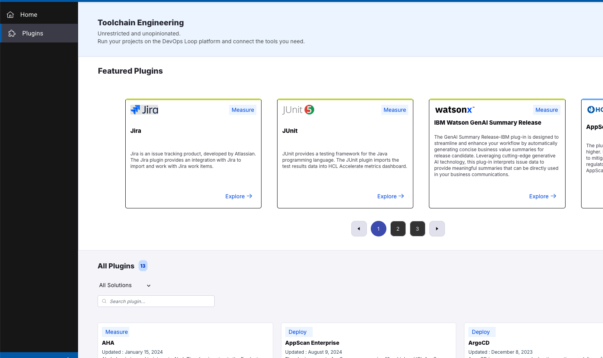

# About Box, Sidebar and Plug-Ins

## Switch to Loop Home page

--8<-- [start:SWITCH2Loop]

| Step | Details                                                                                                    | Additional Information                  |
|:----:|:-----------------------------------------------------------------------------------------------------------|:----------------------------------------|
|      | Switch to the main view of your Teamspace by clicking on **DevOps Loop: Loop** in the **Central App Menu** | ![Central App Menu][CentralAppSwitcher] |

--8<-- [end:SWITCH2Loop]

## About Box and Logging out

--8<-- [start:AboutBoxLogout]

| Step | Details                                                                                                 | Additional Information                        |
|:----:|:--------------------------------------------------------------------------------------------------------|:----------------------------------------------|
|      | **About Loop**                                                                                          |                                               |
|      | On the above right side of your page you have the buttons for viewing the **About** box                 | ![About Button][AboutButton]                  |
|      | By pressing the About button the Information about the platform version and copyright will be presented | ![About Box][About]                           |
|      | Please close by clicking on the "x" symbol on popup                                                     |                                               |
|      | **Logging out**                                                                                         |                                               |
|      | You can always log out of the platform by pressing the user symbol                                      | ![User Symbol for Logging Out][LoggOutButton] |
|      | After a secure log out you will be presented with a new page which provides a login again               | ![Logged out][LoggedOut]                      |

--8<-- [end:AboutBoxLogout]

## Sidebar

--8<-- [start:Sidebar]

| Step | Details                                                                                         | Additional Information          |
|:----:|:------------------------------------------------------------------------------------------------|:--------------------------------|
|      | On the left side of the page you will have the side bar which will provide context related menu | ![Sidebar][SBIcons]             |
|      | You can expand the side bar with the expand button on the bottom left side of the page          | ![Sidebar expander][SBExpander] |
|      | Which will provide the sidebar items with text details                                          | ![Sidebar expanded][SBExpanded] |

### Plug-Ins

--8<-- [start:Plugins]

> NOTE: This page will provide you some information about available Plug-Ins, installing and configuring them needs to be done in the appropiate capabilities.

| Step | Details                                                                                                                                | Additional Information        |
|:----:|:---------------------------------------------------------------------------------------------------------------------------------------|:------------------------------|
|      | On the sidebar a view of slected plug-ins is available. By pressing on the Plug-Ins symbol the Featured Plugins page will be presented | ![Sidebar Plugins][SBPlugins] |

<!--  -->

--8<-- [end:Plugins]

### Settings

--8<-- [start:Settings]

| Step | Details                                                                               | Additional Information          |
|:----:|:--------------------------------------------------------------------------------------|:--------------------------------|
|      | The Settings Menu provides a view User Administration and managing the AI integration | ![Sidebar Settings][SBSettings] |

#### User Administration

--8<-- [start:UserAdmin]

| Step | Details                                                                                       | Additional Information              |
|:----:|:----------------------------------------------------------------------------------------------|:------------------------------------|
|      | This view will provide information about the Tenant and the users in this tenant              | ![User Admin View][UserAdminView]   |
|      | Detailed information about a user, which Teamspaces and Loops it has access to and gobal Role | ![User Detail][UserAdminUserDetail] |

--8<-- [end:UserAdmin]

#### Integrations

View or Create an Integration to an AI Provider.

--8<-- [start:TSAIIntegrations]

Please have a look at the [documentation][LoopDocAIIntegrations] for more details.

| Step | Details                                                                                             | Additional Information                                            |
|:----:|:----------------------------------------------------------------------------------------------------|:------------------------------------------------------------------|
|  1   | Click on *Integrations* in the Settings menue to get the list of all integrations or create new one | ![Sidebar Settings][SBSettings]                                   |
|  2   | A list of integrations is shown if available.                                                       | ![Integrations View with Entry][IntegrationsView]                 |
|  3   | To create a new integration click the Button *New Integration*                                      | ![Create Integrations Button][ButtonCreateNewIntegration]         |
|  4   | A Dialog for the integration appears                                                                | ![New Integrations Dialog][NewIntegrationsDialog]                 |
| 4.1  | Enter a meaningful Name                                                                             | ![New Integration Name][NewIntegrationName]                       |
| 4.2  | Select the AI Provider (for example OpenAI)                                                         | ![Select AI Provider][NewIntegrationsSelectAIProvider]            |
| 4.3  | Enter your API Key and press *Next*                                                                 | ![Press Next][ButtonNext]                                         |
|  5   | Next page of dialog is shown                                                                        | ![New Integrations additional Details][NewIntegrationsDialogNext] |
| 5.1  | Enter the API endpoint (for example for OpenAI)                                                     | [https://api.openai.com/v1](https://api.openai.com/v1)            |
| 5.2  | Select your prefered model and further configurations (for example from OpenAI models)              | ![Enter more details][NewIntegrationsDialogNextDetails]           |
| 5.3  | click on *Save*                                                                                     | ![Click the Save button][ButtonSave]                              |
|  6   | The newly created AI integration is shown                                                           | ![List of Integrations][ListOfIntegrations]                       |

--8<-- [end:TSAIIntegrations]

--8<-- [end:Settings]

--8<-- [end:Sidebar]

---

[CentralAppSwitcher]: ../media/intro-loop-central-app-control.png
[SBSettings]: media/intro-about-loop-sidebar-settings.png
[SBPlugins]: media/intro-about-loop-sidebar-plugins.png
[SBExpanded]: media/intro-about-loop-sidebar-expanded.png
[SBExpander]: media/intro-about-loop-sidebar-expand-button.png
[SBIcons]: media/intro-about-loop-sidebar-small.png
[LoggedOut]: media/intro-about-loop-logged-out.png
[LoggOutButton]: media/intro-about-loop-logout-button.png
[About]: media/intro-about-loop-about-box.png
[AboutButton]: media/intro-about-loop-about-button.png
[UserAdminUserDetail]: media/intro-about-loop-settings-user-admin-users.png
[UserAdminView]: media/intro-about-loop-settings-user-admin.png
[IntegrationsView]: media/intro-about-loop-ai-setup-empty-list.png
[ButtonCreateNewIntegration]: media/intro-about-loop-settings-new-integrations-button.png
[NewIntegrationsDialog]: media/intro-about-loop-settings-integrations-new-dialog-01.png
[NewIntegrationName]: media/intro-about-loop-ai-setup-name.png
[NewIntegrationsSelectAIProvider]: media/intro-about-loop-ai-setup-select-provider.png
[NewIntegrationsDialogNext]: media/intro-about-loop-settings-integrations-new-dialog-03.png
[NewIntegrationsDialogNextDetails]: media/intro-about-loop-ai-setup-page-02.png
[ListOfIntegrations]: media/intro-about-loop-settings-integrations.png
[ButtonNext]: ../../../media/common-button-next.png
[ButtonSave]: ../../../media/common-button-save.png
[LoopDocAIIntegrations]: https://www.ibm.com/docs/en/devops-loop/2.0.2?topic=integrations
