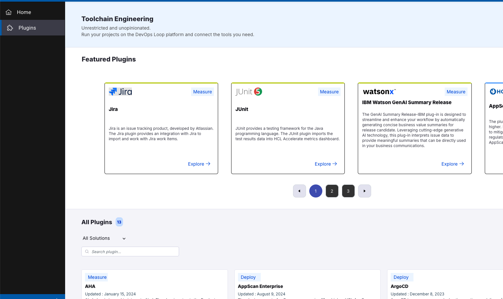

# About Box, Sidebar and Plug-Ins

## About Box and Logging out

On the above right side of your page you have the buttons for viewing the About box:

![About Button][AboutButton]

By pressing the About button the Information about the platform version and copyright will be presented. Please close by clicking on the "x" symbol on popup.

![About Box][About]

You can always log out of the platform by pressing the user symbol:

![User Symbol for Logging Out][LoggOutButton]

After a secure log out you will be presented with a new page which provides a login again:

![Logged out][LoggedOut]

## Sidebar

On the left side of the page you will have the side bar which will provide context related menu:

![Sidebar][SBIcons]

You can expand the side bar with the expand button on the bottom left side of the page:

![Sidebar expander][SBExpander]

Which will provide the sidebar items with text details:

![Sidebar expanded][SBExpanded]

## Plug-Ins

On the sidebar a view of slected plug-ins is available. By pressing on the Plug-Ins symbol the Featured Plugins page will be presented:

![Sidebar Plugins][SBPlugins]

<!--  -->

## Settings

The Settings Menue provides a view User Administration and managing the AI integration. 

![Sidebar Settings][SBSettings]

### User Administration

![User Admin View][UserAdminView]
![User Detail][UserAdminUserDetail]

### Integrations

View or Create an Integration to an AI Provider

![Integrations View with Entry][IntegrationsView]

![Create Integrations Button][ButtonCreateNewIntegration]

![New Integrations Dialog][NewIntegrationsDialog]

![Select AI Provider][NewIntegrationsSelectAIProvider]

![New Integrations additional Details][NewIntegrationsDialogNext]

## Conclusio

Go back to [Introduction][GoBackToParentIndex] or [Lab and Demo Overview][GoBackToDemoOverview]

---

[GoBackToDemoOverview]: ../index.md#introduction
[GoBackToParentIndex]: ../index.md
[SBSettings]: media/Loop_Sidebar_Settings.png
[SBPlugins]: media/Loop_Sidebar_plugins.png
[SBExpanded]: media/Loop_Sidebar_expanded.png
[SBExpander]: media/Loop_Sidebar_expand_button.png
[SBIcons]: media/Loop_Sidebar_small.png
[LoggedOut]: media/Loop_Logged_out.png
[LoggOutButton]: media/Loop_Logout_Button.png
[About]: media/Loop_About_box.png
[AboutButton]: media/Loop_About_Button.png
[UserAdminUserDetail]: media/Loop_Settings_UserAdmin_Users.png
[UserAdminView]: media/Loop_Settings_UserAdmin.png
[IntegrationsView]: media/Loop_Settings_Integrations.png
[ButtonCreateNewIntegration]: media/Loop_Settings_NewIntegrationsButton.png
[NewIntegrationsDialog]: media/Loop_Settings_IntegrationsNewDialog1.png
[NewIntegrationsSelectAIProvider]: media/Loop_Settings_IntegrationsNewDialog2.png
[NewIntegrationsDialogNext]: media/Loop_Settings_IntegrationsNewDialog3.png
