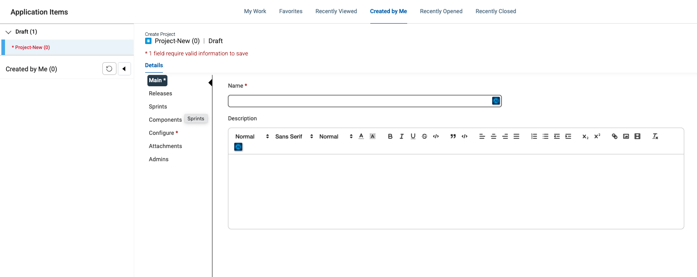
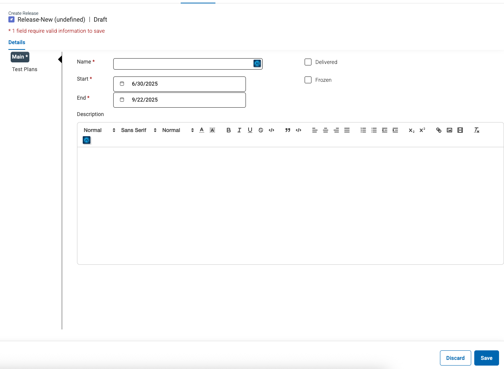
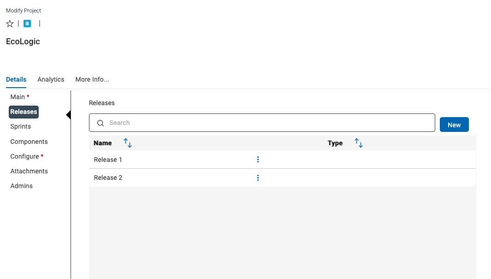
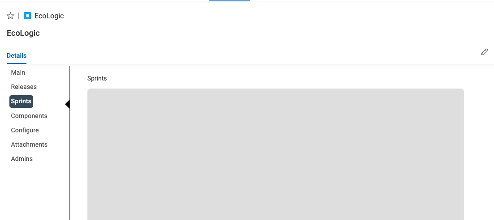
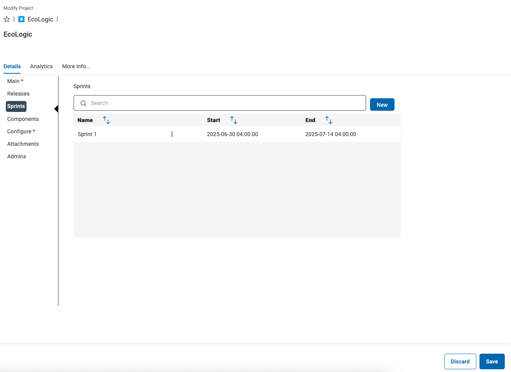
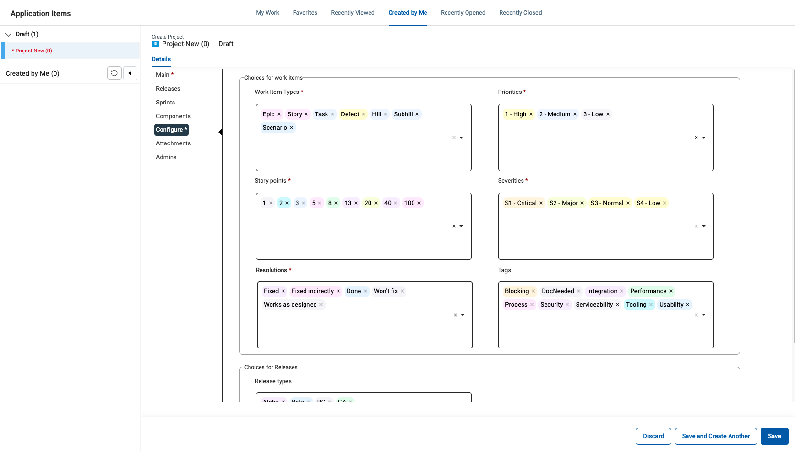
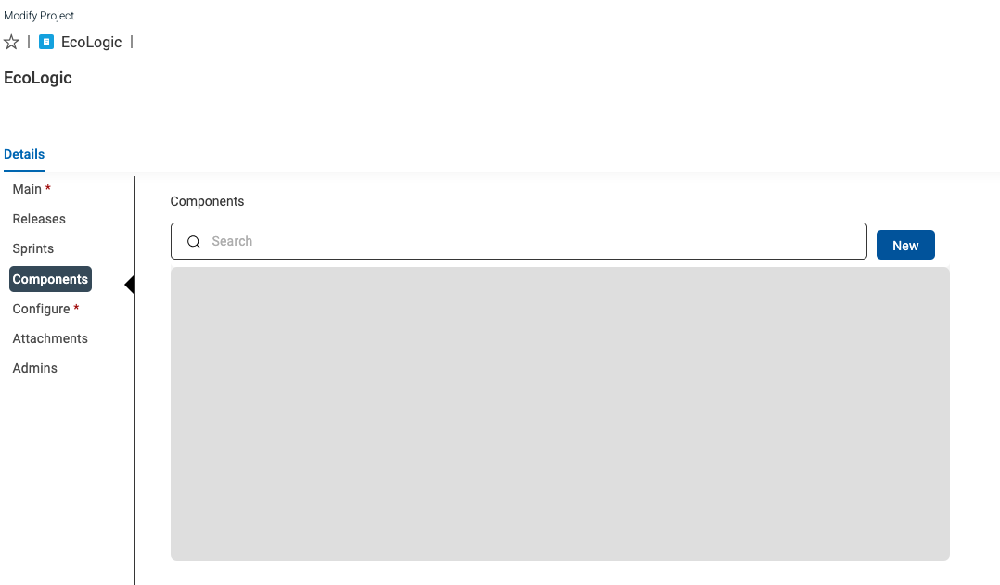
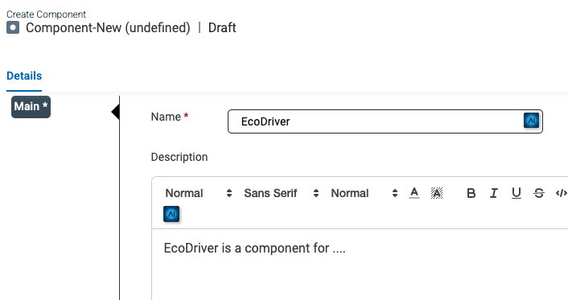

# Create new Project

## Overview

This schema uses Projects as high level seperators for workitem management.

## Steps

### Create a new Project

To create a new Workitem you have to click on the triangle icon on the NEW button on the top right of your screen:

Select Project from the List. This will create a new Record from type "Project" and will show you its Main section first to provide Name and more Details:

The name of our project is "EchoLogic", add a meaningful description too.

### Add Releases to Project

If you have saved the Project, you need to switch back to edit mode by using the Edit Button 

Switch to Releases Section and press the NEW button right of the Search field:

Enter "Release 1" into the Release Name and add a meaningfull description, you can change the Start and End Date if you wish.

Press the SAVE button to save the new Release 

Please now repeat the steps to create "Release 2" which starts 1 day after "Release 1" ends and lasts for another 3 months.

In your release section you will now see your new releases:

If the Save button is active for the project, please press it to save your changes!

### Add Sprints to Project

If you have saved the Project, you need to switch back to edit mode by using the Edit Button 

As no Sprints have been created and attached to this Project the Sprint section is empty.

If you have saved the Project, you need to switch back to edit mode by using the Edit Button 

In the new Dialog/form enter the Sprint name "Sprint 1" and if necessary adjust the Start and End Date:

Press the Save Button  to save this new Sprint. Now the Sprint is visible in the Sprintlist of the Project:

Repeat this steps and create more Sprints and adjust their Start and End Dates accordingly.

Example with two Sprints:

Please do not forget to save the project changes!

### Configure Project

If you have saved the Project, you need to switch back to edit mode by using the Edit Button 

Click on the sidebar on the "Configure" button/link:

This screen lets you customize your project with different values for Work Item Types, Priorities, Story Points, Severities, Resolutions, Tags and Release Types. New values can be added by clicking in the white space, typing in a value and clicking the Create link that appears below. Existing values can be removed by clicking the X beside the value

In the Workitem Types remove the Hill, SubHill and Scenario work item types. You can add or remove other items based on your requirements, the new configuraiton should look like this:

Click the Save button on the lower right of the screen: 

### Add Components

If you have saved the Project, you need to switch back to edit mode by using the Edit Button 

Click on the sidebar on the "Component" button/link:

Click on the "NEW" button to create a new component "EcoDriver":

Save the component and create another one for "LogicDriver".

The new component list should look like this:

Do not forget to save the project to keep the changes!

## Conclusio

Go back to [Plan][GoBackToParentIndex], [Lab and Demo Overview][GoBackToDemoOverview] or proceed with [Next Lab][NextLab]

---

[GoBackToDemoOverview]: ../index.md
[GoBackToParentIndex]: ../index.md#work-with-boards
[NextLab]: ../index.md#work-with-queries