# Measure Lab

TODO: update flow, app references and screenshots
_**TODO: update flow, app references from PIZZA to EchoLogic and screenshots**_

## Introduction

TODO: add more about Measure

## How to switch to Measure from Home Page

You can switch to Measure by either pressing "Let's go to Measure" button on its tile:

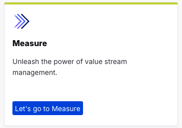

Or you can always switch using the central app switcher on the top left of your screen:

## Let's go with Measure

### Value Stream List

Please select "All Value Streams" to get a list of all Value Streams you have access to:

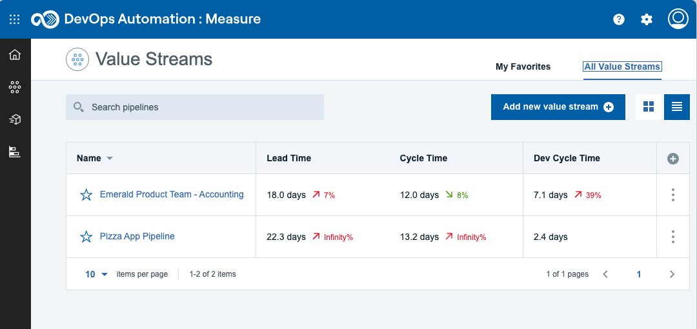

In this list we have two Value Streams Emerald Product Team - Accounting and Pizza App Pipeline.

**_NOTE: Before we proceed here a short intro what a Value Stream is._**

### What is a Value Stream?

A value stream represents the objects and activities that you employ to deliver customer value, from initial concept to final delivered project.

The value stream provides a strategic window into your project workflow and enables you to drill-down to individual objects. The objects, such as builds, pull requests, issues, and tests, come from tools that you integrate into the value stream. Individual objects are represented graphically by small circles called dots. Dots frequently provide information from logically related tools, such as issues linked to source control commits.

When you create a value stream, a minimal value stream is configured and displayed on the Value stream view. The highest level of a value stream is a phase.
Phases represent important, organizational parts of the value stream, such as "Planning," or "Development." On the Value stream view, processing is done in left-right order. For example, your first phase might be for planning and contain items created in an issue tracking system. Your next phase, used for development, can track source control activity related to the issues, and any builds triggered by the activity. Your final phase, used for deployment, might track the related build artifacts as they move through your testing environments toward production.

Phases contain stages that define process flow within a phase. A development phase that integrates a source control tool might contain an In Progress stage followed by In Review and Merged stages. When you customize a value stream, you define the phases and stages and their order.

Stages are containers for dots. Dots represent units of work from HCL Accelerate or tools that are integrated into the value stream. Git commits or Jira issues, to take just two, are represented by individual dots. Work items, such as commits and builds, can be combined into individual dots. A dot's position in the value stream conveys important information about the object. Dots in a stage named Merged might represent items merged into Git repositories. An item's shape and color convey information about the item's type and status. A dot outlined in red, for example, might mean the item is past schedule. When dots change state, they move to new stages in near-real time.

Finally, when you click on a dot, the displayed card provides information about the work items, including their history, and provides links to associated tools.

### Have a look at the Value Stream

Please click on "Emerald ..." Link to open the value stream and explore the shown data. This will open the Dot View of the Emerald Product Team - Accounting VSM:

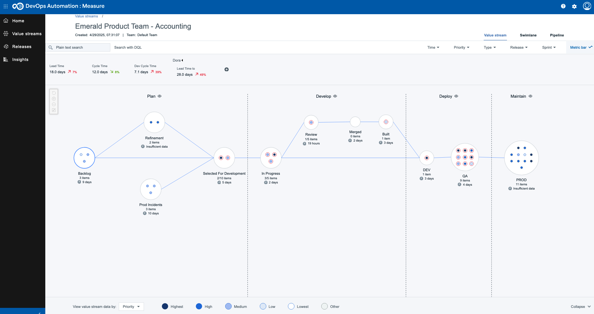

The "Emerald .." VSM contains Demo Data to give you a good insight how Measure works. When you click on one Dot it will open a popup with additional informatio and a full history of changes (lifecycle)

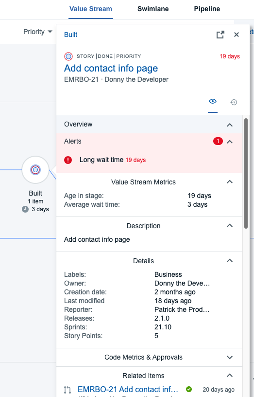

### Swimlanes

Click on the top right corner of your screen on the "Swimlane" link to get another view onto the data:

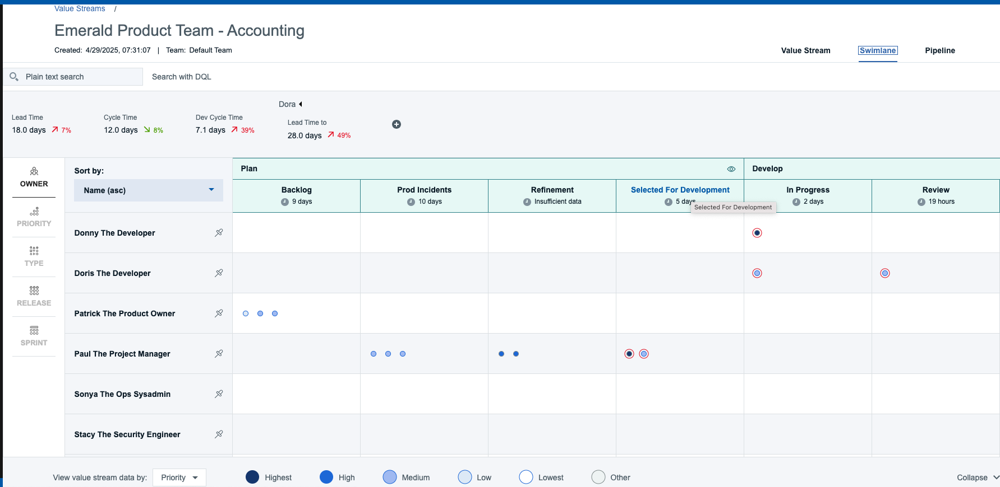

The Swimlane page displays the work items in a variety of ways allowing the team to view distribution of work by team members, priority of work, type of work, along with work items associated to a particular ownder, priority, type, release or sprint.

### Pipeline

Click on the top right corner of your screen on the "Pipeline" link to view your pipelines:

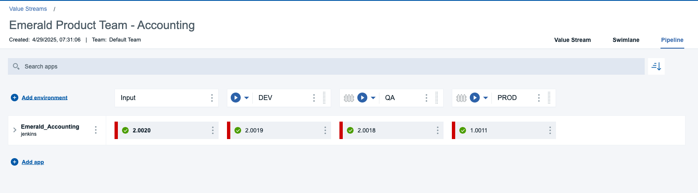

When you create a value stream, a corresponding pipeline is automatically configured. And a pipeline is a sequence of stages that retrieve input and run applications and jobs. Pipelines accept input from source control management (SCM) repositories or other external applications, such as DevOps Deploy, Azure DevOps as well as API driven which allows organizations to update the pipeline inventory using API calls, and more.

#### Quality Gates

Gates ensure that releases cannot be executed in an environment until the gate rule is satisfied. A gate is a condition that determines whether an application version can be deployed into the environment based on some assessment criteria. A pipeline may have some environments with gates and some without gates. A gate condition (or the assessment criteria) is called a rule.

Click on the Gate symbol on the QA column to view the criteria:

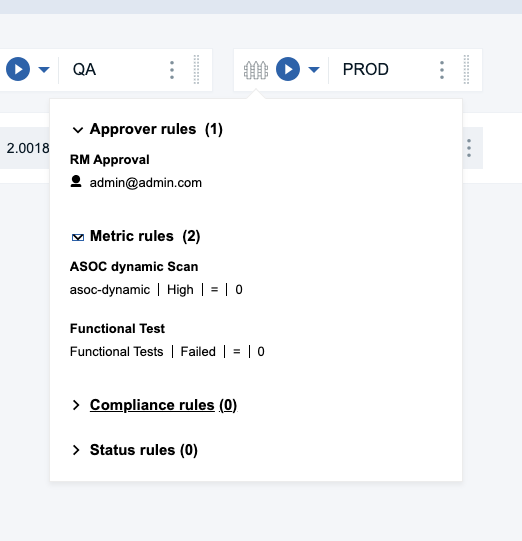

If you click on the Prod column additional gating criteria has been added:

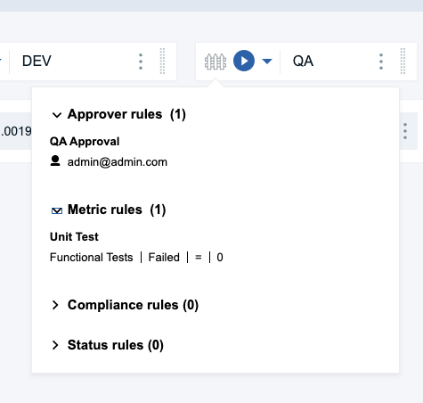

### Pizza VSM

Now have a look at the Pizza value stream view. If you have created a new workitem in Plan you will see it in the dot view. Search for it.

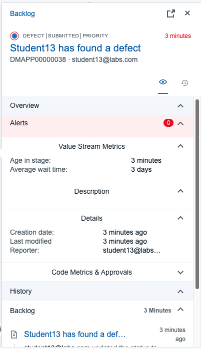

If not, try it out and create a new Defect in Plan and then look for it in this VSM view.

## Insight

Measure provides an Insight view (Dashboards) to gain additional information about your value streams. Click on the 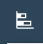 to open the Insight view:

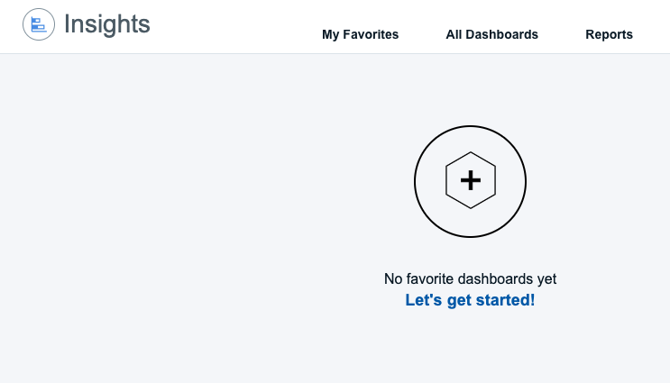

Click on "All Dashboards" to view all available existing Dashboards to you:

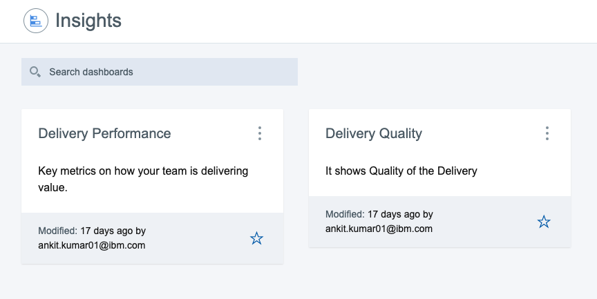

In this view you will see two existing dashboards. Delivery Performance and Delivery Quality. Click each tile and have a look at the provided graphics:

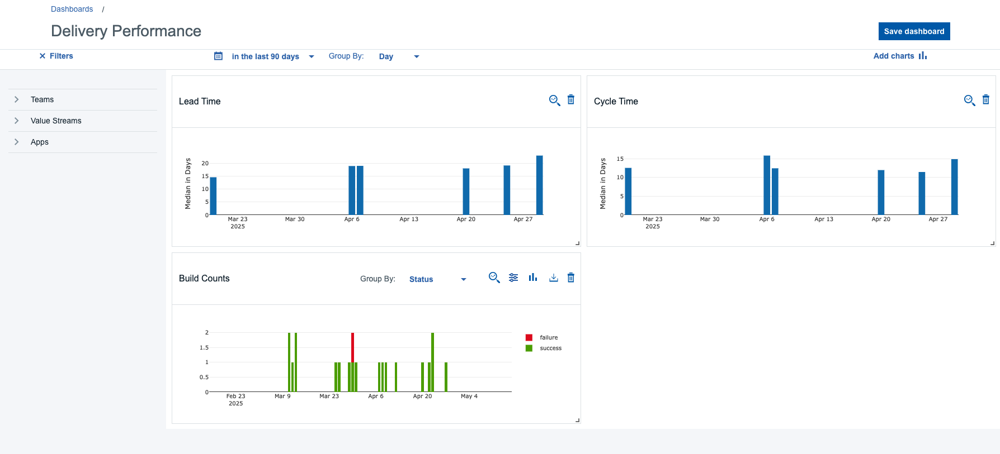

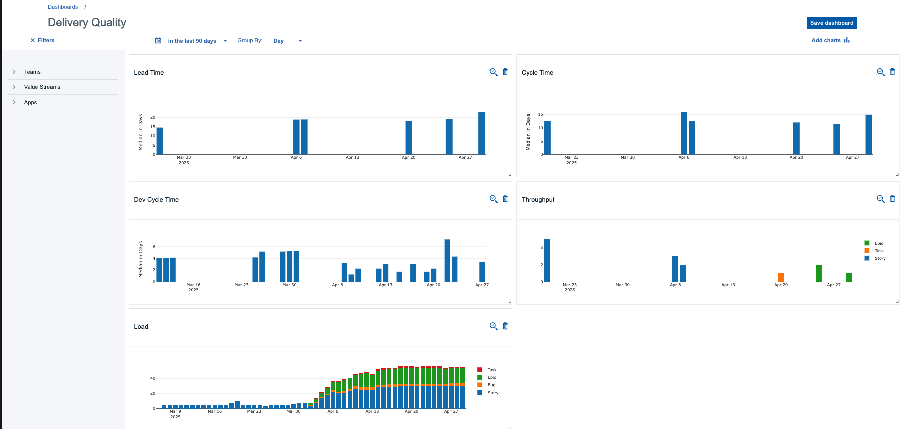

## Conclusio

Congratulations! You have finished the Measure Lab!
