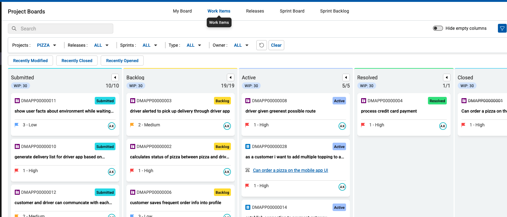
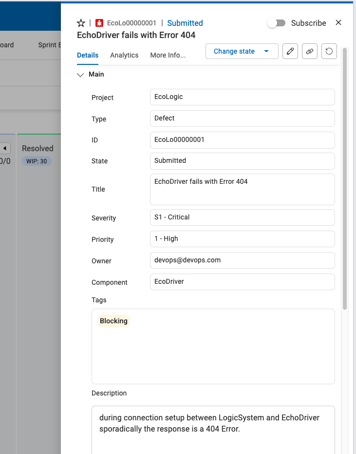
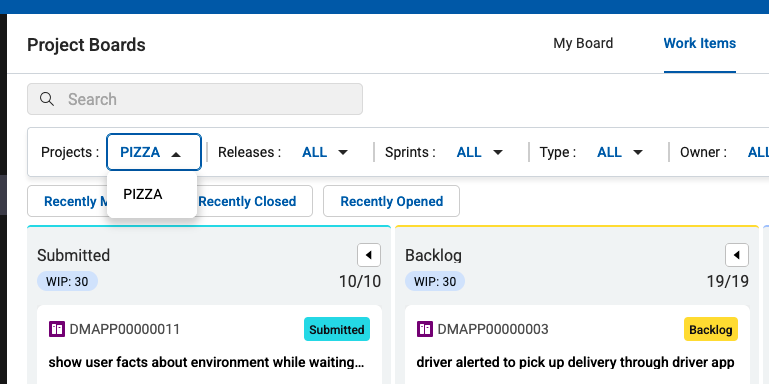
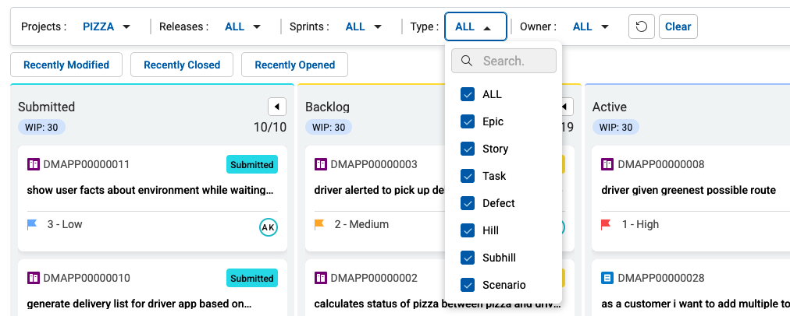
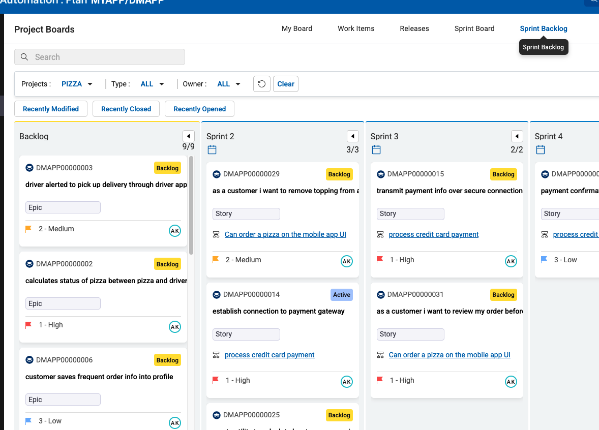

# Boards

## Work with Boards

### Project Board

Project Boards provide a graphical Kanban style overview of worktitems.

TODO: add more text here

To open the board use the Project Board icon  on the Sidebar .

The initial view is your My Board view which will show worktitems that are assigned to you. As we newly started the board is empty.

TODO: Show the board with data and expain what it is good for and how to use it

### Work Items

- 

#### Select Workitem

- 

#### Show Workitem Details

- 

#### Show Commit

Switch to Sourcecontrol section and show the commit link:

![PLAN - Show Control/Git Commit Link][PlanShowCommit]

[Open Control][OpenControl] to see the link to the workitem:

![CONTROL - Show Git Commit Details][ControlShowCommit]

#### Use AI in WorkItem

TODO: Use Plan Genie to create description and explorative test information (need screenshots or animated gif)

### Filter Projects

- 

### Filter Epics

- 

### Show Releases

- 

### Show Sprints

- 

### Show Sprint Backlog

- 

[PlanShowCommit]: ../media/PLAN_Show_GitCommit.png
[ControlShowCommit]: ../../control/media/CONTROL_ShowGitCommit.png
[OpenControl]: control/index.md#how-to-switch-to-control-from-home-page
