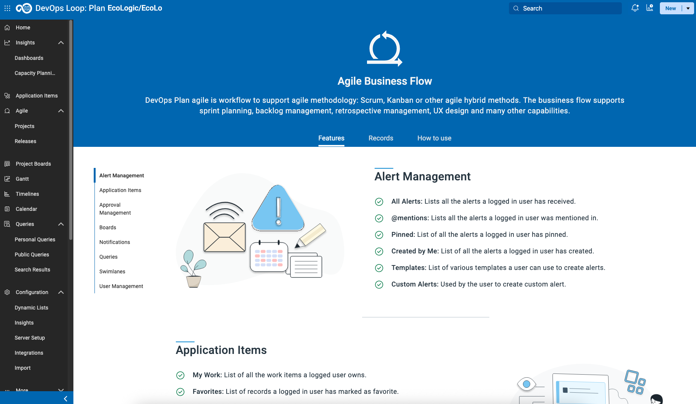

# Plan Lab

TODO: update flow, app references and screenshots
_**TODO: update flow, app references from PIZZA to EchoLogic and screenshots**_

## Introduction

TODO: add here more about Plan

## How to switch to Plan from Home Page

| Step | Details                                                                                | Additional Information               |
|:----:|:---------------------------------------------------------------------------------------|:-------------------------------------|
|  1   | You can switch to Plan by either pressing "Let's go to Plan" button on its tile        | ![Plan Tile lets go][PlanTile]       |
|  2   | Or you can always switch using the central app switcher on the top left of your screen | ![Central App Switcher][AppSwitcher] |

## Demo Data or New Application with Sample Data

### Setup Demo Data

You can use the pre-created Plan application from your Loop and add sampl data to it please follow [this document](setup/index.md) to import Demo data into Plan.

### How to create a new Application

If you want to create a new Application and do not want to use the pre-created application from your Loop please follow the instructions how to [create a new Application with Sample Data](newapp/index.md).

## Let's go with Plan

### Select Plan application to use

If you have not set your default Plan application you will be provided with a screen with all applications you have access to.

![Plan Applications Page][AppPage]

Set the provided app as default and presss "Let's go" to proceed.

### Welcome Page for first time users

If you have logged in the first time into Plan you will get a Welcome Screen:

By pressing the button "Explore" a new page is shown which provides an Introduction to Plan and the used workflow model for the selected application:

### Use Home Button to switch to Plan Home Page

Please use the "Home" button on the left sidebar to switch to the Home page for Plan.

This Home page will provide you some basic information and also the means to switch between Plan applications (My Applications Button on the right)

The explore options on this page will forward you to the Exploration page mentioned above.

### Explore the technical worflow

Pressing the button "View":

will open a new view to the technical details of the used workflow for the selected application.

This view provides the used record types, fields, transition matrizes and more.

## AI Assistant

Select the AI Assistant Icon ![AI Assistant Icon][PlanAIIcon] from the Sidebar ![Sidebar][PlanSidebar]

Accept the terms of service ![Accept Terms][AcceptTerms]

### AI Assistant Chat Dialog

The AI Assistant Chat Dialog opens ![AI Assistant Dialog][AIAssistantDialog]

Enter Now a prompt, you can use the example prompts, or enter your prompt ![Enter Prompt][AIEnterPrompt]

Click on the Next Button ![Next Button][AINextButton]

### AI Assistant Type of Output

Now select the type of Output you want. We will select **Generate Action Items** ![Generate Action Items][AIGenerateActionItems] from the Applying Prompts page ![Applying Prompts][AIApplyingPromptsType]

This will generate a set of responses ![AI Responses][AIResponses]

Click the **Select** Button ![Select Button][AISelectButtonBreakDownintoTitles] and select **Break Down into Titles**

This will convert the list of responses to a list with checkboxes: ![AI Responses with Checkboxes][AIResponsesWithCheckboxes]

Select a few you like from the list ![AI Responses selected][AISelectedResponses]

### AI Assistant Create Records from Responses

Click the **Select Record Type** Button ![Select Record Type][AISelectRecordTypeButton] to select **Workitem** from the list ![Select Workitem][AISelectWorkitemRecordtype]

In the next Dialog ![Record Creation Dialog1][AIRecordCreationDialogEmpty] select the right **Project** and **Workitem Type** for example Project: Echologic and Type: Epic ![Record Creation Dialog2][AIRecordCreationDialogFilled]

Press the **Create Records** Button ![Create Records Button][AICreateRecordsButton] to get the **Epics** created.

A few seconds later all newly created records are now created ![Newly created Records][AINewlyCreatedRecords]

Press **Done** ![Done Button][AIDoneButton] to finish using the AI Assistant

## Work with Boards

[Please follow these instructions to learn more about Boards](boards/index.md).

## Create and customize a new Project

[Please follow these instructions to create a new Project](newproject/index.md).

## Work with Queries

[Please follow these instructions to show how to work with Queries](queries/index.md)

## Integrations

### Control/GIT/SCM

- ![PLAN - Show Control/Git Commit Link][ShowCommitLink]

## Conclusio

Congratulations! You have finished the Plan lab and have got a short overview of its capabilities.

---

[AppPage]: newapp/media/PLAN_Tenant_AppListFinal.png
[PlanTile]: ../introduction/media/Loop_switch_to_Plan.png
[AppSwitcher]: ../introduction/media/Loop_central_app_control.png

 <!-- media/Plan_Applications_page.png -->

[ShowCommitLink]: media/PLAN_Show_GitCommit.png
[PlanAIIcon]: media/PLAN_AI_assistant_Icon.png
[PlanSidebar]: media/PLAN_Sidebar.png
[AcceptTerms]: media/PLAN_AI_accept_Terms.png
[AIAssistantDialog]: media/PLAN_AI_Dialog1.png
[AIEnterPrompt]: media/PLAN_AI_enter_prompt.png
[AINextButton]: media/PLAN_AI_NextButton.png
[AIGenerateActionItems]: media/PLAN_AI_Generate_Action_Items.png
[AIApplyingPromptsType]: media/PLAN_AI_UserInputType.png
[AIResponses]: media/PLAN_AI_to_create_Items.png
[AISelectButtonBreakDownintoTitles]: media/PLAN_AI_SelectButton_List.png
[AIResponsesWithCheckboxes]: media/PLAN_AI_select_items.png
[AISelectedResponses]: media/PLAN_AI_select_items2.png
[AISelectRecordTypeButton]: media/PLAN_AI_select_record_type.png
[AISelectWorkitemRecordtype]: media/PLAN_AI_recordtype_workitem.png
[AIRecordCreationDialogEmpty]: media/PLAN_AI_recordtype_Dialog1.png
[AIRecordCreationDialogFilled]: media/PLAN_AI_recordtype_Dialog2.png
[AICreateRecordsButton]: media/PLAN_AI_create_records_button.png
[AINewlyCreatedRecords]: media/PLAN_AI_records_created.png
[AIDoneButton]: media/PLAN_AI_done.png
