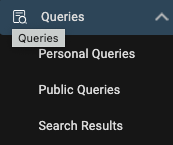
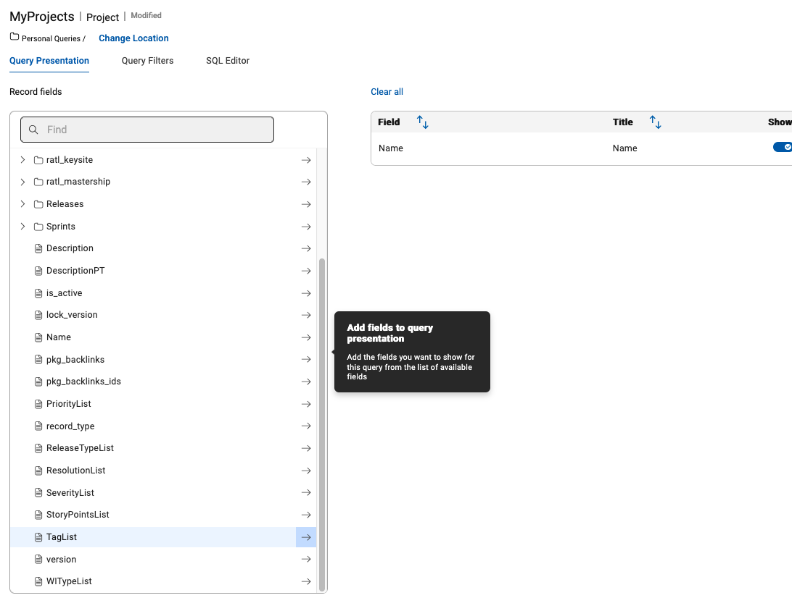

# Queries

## Work with Queries

Use Queries to get a list of items you are interested on. Every user can create its own Personal Queries. If you have the role or permission set to be a Public Query Editor then you can publish personal queries as Public Queries.

### Public and Personal Queries

You can switch to the Query Editor by either Clicking on the Queries icon on the left sidebar to open the submenue:

Or when your sidebar is expanded click on Personal to create a new Personal Query:

The Query Editor list all your queries you have access to. You can switch here between Personal and Public queries by clicking on the triangle symbol right beside the Public/Personal Query:

#### create new personal query

Now let us create a simple Query to list all Projects we own. Click on the Add New Query button and select "New Query":

This will open a Popup where you need to provide a name for your query and which record type will be queried:

Please provide a meaningful name like "My Project Query" and select the Project record type. Then Press Continue to open the Query Editor:

In this Editor you can configure the fields which will be shown on the result. It is also possible to add fields from related record types like Releases or Sprints. In this example we will keep it Simple and add only the Tagslist to our Result set.

Scroll down on fields list to Tags and press the arrow to add it to your result field view:

In the results field view you can change the ordering of the fields, set the sort order and more. Every field reveals a three dot inline menue for modification of these parameters or if you added it by mistage to remove this field from this list.

Now let us do a dry run and see the results. Press the Run button on the bottom right of your screen to run and have a look at the result:

Use the "Back to Edit" link to return to the Query Editor to add aditional fields or change the query:

We need to add a Filter on our Query so that only our own items are selected. This can be done by clicking on the Query Filter link on the top above the field list:

In this view select Owner from the field list and press the arrow button to add it to the Filter Criteria, then you need to change the value to "Current User":

NOTE: you could have selected your own username from the list, but to if you want to publish this query, you can use the generic "Current User" which will automatically use the username of the logged in user.

We are now finished with setting up our query. Press Save and Close on the bottom left:

If you want to save and go on with editing use the Save button. It can be also used for saving your query under a new name too:

#### Public Queries

Have a look at the available Queries in the Public Queries list and try them out.
