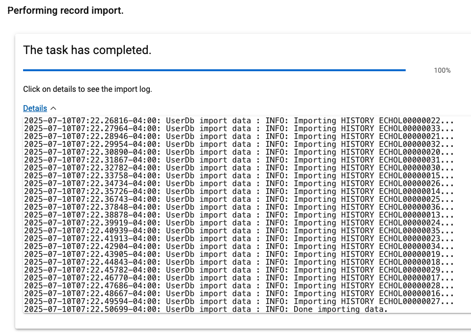

# Setting Up

## Importing Sample Data

| Step | Details                                                                    | Additional Information                                   |
|:----:|:---------------------------------------------------------------------------|:---------------------------------------------------------|
|  1   | Use the Import Feature of plan to load sample data                         | ![Import Icon][ImportIcon]                               |
|  2   | In the Dialog for importing record data                                    | ![Import Dialog][ImportDialog1]                          |
|      | click the Choose File Button to select the sample data file to be imported | ![Choose File Button][ChooseFileDialog]                  |
|  3   | Select the [EchoLogic Zip File from files section][EchoLogicZipFile]       | ![Select the file][SelectZipFile]                        |
|  4   | Now we have the file selected                                              | ![Import Dialog with selected File][ImportDialog2]       |
|  5   | Presss the Import Button to start                                          | ![Press Import Button][ImportButton]                     |
|  6   | The Import process starts.                                                 | ![Import Process starting][ImportStarts]                 |
|  7   | By clicking on Details the process output can be viewed                    | ![Import running with Details][ImportRunningWithDetails] |
|  8   | Import has finished                                                        |        |
|  9   | Press the close button (bottom right on the screen)                        | ![Close Button][ImportClose]                             |
|      |                                                                            |                                                          |

Back to [Plan Lab](../index.md#setup-demo-data)

---

[ChooseFileDialog]: media/PLAN_Import_Dialog_ChooseFile.png
[ImportIcon]: media/PLAN_Import_Icon.png
[ImportDialog1]: media/PLAN_Import_Dialog1.png
[SelectZipFile]: media/PLAN_Import_Select_ZipFile.png
[ImportDialog2]: media/PLAN_Import_Dialog2.png
[ImportButton]: media/PLAN_Import_Button.png
[ImportStarts]: media/PLAN_Import_started.png
[ImportRunningWithDetails]: media/PLAN_Import_running.png
[ImportClose]: media/PLAN_Import_Close_dialog.png
[EchoLogicZIPFile]: https://github.com/DevOpsAutomationLabs/EchoLogic_DemoApp/raw/main/files/plan/EchoLogic.zip
